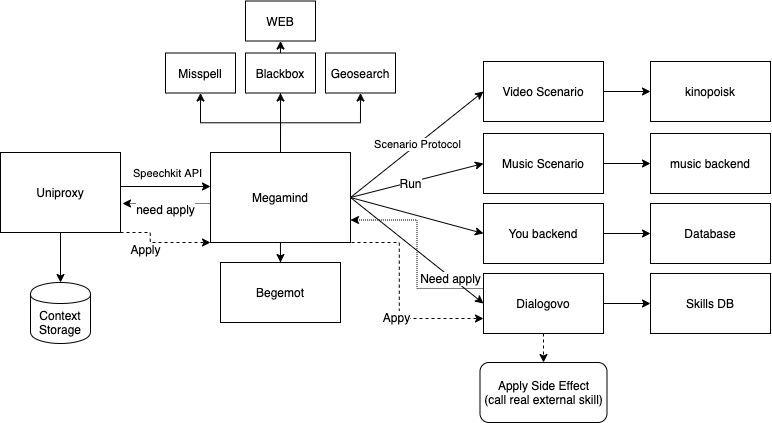

# Архитектура платформы сценариев

Все реплики пользователей приходят в Мегамайнд, все ответы Алисы формулируются Мегамайндом. Мегамайнд выполняет диспетчерскую функцию, делегируя дополнительным компонентам разбор реплик (NLU), выбор наилучшего сценария разговора и обработку конкретных данных, полученных от пользователя. Поэтому Мегамайнд — центральная часть архитектуры сценариев Алисы.

Общий алгоритм обработки реплик:

1. Устройство пользователя реагирует на ключевые слова обращения к Алисе и отправляет соответствующие фразы в Uniproxy для распознавания.
1. Uniproxy распознает полученный звук с помощью ASR.
1. Распознанный текст фразы Uniproxy отправляет в [Мегамайнд](megamind/index.md) в формате SpeechKit API.
1. Мегамайнд запрашивает в [Бегемоте](nlu/index.md) разбор реплики на базе технологий NLU и, учитывая найденные семантические фреймы, составляет список сценариев, которые лучше всего подходят для обработки этой реплики.
1. Мегамайнд [отправляет запросы](megamind/protocol.md) во все подобранные сценарии одновременно, чтобы выбрать наилучший ответ в контексте.
   * Наилучший ответ может принадлежать сценарию, который не только
     составляет ответ Алисы, но и изменяет внутреннее состояние
     каких-то объектов (производит сайд эффект: пишет в базу данных
     или включает лампочку умного дома). В этом случае Мегамайнд
     вызовет сценарий еще раз, сигнализируя о том, что сайд эффект
     можно исполнить. Подробнее — в разделе [Варианты вызова сценария](#variants).
1. Выбрав наилучший ответ, Мегамайнд отправляет его в Uniproxy.
1. Uniproxy с помощью TTS озвучивает ответ и отправляет его пользователю. С вопросами о генерации звука из текста, сгенерированного сценарием, стоит обращаться к [Владимиру Кириченко](https://staff.yandex-team.ru/vvkiri) или в [Группу синтеза речи](https://staff.yandex-team.ru/departments/yandex_ctoffice_voice_tech_8820/).
1. Пользователь произносит следующую реплику, и запускает цикл обработки заново.

## Распознавание голоса {#voice-recognition}

Те реплики, которые были опознаны как обращения к Алисе, устройства пользователей отправляют на Uniproxy. Uniproxy распознает полученные звуковые сообщения с помощью ASR и отправляет реплики в Мегамайнд, в формате SpeechKit API.

В общем случае при разработке сценариев нет необходимости задумываться о том, как работает ASR, и можно считать распознавание речи идеальным. Но если в вашем сценарии общения с Алисой возникают нюансы распознавания определенных слов или фраз, вы можете обратиться непосредственно в [Группу технологий голосового ввода](https://staff.yandex-team.ru/departments/yandex_ctoffice_voice_tech_7971/), к Алексею Колесову, чтобы обсудить необходимые доработки.

## Вызов сценариев {#request}

Чтобы выбрать лучший сценарий, Мегамайнд должен запустить все сценарии из списка подходящих, и оценить полученные ответы. Запросы отправляются на HTTP-ручки согласно [протоколу](megamind/protocol.md).

Чтобы сценарий вызывался только для определенных [семантических фреймов](frames.md), вы можете указать их в [конфигурации сценария](megamind/config.md).

### Запрос данных в источниках {#sources}

Мегамайнд может запрашивать данные в стандартизированных источниках, чтобы сценариям не приходилось отправлять стандартные запросы самостоятельно. Формально доступные источники перечислены в [data_source_type.proto](https://a.yandex-team.ru/arc/trunk/arcadia/alice/megamind/protos/common/data_source_type.proto).

Точно общественно полезные и актуальные источники:

* `BLACK_BOX` — Черный ящик с личными данными пользователя. Доступные через Мегамайнд атрибуты описаны в сообщении [TBlackBoxUserInfo](https://a.yandex-team.ru/arc/trunk/arcadia/alice/megamind/protos/blackbox/blackbox.proto#L10).
* `WEB_SEARCH*` — результаты поиска по запросу. Семейство источников
  данных из поиска. Прежде чем закладываться на его использование
  посоветуйтесь с [zubchick@](https://staff.yandex-team.ru/zubchick).
* `USER_LOCATION` - возможность получить регион пользователя из
  геобазы. Описание в proto формате [в аркадии](https://a.yandex-team.ru/arc/trunk/arcadia/alice/library/geo/protos/user_location.proto?rev=6055378).

### Варианты вызова сценария {#variants}

Мегамайнд поддерживает следующие варианты вызова сценариев:

1. Базовый вариант (для сценариев без сайд эффекта), в котором
   сценарий получает текстовый запрос (ручка `/run` в [протоколе](megamind/protocol.md)),
   возвращает финальный ответ пользователю и ограничивается этим.
   Примером такого сценария может быть «сложи три и два» — результатом
   является только сгенерированный для пользователя ответ Алисы о
   сумме двух чисел.

1. Вариант с _сайд-эффектом_: сценарии, которые подразумевают
   изменение внутреннего состояния какого-то объекта (например запись
   в БД или вызов такси или включение лампочки). К сайд эффектам не
   относятся действия на клиенте, чтобы выполнить действие
   непосредственно на клиенте, с которого пришел запрос, нужно
   отдавать в ответе [директивы](https://wiki.yandex-team.ru/Alice/Megamind/ProtocolScenarios/proto/directives/).

   1. Первый запрос Мегамайнд делает в ручку `/run`. Сценарий должен
      сформулировать финальный ответ пользователю, как в базовом
      варианте, не применяя никаких сайд эффектов. Иначе такси
      вызовется, даже если пользователь хотел поговорить о чем-то
      другом.

   1. Если ответ сценария окажется наилучшим, Мегамайнд пришлет еще
      один запрос, в ручку `/commit`. Сценарий должен выполнить всю
      соответствующую серверную логику и сообщить об успехе или ошибке
      операции.

Если сценарий не может генерировать ответ пользователю на каждый вызов ручки `/run` (например, из-за того, что финальный ответ генерируется с помощью сложного или долгого вызова), см. раздел [Генерация ответа после ранжирования](#postpone).

### Генерация ответа после ранжирования {#postpone}

Иногда сценарий по какой-то причине не может сгенерировать ответ для пользователя при вызове ручки `/run`: например, формулировка ответа зависит от другого сервиса, который нельзя вызывать при каждом ранжировании. Мегамайнд позволяет сценарию запросить отложенную обработку реплик — формулировать ответ только после того, как сценарий победил в ранжировании.

Для этого:

1. В ответе ручки `/run` сценарий возвращает только
   [фичи](megamind/protocol.md) для постклассификатора и произвольные
   аргументы для последующего вызова `/continue` или `/apply`).
1. Если ответ сценария победит, Мегамайнд передаст полученные аргументы в указанную сценарием ручку:

   * `/continue`, если сценарий откладывает ответ из-за долгой обработки запроса, которая не позволяет составлять полный ответ при каждом ранжировании.

   * `/apply`, если сценарий должен выполнить какой-то сайд-эффект, чтобы сформулировать окончательный ответ.



Формулировка ответа после сайд-эффекта (`/apply`) приводит к проблемам при измерении качества сценариев, при тестировании, при обучении ранжирования — во всех случаях, где от сценария нужен ответ на гипотетическую реплику. Сценарию и Мегамайнду приходится различать тестовые и боевые вызовы, реализовывать соответствующую логику, генерировать тестовые данные для формулировки тестовых ответов и т. п.

Практически любые задачи сценариев, которые подразумевают
сайд-эффекты. можно решить реализацией ручки `/commit` (и
соответствующего поведения ручки `/run`). Если вы не понимаете, как в
вашем случае можно сформировать ответ пользователю без использования
ручки `/apply`, приходите посоветоваться к [zubchick@](https://staff.yandex-team.ru/zubchick).



Наглядно в виде таблицы:

Вариант | Ручки | Пример
--- | --- | ---
чистый | `/run` | Запрос погоды (теоретически не требует сайд-эффектов).
чистый, но медленный | `/run` + `/continue`| Запрос музыки (`/run` возвращает результаты поиска, `/continue` — музыкальный трек).
финальный ответ при ранжировании, сайд-эффект потом | `/run` + `/commit` | Покупка фильма. Ответ про «оплатите в приложении» можно сформировать до того, как отправить пуш про оплату.
финальный ответ после ранжирования и сайд-эффекта | `/run` + `/apply` | Внешние навыки (Диалоги). Невозможно составить ответ, пока внешний навык не ответил.

## Ранжирование сценариев {#scenario-ranking}

Получив разбор реплики от Бегемота, Мегамайнд составляет список сценариев, которые могут быть релевантны пользователю, с помощью преклассификатора. У каждого сценария из списка Мегамайнд запрашивает ответ, который бы они дали на полученную реплику.



Сценарий может явно сообщить о том, что не подходит для обработки полученной реплики. В этом случае сценарий должен вернуть Мегамайнду ответ с фичей [IsIrrelevant](megamind/protocol.md).



Полученные ответы ранжируются постклассификатором, который выбирает наилучший ответ в контексте предыдущего диалога. Мегамайнд отправляет в Uniproxy ответ победившего сценария. Если сценарий запросил отдельный вызов серверной логики, после ранжирования от Мегамайнда придет соответствующий запрос, в ручку `/commit`, `/continue` или `/apply`.

База, на которой обучается постклассификатор, — оценки толокеров. Более подробное описание того, как работает постклассификатор и ранжирование сценариев, — в разработке.
