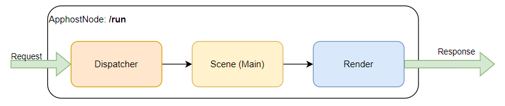
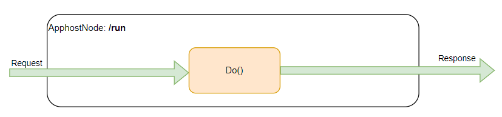
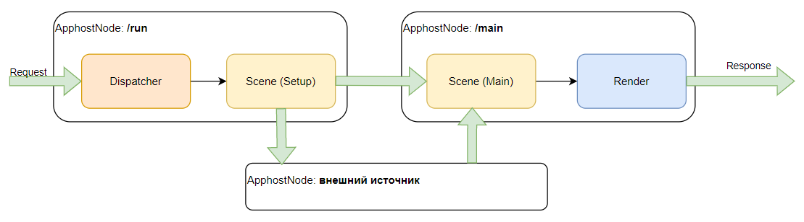
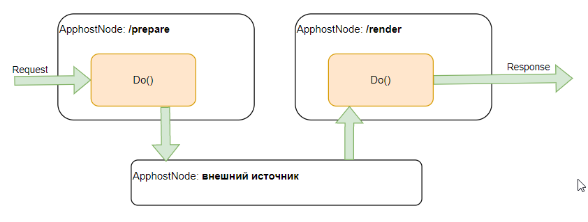

# Взаимодействие с графом сценария

Гибкая структура Hollywood Framework позволяет комбинировать локальные вызовы с аппхостовыми незаметно для пользователя.

Hollywood Framework позволяет заранее спроектировать систему без необходимости позже расширять граф с походами. В новых сценариях используется двухнодовый граф аппхоста.

### Сценарий без сетевых походов



- Hollywood Framework

  Используются `Dispatch()`, `SceneMainRun()` и `Renderer()`.

  

- Традиционный способ

  Используются ручка `/run` и функция `::Do()`, в которой описывается вся логика работы.

  



### Сценарий с сетевыми походами



- Hollywood Framework

  

  Если в сценарии не было сетевых походов, но вы хотите их добавить, то замените граф аппхоста с однонодового на двухнодовый. 

- Традиционный способ

  



## Конфигурирование графа

Если вы перевозите старый сценарий или задаете граф аппхоста вручную, то обратите внимание на следующие важные ограничения и условия:

* Чтобы фреймворк мог передавать свои данные между нодами, разрешите передачу протобафа `hw_selected_scene`:
  * от `preselect` до `run` (при наличии ноды `preselect`);
  * от `run` до `main`.
* Если ваш граф расширяется на несколько нод `main`, проставьте флаг в формате `hwf#scenario_name#scene_name` (все названия в lower case). Он не допускает попадания обработки в ноды, которые не относятся к выбранной сцене.

Если вы используете [флаги эксперимента](../main/flags.md) в качестве условий для `edge_expressions` в конфигурации аппхоста, то при `value:0` эксперимент все равно считается включенным. Чтобы включать и выключать эксперименты в аппхосте, полностью удалите или добавьте соответствующие флаги.

## Пример сценария

Сценарий `get_date` умеет отвечать на вопросы:
* **1 января какой день недели будет?** — ответ описывается математической формулой и не требует дополнительных уточнений.
* **Пасха в следующем году какой день недели будет?** — ответ требует похода в поиск с вопросом «Пасха 2023 год какое число».

### Состав сценария

* Диспетчер.
* 2 сцены:
    * для простых вопросов (без сетевых походов);
    * для сложных вопросов (с сетевыми походами);
* 1 функция рендера.

### Аппхостовый граф сценария

В сценарии используется двухнодовый аппхостовый граф с нодами `/run` и `/main`, фреймворк сам автоматически распределит вызовы функций по нодам.

В аппхостовой ноде `/run` выполняются функции:
* `Dispatch`;
* `Scene2Setup` (если диспетчер выбрал выполнение второй сцены).

В аппхостовой ноде `/main` выполняются функции:
* `Scene1Run`;
* `Scene2Run` (логика как в `Scene1Run`);
* `Renderer` (единый для обеих сцен).