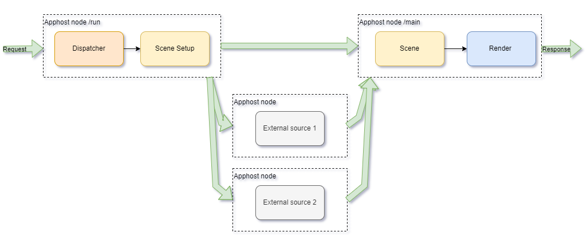
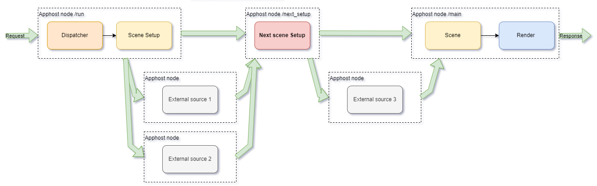

# Дополнительные сетевые походы

Для большинства сценариев фреймворк предоставляет типовую схему работы, в которой в сцене может быть только 1 функция сетевого похода, которая настраивает несколько **параллельных** запросов в источники.



Однако в ряде случаев необходимо сформировать **последовательные** сетевые походы, в которых последующий запрос опирается на ответ, полученный в предыдущем запросе.



Фреймворк предоставляет расширение стандартного функционала, который позволяет настроить **последовательные** сетевые походы.
Для обработки таких походов надо зарегистрировать в системе дополнительные функции.

Фреймворк позволяет вклиниться в цепочку сетевых походов:

* между функциями DispatchSetup и Dispatch;
* между функциям MainSetup и Main;
* между функциями ContinueSetup и Continue;

обратите внимание, что последовательные сетевые походы для ручек commit и apply не предусмотрены.

## Декларация и регистрация функций



- Для сценария

  ```
  TRetSetup TMyScenario::Handler(const TRunRequest&, const TStorage&, const TSource&) const;

  TMyScenario::TMyScenario() {
      ...
      Register(&TMyScenario::Handler(), "chain_apphost_node_name");
  }
  ```

- Для сцены в ручке `/run`

  ```
  TRetSetup TMyScene::Handler(const TRunRequest&, const TStorage&, const TSource&) const;

  TMyScenario::TMyScenario() {
      ...
      RegisterScene<TMyScene>([this]() {
          ...
          RegisterSceneFn(&TMyScene::Handler, "chain_apphost_node_name");
      }
  }
  ```

- Для сцены в ручке `/continue`

  ```
  TRetSetup TMyScene::Handler(const TContinueRequest&, const TStorage&, const TSource&) const;

  TMyScenario::TMyScenario() {
      ...
      RegisterScene<TMyScene>([this]() {
          ...
          RegisterSceneFn(&TMyScene::Handler, "chain_apphost_node_name");
      }
  }
  ```



Во всех случаях функция получает стандартные параметры запроса `TRunRequest` (или `TContinueRequest`), данные из стораджа и результаты предыдущего сетевого запроса.

Функция может вернуть:

* `TRetSetup` - для организации последующего сетевого похода.
* `TReturnValueDo()` - для переключения в ноду классического Голливуда.
* `TError()` - для индикации ошибки и прекращения обработки текущего сценария.

Так как обработчик цепочки сетевых походов жестко привязан к ноде аппхоста (и в ней не может исполняться никакой другой код фреймворка), название этой ноды задается прямо при регистрации функции.

## Настройка графа аппхоста

Для корректной работы аппхоста и фреймворка необходимо настроить сетевой граф аппхоста следующим образом:

* название ноды аппхоста - в соответствии с тем, что указано при регистрации функций в диспетчере ("chain_apphost_node_name")
* входящие объекты:
  * hw_scene_proto
  * mm_scenario_request (протягивается от старта графа)
  * ответы источников, которые были запрошены на предыдущем шаге
* исходящие объекты в следующую ноду:
  * hw_scene_proto
  * mm_scenario_request (протягивается от старта графа)
  * настроенные сетевые походы в другие источники


## Тестирование функций цепочки сетевых походов

Функции цепочки сетевых походов могут тестироваться при помощи класса `TTestApphost` с названием ноды аппхоста точно также, как и другие функции сценария:

Пример 1. Отдельное тестирование функции
```cpp
    TTestEnvironment testEnv("my_scenario", "ru-ru");
    ... // симулируем ответы источников, которые получает функция
    UNIT_ASSERT(testEnv >> TTestApphost("chain_apphost_node_name") >> testEnv);
    ... // проверяем, какие последующие сетевые походы запросила функция
```

Пример 2. Тестирование функции в связке с остальными

```cpp
    TTestEnvironment testEnv("my_scenario", "ru-ru");
    ... // заполняем исходные данные 
    
    // вызываем последовательно функции фреймворка
    // диспетчер и сетевой поход сцены
    UNIT_ASSERT(testEnv >> TTestApphost("run") >> testEnv);
    // Обработчик цепочки сетевых походов
    UNIT_ASSERT(testEnv >> TTestApphost("chain_apphost_node_name") >> testEnv);
    // Бизнес логика сценария и функция рендера
    UNIT_ASSERT(testEnv >> TTestApphost("main") >> testEnv);
    ... // проверяем ответ, который отправится пользователю
}