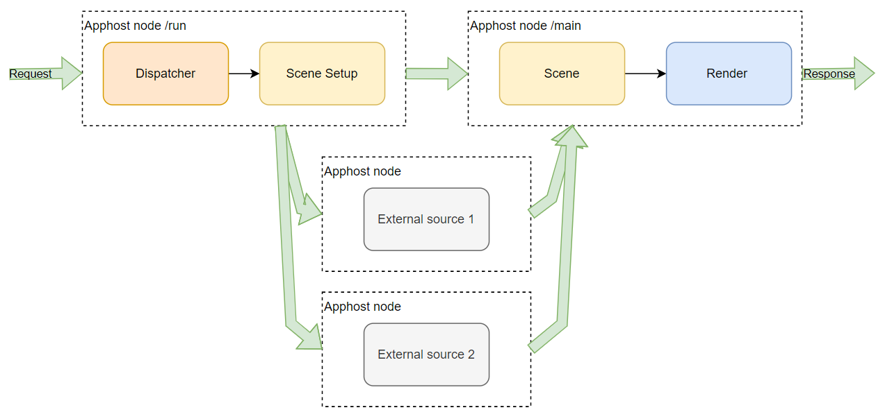
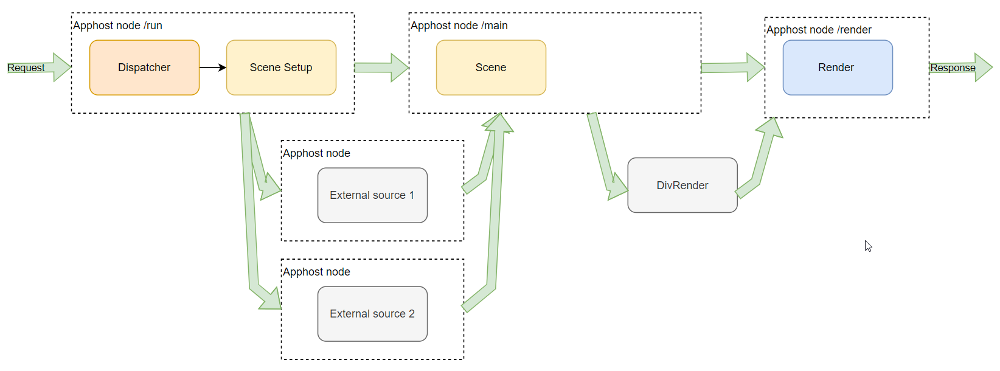

# DivRender

Hollywood framework поддерживает использование отдельной ноды DivRender между нодами Main() и Render().
Для того, чтобы воспользоваться функциями DivRender, необходимо:

* в графах аппхоста описать дополнительную ноду `/render`, соединить ее с нодой `/main` (см ниже);
* Изменить задание локального графа сценария;
* В главной функции сцены `Main()` кроме задания аргументов рендера также задать параметры для DivRender;
* В функции рендера получить результаты DivRender и смержить их с основным ответом.

## Дополнительная нода аппхоста 

* Регистрируем новую ноду (по умолчанию называется `/render`);
* протягиваем в нее напрямую данные фреймворка (`hw_scene_item`)
* добавляем поход в DivRender
* результатом ноды `/render`становится `mm_scenario_response`

Пример типового графа сценария:



Пример типового графа сценария с подключенным DivRender:



**Если ваш сценарий уже был в продакшене (независимо от того, ходил ли он в DivRender ПОСЛЕ рендера или нет) - см ниже раздел "Совместимость сценариев"**

## Локальный граф сценария

Требуется добавить дополнительную ноду рендер: `NodeRender()`.
Приведен пример для типового двухнодового графа 

```cpp
//
// Было
//
SetApphostGraph(ScenarioRequest() >> NodeRun() >> NodeMain() >> ScenarioResponse());

//
// Стало
//
SetApphostGraph(ScenarioRequest() >> NodeRun() >> NodeMain() >> NodeRender() >> ScenarioResponse());
```

## Задание параметров для дивного рендера

Задание параметров для DivRender проводится в бизнес логике сценария одновременно с формированием аргументов для обычного рендера.
Для того, чтобы задать параметры DivRender, надо к `TReturnValueRender()` добавить вызов `AddDivRender()`.

```cpp
//
// Было
//
return TReturnValueRender(&MyScene::MyRenderFn, MyRenderArgs);

//
// Стало
//
auto ret = TReturnValueRender(&MyScene::MyRenderFn, MyRenderArgs);
ret.AddDivRender(std::move(myDivRenderData));
return ret;

// Или более компактный вариант
return TReturnValueRender(&MyScene::MyRenderFn, MyRenderArgs).AddDivRender(std::move(myDivRenderData));
```

**Фреймворк не позволяет задать параметры для DivRender при иррелевантном ответе от диспетчера**

## Получение параметров дивного рендера

Результаты работы DivRender доступны в функции рендера через метод `TRender::GetDivRenderResponse()`.
Метод возвращает константный указатель на `TVector<std::shared_ptr<NRenderer::TRenderResponse>>`.

## Совместимость сценариев

Для обеспечения совместимости сценариев, которые ранее работали в продакшене, требуется более аккуратная поддержка графов. Порядок работы:

1. доработки по локальным графам Голливуда
2. доработать и выкатить графы аппхоста
3. включить новый вариант DivRender, выкатить его
4. удалить лишнее, добавленное на 1 и 2 этапах.

### Доработки по локальным графам Голливуда

Перед тем, как катать графы аппхоста, необходимо добавить в конструктор сценария вспомогательную декларацию для корректной обработки новых графов:

```cpp
SetApphostGraph(ScenarioRequest() >> NodeRender() >> ScenarioResponse());
```

### Доработки по AppHost

Для сохранения совместимости со старым вариантом сценария при обновлении графов аппхоста - требуется временно разрешить `mm_scenario_response` из ноды `/main`.
Это позволит старому варианту сценария (где main+render в одной ноде), корректно выполняться на новых графах.
