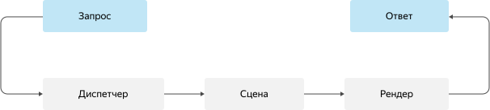

# Обзор

Пользователь отправляет Алисе запрос (request) любого типа:
* голосового;
* звукового;
* текстового;
* графического.

Сценарий обрабатывает полученный запрос и возвращает ответ (response).



## Основные функции

| Функция | Описание |
| ----------- | ----------- | 
| [Диспетчер сценария (dispatch)](dispatcher.md)  | Анализирует запрос и выбирает сцену. |
| [Сцена (scene)](scene.md)  | Обрабатывает запрос. |
| [Рендер (render)](renderer.md)   | Переводит вычисленные в сцене данные в ответ и/или дополнительные директивы. |

## Регистрация функций

Опишите диспетчер, сцены и рендеры в конструкторе сценария.

```cpp
class TMyScene1 : public TScene<TMySceneProto1> {
public:
    TMyScene1(const TScenario* owner);
    TRetMain Main(const TMySceneProto1& sceneArgs, const TRunRequest& request, TStorage& storage, const TSource& source) const override;
};
class TMyScene2 : public TScene<TMySceneProto2> {
public:
    TMyScene2(const TScenario* owner);
    TRetMain Main(const TMySceneProto2& sceneArgs, const TRunRequest& request, TStorage& storage, const TSource& source) const override;
};

class TMyScenario : public TScenario {
public:
    TMyScenario();
    TRetScene Dispatch(const TRunRequest&, const TStorage& storage, const TSource& source) const;
    TRetResponse MyRender(const TMyRenderProto& renderArgs, TRender& render) const;
};
...
// Регистрация функций в конструкторе сценария 
TMyScenario::TMyScenario()
    : TScenario("my_scenario")
{
    // Диспетчер
    Register(&TMyScenario::Dispatch);

    // Сцены и их функции
    RegisterScene<TMyScene1>([this]() {
        RegisterSceneFn(&TMyScene1::Run);
    });
    RegisterScene<TMyScene2>([this]() {
        RegisterSceneFn(&TMyScene2::Run);
    });

    // Рендеры
    RegisterRenderer(&MyRender);
    ...
}
```

Кроме указанных функций конструктор сценария может вызывать и другие функции:

* Задание параметров для аналитики (PSN).
* Загрузка NLG файла.
* Подключение FastData.

Полный список в разделе [Класс TScenario](../details/tscenario.md).

## Регистрация сценария

Используйте макро `HW_REGISTER()` для того, чтобы зарегистрировать сценарий в системе.

```
HW_REGISTER(TMyScenario);
```

Внимание! Убедитесь, что исходный cpp файл в ya.make помечен тегом GLOBAL. 
В противном случае сценарий не подключится к Голливуду.
