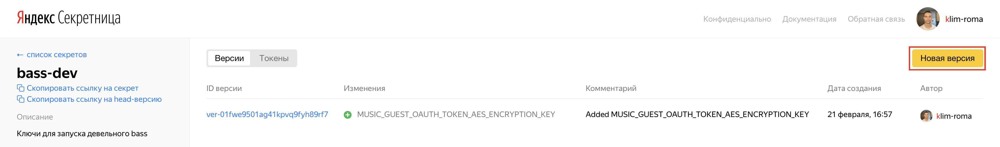
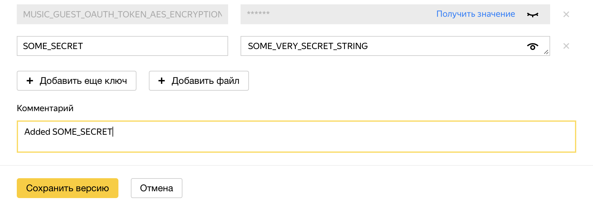

# Хранение секретов в памяти Голливуда

В некоторых случаях при написании сценариев может возникнуть необходимость в использовании секретов. Например, в качестве такого секрета может выступать ключ шифрования для [симметричного шифрования sensitive данных](./crypto/common.md). В этом разделе описан механизм хранения секретов из [Секретницы](https://yav.yandex-team.ru) в памяти Голливуда.

Для Голливуда есть два хранилища секретов, оттуда они будут браться:
- [bass-dev](https://yav.yandex-team.ru/secret/sec-01cnbk6vvm6mfrhdyzamjhm4cm/explore/versions) — используется при локальном запуске Голливуда. Если вы можете поднимать локальный Голливуд, то скорее всего у вас есть доступ на редактирование в этом хранилище.
- [bass-prod](https://yav.yandex-team.ru/secret/sec-01cxsqmp818f86wzv3rkshpctq/explore/versions) — используется на проде. Если доступа нет, попросите добавить вас в ABC-группу [Бекенд Алисы (BASS)](https://abc.yandex-team.ru/services/bass).

## Секреты в переменных окружения

По умолчанию все секреты из хранилища выкачиваются при старте Голливуда, и большинство из них лежит в одноименных переменных окружения. Получить их значения в коде можно с помощью функции [GetEnv](https://a.yandex-team.ru/arc_vcs/util/system/env.h?rev=r3636820#L19).

## Секреты в registry секретов

Для безопасности в Голливуд было добавлено registry секретов.

### Добавить секрет

1. Нажмите кнопку **Новая версия**.
  
2. По новому ключу добавьте значение вашего секрета. Указанный на этом этапе ключ будет использоваться и в коде, так что выбирайте осознанно. Добавьте описание изменения.
  

### Зарегистрировать секрет

1. Добавьте в сценарий инклюд:  
   ```
   #include <alice/hollywood/library/registry/secret_registry.h>
   ```
2. Зарегистрируйте секрет, указав его ключ из Секретницы и значение по умолчанию. Пример для ключа `SOME_SECRET`: 
   ```
   REGISTER_SECRET("SOME_SECRET", "DEFAULT_SECRET_VALUE");
   ```

   Ключ и значение по умолчанию можно положить в глобальные переменные, чтобы переиспользовать их в коде:
   ```
   constexpr TStringBuf SOME_SECRET = "SOME_SECRET";
   constexpr TStringBuf DEFAULT_SECRET_VALUE = "DEFAULT_SECRET_VALUE";
   ...
   REGISTER_SECRET(SOME_SECRET, DEFAULT_SECRET_VALUE);
   ```

Ожидается, что на проде будет использоваться значение секрета из Секретницы. Значение по умолчанию нужно для того, чтобы был возможен запуск тестов без доступа к хранилищу в Секретнице (например, в CI). Конфигурация запуска устроена таким образом, что при пустой одноименной переменной окружения на проде будет брошено исключение. В остальных случаях при пустой переменной окружения будет использовано значение по умолчанию.

   

   После регистрации секрета из Секретницы описанным образом соответствующая переменная окружения в рантайме будет содержать пустое значение. Это сделано для безопасности: идеологически не должно быть другого способа получить значение секрета, кроме этого.

   

### Получить значение секрета

1. Добавьте в соответствующий `ya.make`-файл `PEERDIR` на `alice/hollywood/library/registry`.
2. Добавьте в место использования инклюд: 
    ```
    #include <alice/hollywood/library/registry/secret_registry.h>
    ```
3. Если ключ зарегистрированного секрета равен `SOME_SECRET`, то получить его значение из registry можно так:  
   ```
   auto secret = TSecretRegistry::Get().GetSecret("SOME_SECRET");
   ```

Registry возвращает секрет в формате `NSecretString::TSecretString`, который описан [здесь](https://arcanum.yandex-team.ru/arc_vcs/library/cpp/string_utils/secret_string/secret_string.h). Он позволяет не раскрывать секреты при возникновении core dump. Для доступа к данным класс `NSecretString::TSecretString` имеет метод `Value()`, возвращающий `TZtStringBuf`, который неявно приводим к `TStringBuf`.

