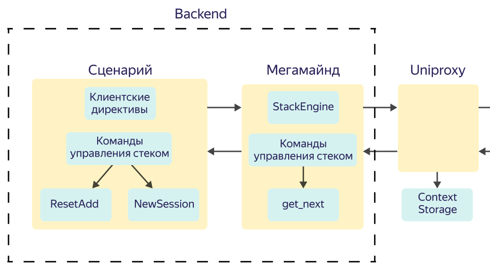
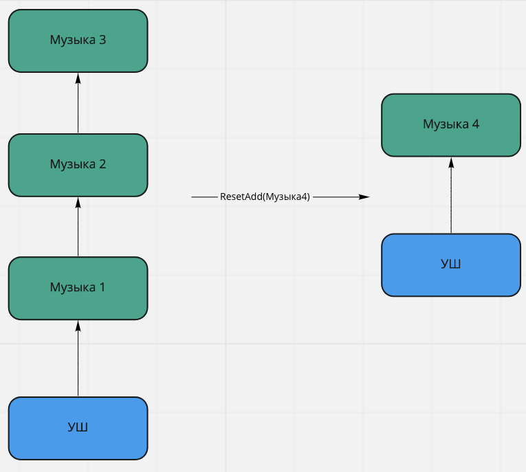

# Компоненты на backend



## StackEngine {#stackengine}

Стек состоит из элементов — items. Один item представляет из себя имя сценария и эффект (типизированный фрейм или callback-директива). С помощью команд управления стеком сценарии обмениваются сообщениями между собой.

### Команды управления StackEngine

#### ResetAdd

[Описание в протоколе](https://a.yandex-team.ru/arc/trunk/arcadia/alice/megamind/protos/scenarios/stack_engine.proto?rev=r8044201#L24)

Команда используется со стороны сценария. Она сбрасывает фреймы своего сценария сверху вниз, пока не дойдет до нового сценария. Далее команда сверху добавляет в стек новые элементы.

Особенности работы: у команды есть поле RecoveryAction, где можно указать callback. Поле использует для восстановления работы. Если откажет Context Storage, callback отправляется в сценарий и тем самым сохраняется ключевая информация.

Пример использования `RecoveryAction`при воспроизведении музыки: музыка сохраняет данные для восстановления (идентификатор трека) в recovery callback. При возникновении проблем с контекстом пользовательского взаимодействия музыкальный сценарий может восстановить последовательность действий по данному идентификатору.

Пример использования команды `ResetAdd`: пришел запрос "сделай шоу повеселее". Уже есть стек с какими-то вызовами. Команда `ResetAdd` удаляет из стека все элементы текущего сценария и добавляет новые.
 

 *Пример заполненного protobuf*

 ```json
TStackEngineAction: {
    ResetAdd: {
        Effects: [{
            ParsedUtterance: {
                TypedSemanticFrame: {
                    MusicPlaySemanticFrame: {
                        // filled frame slots
                    }
                }
            }
        }]
        RecoveryAction: {
            Callback: {
                Name: "stack_engine_recovery.get_next.music_play"
                Payload: {
                    "playlist_id": <id>,
                    "start_time": <datetime>
                }
            }
        }
    }
}
 ```

#### NewSession

[Описание в протоколе](https://a.yandex-team.ru/arc/trunk/arcadia/alice/megamind/protos/scenarios/stack_engine.proto?rev=r7677239#L32)

Команда используется со стороны сценария. Она удаляет всю информацию из стека и создает новую сессию. Команда предназначена для разбивки сессий и для различных аналитических подсчетов. **Если не проставить NewSession, TLT вашего сценария не будет посчитан**.
Чтобы считать TLT сценария используется идентификатор запроса. При инициировании новой сессии создается идентификатор запроса (RequestId). Далее, при каждом вызове get_next, идентификатор запроса (RequestId) записывается в AnalyticsInfo в [ParentRequestId](https://a.yandex-team.ru/arc/trunk/arcadia/alice/megamind/protos/analytics/analytics_info.proto?rev=r7677239#L26).



Команда отправляется в самом начале взаимодействия, т.е. необходимо, чтобы команда была **первой в списке** [Actions](https://a.yandex-team.ru/arc/trunk/arcadia/alice/megamind/protos/scenarios/stack_engine.proto?rev=r7677239#L37) стека. Для понимания, нужно ли начинать новую сессию или продолжать текущую, сценарий может посмотреть на поле запроса [RequestSource](https://a.yandex-team.ru/arc/trunk/arcadia/alice/megamind/protos/scenarios/request.proto?rev=r7710902#L481).



*Как понять, нужно ли начинать новую сессию*

Логика создания/продолжения сессий заложена в сценарии. Чтобы ориентироваться, начнется новая сессия или будет продолжена текущая, в сценарии в запросе приходят следующие поля:

1. **поле [RequestSource](https://a.yandex-team.ru/arc/trunk/arcadia/alice/megamind/protos/scenarios/request.proto?rev=r7710902#L481)** принимает два значения: Default — обычный запрос; GetNext — запрос в сценарий, получен из стека посредством запроса с серверной директивой `get_next`.
2. **поле [IsStackOwner](https://a.yandex-team.ru/arc/trunk/arcadia/alice/megamind/protos/scenarios/request.proto?rev=r8185286#L538)** указывает сценарию, что сейчас сессия стека принадлежит этому сценарию, т.е. последний NewSession вызывал этот сценарий.

*Пример заполненного protobuf*
```json
TStackEngineAction: {
    NewSession: {} // no inner payload
}
```

#### get_next

Callback-директива, которую генерирует Мегамайнд, если стек был изменен. Директива вызывается, чтобы продолжить цепочку воспроизведения. Берется верхний элемент из стека и исполняется.



Особенности работы: команда автоматически добавляется к ответу, если состояние стека изменилось.



*Ошибки, связанные с get_next*

- с клиента может прийти запрос с GetNext, который принадлежит другой сессии;
- возможна ситуация, когда стек пуст (по разным причинам), но с клиента пришел запрос с GetNext.

В обоих случаях Мегамайнд попробует восстановить стек, используя `recovery_callback`. Если восстановление не удастся, запрос завершится ошибкой.

