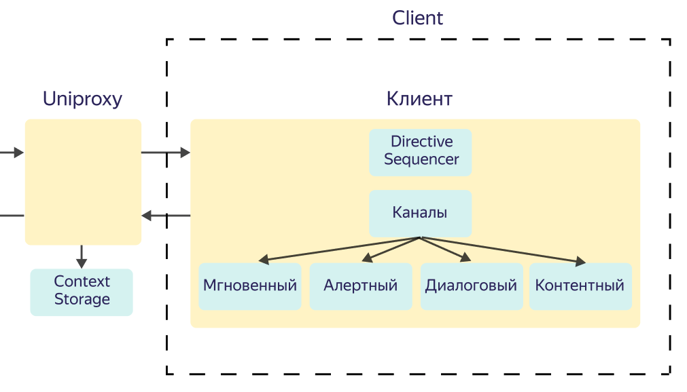

# Компоненты на клиенте

## Directive Sequencer {#directive-sequencer}

Directive Sequencer — точка синхронизации директив. Распределяет директивы по каналам (контексты исполнения). Директивы связаны в цепочку (цепочка воспроизведения разных сценариев).

*Логика работы*

Directive Sequencer управляет директивами и распределяет их по каналам. Когда директива попала к Directive Sequencer, Directive Sequencer выбирает подходящий канал. Если канал свободен, директива начинает исполняться. Если канал занят, директива, находящаяся в канале, вытесняется пришедшей директивой. 



Вместе с директивой вытесняется вся связанная цепочка директив. Например, пользователь попросил включить литрес: запускается директива audio_play + get_next. Все неиспользованные директивы от предыдущего ответа выбрасываются. 



*События, на которые реагирует Directive Sequencer:*

1. Окончание исполнения директивы. 
После "доигрывания" директивы, Directive Sequencer дергает следующую директиву из цепочки и направляет в подходящий канал.
2. Приход нового ответа от Алисы (в ответ на какой-то вопрос, либо асинхронно/из пуша).
Из нового ответа берется первая директива и Directive Sequencer направляет его в подходящий канал.

Пример: Алиса проигрывает трек в контентном канале, параллельно в алертный канал приходит нотификация "Поздравить с Днем Рождения в 15:00". Алиса озвучивает нотификацию, трек уходит в фон (приглушение), но не прерывается.



Одновременно в канале может находиться только одна директива.



## Каналы {#channels}

Канал — это контекст исполнения. У канала есть тип, который зависит от контекста и приоритет исполнения. Логика заложена на клиенте и не может быть изменена разработчиком.

Типы каналов и их приоритеты:

1. **Мгновенный**. Директивы, которые не требуют взаимодействия с пользователем. Например, изменение громкости, установка бортового таймера.
2. **Алертный**. Например, будильник или нотификация.
3. **Диалоговый**. Директивы про диалоги. Например, слушать или говорить один TTS, показывать одну шторку или один саджест.
4. **Контентный**. Директивы, которые воспроизовдят контент: музыку, видео, видеоигры. 

*Логика работы приоритетов*

Если во время акивности какого-то процесса появляется активность с более высоким приоритетом, активность с низким приоритетом уходит в бекграунд.

Пример: играет музыка (контент) и начинает звонить будильник. Музыка уходит в бекграунд, в зависимости от настроек может приглушиться или встать на паузу. Способ "ухода в бекграунд" зависит от активности: звук приглушается / встает на паузу, видео затемняется и приглушается звук, игра встает на паузу.

## Директива очистки {#clear-queue}

Для очистки очереди на клиенте есть директива [clearQueue](https://a.yandex-team.ru/arc/trunk/arcadia/alice/megamind/protos/scenarios/directives.proto?rev=r8410797#L1290). Ее можно запустить с помощью слова "стоп".
