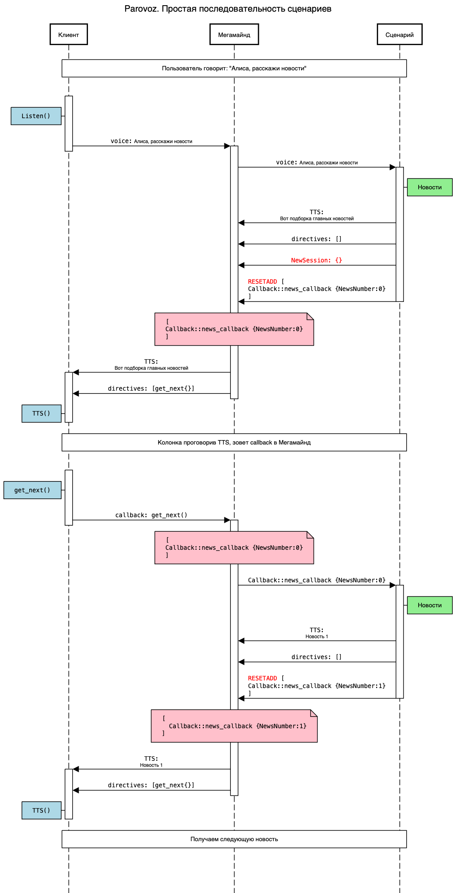
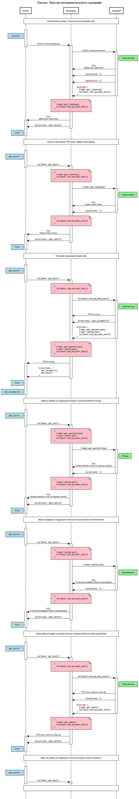

# Примеры реализации

## Новости
Исходный сценарий подготавливает "порцию" новостей. Первая новость проигрывается на клиенте, Далее происходит возврат в тот же самый сценарий за новой новостью.

## Утреннее шоу
Исходный сценарий подготавливает "порцию" контента (например, новости и/или музыка). Первая порция проигрывается на клиенте, Далее происходит возврат в сценарий за новой порцией. В утреннем шоу используется цепочка из нескольких сценариев.

