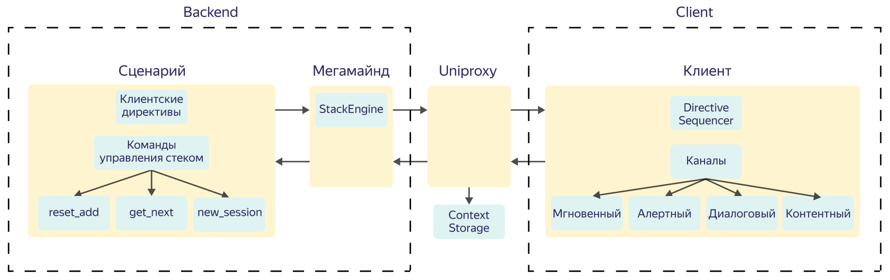

# Общие сведения

Паровоз — технология, с помощью которой разные сценарии Алисы можно объединить в одну цепочку воспроизведения. Для пользователя это выглядит как единый сценарий, но на самом деле это цепочка из нескольких директив. Паровоз является как частью Мегамайнда, так и частью клиента.

Примером использования технологии является сценарий утреннее шоу: исходный сценарий подготавливает "порцию" контента (например, новости и/или музыка), который проигрывается на клиенте, после чего необходимо вернуться в сценарий за новым контентом.

На уровне протокола сценария эта возможность реализована следующим образом: сценарии обмениваются сообщениями через стек (StackEngine).

Паровоз состоит из двух больших частей: [Backend](components-backend.md) и [Client](components-client.md).

На Backend сценарии обмениваются сообщениями через стек (StackEngine). Для управления стеком со стороны сценария используются две команды:

1. `new_session`
2. `reset_add`

На Client происходит распределение директив по каналам. 

