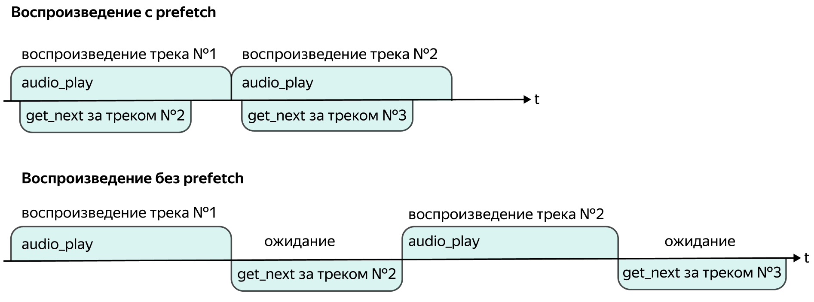

# Механизм прогрева директив

Чтобы между новостями/порциями утреннего шоу/другими сценариями не было пауз в паровозе используется механизм прогрева директив.

Сразу после начала выполнения первой директивы в цепочке, включается механизм прогрева: клиент заранее выполняет команду `get_next` и предзагружает следующую директиву для исполнения. Таким образом паузы между выполнением директив минимизируются.

