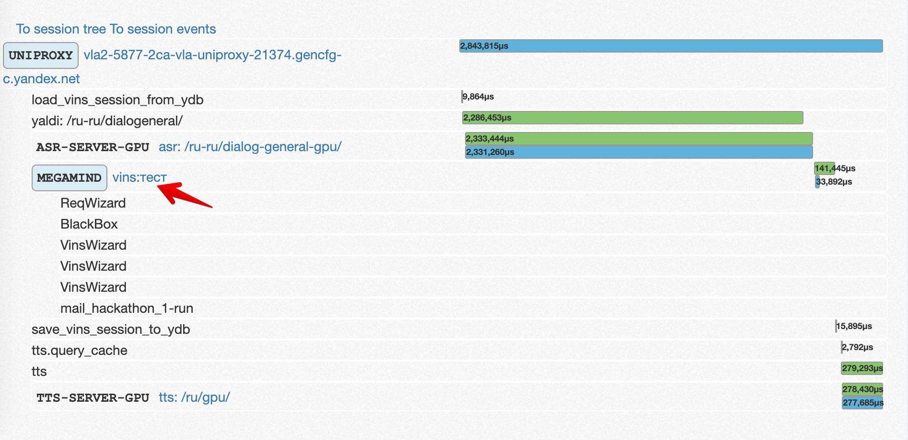

# Сервис rt трассировки запросов

SETrace - инструмент realtime просмотра логов запросов пользователей.

## Использование

Логи каждого разговора можно посмотреть в [интерфейсе SETrace](https://setrace.yandex-team.ru/ui/) (вкладка **Alice**).

Чтобы найти конкретный запрос в SETrace, введите в поле **Trace by** идентификатор `request_id` или `uuid` или `device_id` устройства:

* `request_id` присылает Мегамайнд в каждом запросе к сценарию.
* `uuid` в Поисковом приложении можно узнать, тапнув 5-6 раз на иконку Яндекса на экране **О приложении**.
* `device_id` устройства можно узнать в ПП зайдя в Дополнительную информацию об устройстве.

По клику на ссылку рядом с надписью **MEGAMIND** можно посмотреть логи соответствующего запроса в Мегамайнде:



[AmandaJohnsonBot](../testing/amanda.md) умеет выводит логи для последнего запроса по команде `/setrace`.



## Больше информации

Более подробное описание принципов работы с SETrace в Алисе доступно на [wiki](https://wiki.yandex-team.ru/alice/setrace/).

Общее описание сервиса также доступно на [wiki](https://wiki.yandex-team.ru/setrace/).
