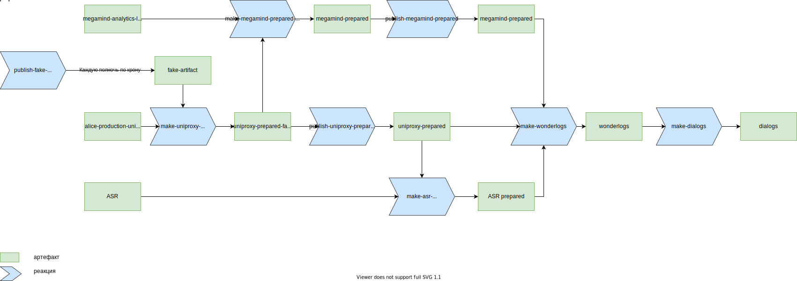
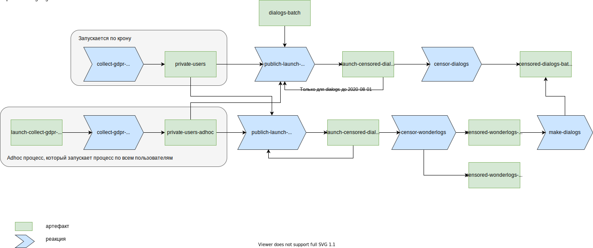

# Описание

**Wonderlogs** — процесс и одновременно схема представляения логов Алисы.

## Как представление логов

Находятся на [YT](https://yt.yandex-team.ru/hahn/navigation?path=//home/alice/wonder/logs). Представляют из себя поджойненные логи из megamind, uniproxy и asr.

Wonderlogs преимущественно подходят для решения аналитических задач, примеры можно посмотреть [тут](examples.md).



Свежая схема всегда находится в [репозитории](https://a.yandex-team.ru/arc/trunk/arcadia/alice/wonderlogs/protos/wonderlogs.proto). С какой ревизией собираются wonderlogs можно посмотреть в [реакторе](https://reactor.yandex-team.ru/browse?selected=6650483).



### Описание полей { #field_descriptions }
1. **speechkit_request**
    1. **header**
        1. **request_id** - идентификатор запроса, генерируется клиентом
        2. **prev_req_id** - идентификатор предыдущего успешного ответа дошедшего до клиента
        3. **sequence_number** - монотонно увеличивающийся счётчик для запросов
        4. **dialog_id** - id вкладки в ПП
        5. **ref_message_id** - уникальный идентификатор запроса, генерируется на SpeechKit
        6. **session_id** - идентификатор сессии соединения клиента с Uniproxy
        7. **random_seed** - приватное поле (для прокачек)
    2. **application**
        1. **app_id** - например, _ru.yandex.quasar.app_ или _aliced_
        2. **app_version**
        3. **os_version**
        4. **platform** - например, _android_
        5. **uuid**
        6. **device_id**
        7. **lang**
        8. **client_time**
        9. **timezone**
        10. **timestamp**
        11. **device_model**
        12. **device_manufacturer**
    3. **request**
        1. **event**
        2. **location**
        3. **experiments**
        4. **device_state**
        5. **additional_options**
        6. **voice_session**
        7. **reset_session** - сбросить сессию, перед обработкой запроса
        8. **test_ids**
        9. **laas_region**
        10. **raw_personal_data**
        11. **smart_home**
        12. **notification_state**
        13. **activation_type**
        14. **megamind_cookies**
    4. **session** - сессия есть только в запросах с флагом `dump_sessions_to_logs`
    5. **memento** - сериализованный в base64 proto message с данными из мементо отправленными Uniproxy
    6. **iot_user_info_data** - сериализованный в base64 proto message с данными из Умного дома. Полностью отсутствует в логах
2. **speechkit_response**
    1. **header**
        1. **request_id**
        2. **response_id** - идентификатор, использующийся для джойна логов Uniproxy и Megamind, чтобы понять каким паршиалом ответила Uniproxy клиенту
        3. **sequence_number**
        4. **dialog_id**
        5. **ref_message_id**
        6. **session_id**
        7. **parent_request_id**
    2. **voice_response**
    3. **response**
    4. **sessions** - сессии есть только в запросах с флагом `dump_sessions_to_logs`
    5. **contains_sensitive_data**
    6. **version** - версия Megamind
    7. **content_properties**
    8. **megamind_analytics_info**
        1. **analytics_info** - информация только от выигравшего сценария
            1. **scenario_analytics_info**
            2. **version**
            3. **semantic_frame**
            4. **frame_actions**
            5. **matched_semantic_frames** - сементик фреймы, на которые сценарий сматчился на Run
            6. **parent_request_id**
            7. **parent_product_scenario_name**
        2. **users_info** - информация по юзеру от всех сценариев после Run
        3. **original_utterance**
        4. **tunneller_raw_responses** - ответы туннеллера сценариев, используется для ретраев в прокачках
        5. **modifiers_info**
        6. **device_state_actions**
        7. **recognized_action**
        8. **scenario_timings**
        9. **winner_scenario**
            1. **name** - имя победившего сценария (с большой буквы)
        10. **pre_classify_duration**
        11. **post_classify_duration**
        12. **service_source_timings**
        13. **shown_utterance**
        14. **iot_user_info** - информация от умного дома, приходит на любой запрос в Megamind
3. **request_stat**
4. **asr**
    1. **data** - первое распознование, у которого выставлен `end_of_utterance` (по такой логике работает Uniproxy с ASR)
        1. **mds_key** - ключ в MDS с голосом, загруженным ASR
        2. **recognition** - выигравшая гипотеза
            1. **normalized** - нормализованный текст с пунктуацией
            2. **words** - массив слов гипотезы
        3. **trash** - флаг трэшовости запроса
    2. **voice_by_uniproxy**
        1. **mds** - URL в MDS с голосом, загруженным Uniproxy
        2. **format** - формат аудио, например, _audio/opus_
    3. **trash_or_empty** - флаг трэшовости или пустового запроса (_asr.data.recognition.normalized_ пуст)
5. **spotter**
    1. **false_activation** - споттер понял, что ложно активировался
    2. **mds_url** - URL в MDS с голосом
    3. **format** - формат аудио, например, _audio/opus_
    4. **transcript** - текст
6. **privacy**
    1. **get_restrictions**
        1. **prohibited_by_region** - пользоваться данной строчкой лога запрещено из-за законов данной страны
        2. **region** - страна
    2. **prohibited_by_gdpr** - пользователь сделал запрос на очистку своих данных из Алисы
    3. **content_properties**
        1. **contains_sensitive_data_in_request** - сценарий решил, что в запросе чувствительный данные
        2. **contains_sensitive_data_in_response** - сценарий решил, что в ответе чувствительный данные



Поля с префиксом _, например, **_uuid** или **_downloading_info** предназначены для внутреннего использования, поэтому их поддержка не гарантируется.



## Как процесс { #process }
Строятся таблички [uniproxy-prepared](https://yt.yandex-team.ru/hahn/navigation?path=//home/alice/wonder/uniproxy-prepared), [megamind-prepared](https://yt.yandex-team.ru/hahn/navigation?path=//home/alice/wonder/megamind-prepared), [asr-prepared](https://yt.yandex-team.ru/hahn/navigation?path=//home/alice/wonder/asr-prepared), [wonderlogs](https://yt.yandex-team.ru/hahn/navigation?path=//home/alice/wonder/logs). По данным таблицам можно построить метрики потерь логов каждой из компонент. Также метрики сломанных/невозможных логов и т.п.

### Пайплайн построения { #pipeline }
[](https://drawio.yandex-team.ru/?lightbox=1&highlight=0000ff&edit=_blank&layers=1&nav=1&title=alices-logs#R5R3bkqM29mtclTzYBeL%2B6Es7W7XZpDezW5l5cskg20zbyAO4u52vjwQCS4Ax2Ny609WFQQhJnPvRORIjZX54%2F8WHx91%2FsIP2IyA57yNlMQJAVgEY0X%2FJObMSy9Dikq3vOqzsUvDF%2FQuxQomVnlwHBULFEON96B7FQht7HrJDoQz6Pn4Tq23wXuz1CLcoV%2FDFhvt86Z%2BuE%2B7iUhMYl%2FJ%2FIXe7S3qWdSu%2Bc4BJZfYmwQ46%2BI0rUp5GytzHOIzPDu9ztKfQS%2BASP7e8cjcdmI%2B8sMoDvz1DNVg8%2F5iHvx03r7IF%2F5DRmLXyCvcn9sKjhTSaRseZFB3l6DiLjuZoIY9MPTrORmBOHo3KQXIyjY5PUQXAnUvsEXrUosrRCbuV9rWISpbJ4%2BQosxL2SNpmPCRSMhf6ZcPgBxAfNa7NWdKazN2SuMomd%2FeJe8GoMDsScm5wYzCTMRhcs1rydmnjy6Ta8sobGULvDERpvxpXnzb1E4cqjT0vdCBxaDCTcaRwn4mvmuJVjeorOTqIu7B%2BnrCKFn8zflThmlRzQ0gRuuBeKh7RXIRwCRGmd%2BccQlN0mLlGNK5ydJIlDIkbRorNeRGmplyzRkLbGUzFtGFxbWq5pniEcgMAebTw8AQp3JUc3AHHSDPxhacc0SSES4WGvicCZLYmJ1t68tOJyNzovXV4OJICbx3QnwMKAiLuVq7zc%2FIMkTbpYxMm5sJzIjt9fPIcRMWPTO6%2F7dwQfTlCm959I%2BqClO3Cw57ddmCwS%2BvSi2cYhsj3ohIgqaR04%2B73c7zHPinzsEfamb0iP3SJtJ7u3S2tusZhiA%2FRyLLSMRF15An0zhUxafkLwgcU%2BmdShd0FKpPcTHelkvztogjSOjtOCagaK4RM%2BWzTti%2FymZwwEV1DXCs5GCOHqCt2if1wh7fYg%2FunS%2BnsggWJXF3q%2FIrxkYH7OwrDM9O98BRiETMEgv75K3s%2BuvhGLyZacrl4528uzuwqCH38ghKEjYAiRX9ZXF%2FFVIBPvo1KoKEzewD6WxSW1FOZSqawKkW8j%2FYwdF9F1f8IEjf219m%2Fn41fFcv2Vvho%2FA5%2F%2FDlWPxISCyHXLrpM%2FUHsRI9OfR%2BeuQpH7HphwLX8TAsu3C5LisjuqmhPkZO4yQvi07HdTwuJmTsMYjCGSA19EINlibTAnJY7SeH%2FAfJ%2FX3%2Bn7gmQ9nCN9nGrAVGoLvaCuKu9673E5bswpN7NlHYIludwcoYE3%2B%2FjEMHDxD%2BRsh3ceeTHg6%2FuloABE9W3PCYOB31oR4ZDfl6xa9Nfx4V7vCUnly6Zbo%2F7LlU6PDsymi5U8tJtJc9rcKIQNhuk23aRqnAMax2piq0PHZcQF3dvJi8Wy%2BpqpLrCtzISAEjWxOL%2F1Jz%2Bl0GB%2Ftfrq39yyVFJHQGi9ytAJooKRCEiSeCGFImunpHvEqggv3nRYlYVLY%2FKlivIvMbv6JW8SjBG78c1fkctsj3cZ9j%2B6CMKSGdFLoPVZQDVhQAPqmaFgKMh01GLhIAJ1oquFwgBZvw3wPKynJH0St7G75LHC2HPzFdukubiokmCV9arJNAEOVDJkriHuxOTqTlrvtgGUBQw0UR9YGWQHksY9lwG7w0Yh9qQbMMOTcMEwzcFuKb0YRxmrQQrM%2B9aXp283UN%2BxTXlckBbeHA9ZwwJts%2BhawdjKuxbUDJxs8u0w1jFyE4ddSJLHHyb1SdraJuOUqRPgKKqmtOM4tAzRKAPUG%2FICcN1K0De3fArd86JD3J1kR70QrAI7xY6d8kYUNVIBE2rm4dmAC3jXmOAEHYoYgqySVObQI%2Fa4bnZ1IPrODFRoMD9C66jpijcmYgk7WqzkbYgJZEkmkH7ZRsRkODk0b9CZJVSbY4X0yAfG8iIj6MV8ehYmgBVVQVGZe7SvbZBUgVvNgFqRen37M%2BJ%2FAe61PpVObIfrS9nZge1cq0vZ7W%2B3MoUUuTpjY8%2Bdk421dXjk%2BeSq%2Fdze3q%2FpMu6RgD4XEaAWhAg6t8I0HIKI4oc8pH6NI6ZRioXYgz0amCvlTm%2FBjBjytmpvNYwUxENeh4NWbBS1Xms%2FvK19WGGXI0Cm1XRCoACWgNK3pjpn9bK0XebAjloFgWH2wOmWcjojJXTvAMuBYMlQcQZHlFOAEgzINL8l5L8lDQ1hM%2Bh4BN20tSPmZj0kab8pPX5xA1NSNyomKxx29oVaYBNIRakFCRW8R5twjKbuIgURWJtnrbYXaMgEcFsidYKjdQ8mw45alnskRrlLmmDlq1S1bJVrAct24eQ2nNyCedsfONv1kIqGB5SH81mqBlkimM%2BHcSUX10aRk68grTb6ua%2F0p75%2F2BguQED1NAyvoHUr29QHDzuRY43yYRVs0jakqzXuJBOyQUr19vgLCOW52cc3MAmP9nHy%2FmowQSNHL%2FotonWm%2Bsx2AzjNclClpHxV%2BQButeKMSRTqL35csWqyGmmUcjffRk1%2FaJnTNNhTBFHuqzfMm1azo%2BpjEsVtIO62wlxhMcJiwPJhr7Thi0TEiMFLH28xuE4EsLjH5BLj1vR7les8xoWDa9lmrVolssnfT6%2FYbc0nRAnJ7HqNHrSswgutmKG5bjcynzp2xtVqzousSTvS3DLvWS%2F9ALnjtMQgxc3Ar%2BPbHw4IM%2BJJWR7wvZqMjIdyEocRn2hKyipz5yaOFatiaVKlz9NG549rDJhPKQ4h9V3nCPJQWgrztEknZZjdbjhD7Uozlm4TnchrhVuMNgB2ImVLIrNIvkDRSVqoHwoUQnZ6tcQvMcXb8bUMAZqatDn3BfiWUkHvHYJvCklQD9cIxh2YGmwuWm%2Byxp2BW%2F%2Bdm5XtGFAKIOcg86nl%2FxDEt7UylNqPTkIjhvYmNBbG8lkpT5BsOK6rsGx7U2%2FDMsTAIOchul5XTuXB1B9AVIjjKwpA2Xk0D243jbCSav6NllvGBwRcqhrt4x7XrF%2Bq7OwkNv7mVl4LA9xpaFWwVHt2nsvgFO33rtW4Fk26b2vZcfZSEWEKUuGYtVw01P0DddN1wryYLO7IOV3y%2BITA2UhNXnBb6uU3y8pb1x%2BIBe8Bjp7cMGLh1who7drAVLg9XQsQAoycxsVIPcsdihH34AFSH41PDcVNxN3G%2FzMwqE6qoYyPzcoT7%2FLrY4Yu9%2FOt2gp4npjem4cT87FC7kb9xHS5eL5vmquF4vh2Ipz0Mt6MdkcoAug55XVEHcbuYeZ7%2BLdqpN0hlooMbpj5umXP1rg3sw8HQx8tq3E8oj8sQPPVfi2vXm5XvhWG2IiaqLdy4zMzhJo7uE0o6qWNLWeOS3d%2BSTZVqs9vktm1t4wacAfcbuuiH2Xk0aDevP6HMW1WY0G%2BE%2FJbrkzxN1WjL7TEI1a66ceYFT1ozBqpBKlHriUqsk6DKp%2BMgbVeo40F0P5I1q2NwPSSToxt%2FYxZf8b6cR37a1ZVUt3Zg9XQ76Z%2F9LFNeQTkpxFZbGmXfkoOGIvoHd7lvD3rZC9bL71jaeF3ggDDIowrEFtuNSeI1sZP71r7ct%2BQn2o7qT3OvrbbHFi6p7gYH39DUT9rfQ8M1WcYPLxGLWZ7ay1ipwrLKjvgFFjnmln1vgae172NijnSK01jtyYNireW2BtanRbuEY4UsusvFMsZZIklHfDlNewvmCpelJ8jOb17RvJRQTAB%2BjlyYBIWtpBGh%2BwaeZfshQeviB2tbosDCXDX37H67mPIrL5n3tA%2Fz3RPEFl8e1p%2BkcaTiB1nuNPu8lpWfRpt5jRE7CVE1HVhfXNfN6oAaqRdf1%2BstHAJNmQqx3KmUOfaFPJJjz98jjBsIVi0e8qbnNlh37HJFI1SXw4JKJmfHVdJiQicV%2B5GAi1TGefXLpU%2FaTCgEjHtATSIXbixALcikTQMe1UNBx73qNjIllAtB4lcNN5b3kPiCQddXA5y6%2Bug3B3a4OS7qpnIVh89tlnTlEeZIayBfrg5eufMrxrN4cHFy3cxe%2BV1yh0Nf1TUXb%2FU73%2ByggT5FFXAjr2%2FWzs2TBsUVanXS0JBx5WZMh0lx7Xx95q7UPP3lH7nw2ihgRvcJFJA4I347IV7FbQotQd0V2QcMhV577krjz9DQ%3D%3D)

### Как запускается { #how-it-runs }
Всё построение происходит в [реакторе](https://reactor.yandex-team.ru/)
[](https://drawio.yandex-team.ru?lightbox=1&highlight=0000ff&edit=_blank&layers=1&nav=1#R7Vxbd9o4EP41PLrH98tjmkD2nN1su812t92XHIGFrcYgjiwC9NevbEvgizAmwTaQ5sGRRrIlj%2BabGc3IDIzb2fqegEX4gH0YDXTVXw%2BMu4HO%2FkyP%2FUsom4ziqE5GCAjyM5K2Izyin5ATVU5dIh%2FGhY4U44iiRZE4wfM5nNACDRCCV8VuUxwVR12AAFYIjxMQVan%2FIp%2BGGdXVnR39N4iCUIys2fyFZ0B05m8Sh8DHqxzJGA6MW4IxzUqz9S2MEuYJvnx6WfkbGAP08DLEw%2BmfX%2B6%2FrpTsYaNjbtm%2BAoFz%2BupHW%2F%2BY9MlT%2F57avjeiz8bMerhRHJu%2FG90IhkGf8Y9XMaEhDvAcRMMd9SPBy7kPk8eqrLbr8wfGC0bUGPEHpHTDhQEsKWakkM4i3speg2y%2B8fvTyvek8sES1bt1vvFuw2sN%2BcD5FeMlmcCal%2BcLTQEJIK3pJyQi4UxOqDib7yGeQTZL1oHACFD0UpQ8wAU42PbbLRIr8HVKq19jSD6NfyQw0NUIjGGU3TqDAZihua8AxuUNRZNYiXAQZ8%2BP0Pw56xZSmoDqJnm8PiIQTCgmHzaALdZaoRDMPpAlaxgnoIJpjxhHyWxHCyHrI%2FbcKZsPJKwcgnCekeJkotJJsIaYsqFmrGCx5mxOtTLn5ZjHZTQnfkXhWoWIwscFSNdxxTRUUZCmKIpucYRJeq%2FhW9D1TUZnU8LPMNfi6mPDto8WoRdIKFzXrrlo5UqCa0nN5PXVTudoQpGEOX1jq0dLCavmBOUIsLt6H2A%2FMWg1oyFqXa1n1IIITaCyINhfTijCc2U5R6y23nSL25ppHA3djPlXjl3DOUPs6twGvYBoybldAXPA%2BL94I5O2jhgYi8eqtcxTNKfIPlvCPsOSsE8%2Fnn3NeGWoh3nVsqgGBPiIrYBom%2BM5lEpw%2FWIfFuEck81OeaxVecxY%2BVEdMI652TWjWGnZFK3sesNby2vC3pUWGV9kMGdifjU4iem4YM6qEZwmT0j4htgW4IaTZ8j3U2MmW%2BeiJJx%2BhdZi31RBhe52uWLeNVh%2F02lq%2Ffv22W8ev7Rh518ws%2BYUTsLEsscku%2FLdwGjK7giVBSSKDzYKb1AyVX7YuGe8vXLjbun9Gnf00wx%2Bv%2F9LQ%2F95D56ORmQy%2FqxoVn%2FQLAHklFiV7K%2Flr2%2FIV7D17fSCwORt%2FbcB1RjFMGKDpGth25ZhmFYTuJ1wH7wfVvuA2BbcLPUCNsKe0wfe4BrRb7lyLubFaruQV1JpKeJliQjsIfPpmedgPtXTAFRuSdN9Mfu%2FwuwuIjbLMXkqDlorSFaeK1eDYde6AJvpXaPJtKyGJtNtB40N3ZVeeC%2FU505lfs9rzBr12e161aQQulOfIsa3dXGUKYhpZ2pUDL%2FVpU%2B74esVqnU6hXo%2BexDDuIAIoyY8t3eZC7SaBha8vgMLeaB1BOfykPUQvtIwgnsBGHb62dicB4RtSbyhNjDRXz4fPEOlEoXo1kQnc3gSczjaTtv1wYs4BIukGFOYIHoBCWK8goSTPu%2FqhzXAGopTRRKNMJlAazqVaQTDNjzDb9Oo66VIhyFRCLKcjNulQuBB%2F%2FNPGzpqlX3StKHRVoLEMau84smsLI1VSmDZadlNy6MKVy8ombUVkstJZjmS9GN5Bc5bCb11JfKJX6tDlLjv%2BcSg2zR%2BKgID%2FboY2yjAQLejRJeMCSsFSalHp%2BPVwQG3Ptp63ng%2F0TakFJo17DN0OjyjDxVxaqg33U2InEq%2FUE%2BS%2FftR3i3Aj0yiuL%2F2ErZdyrho5whr9wpgLRKbh2HtnAOsewj2pRA%2BKuKX8fRdA9jTz8suS%2FN2QjivK2fqSQy1%2FPX3RCRaBbCPQPfoLQxaD91ftlfTy9m5c8Qud6lLx629m1xUKotHmWk8ykivQ3ZHShyl12F6%2FZhe7wSFdXPS6225s54Pdqm5J9zxIS5bmciPNjTVJd2qksVyHKE4ZJt1plKqbj4gFE3BpJV9%2FOs%2BLNJKjv9%2BZl%2BQ7pFEvZsJXvMouC47Ltm37jGvEel6w32A27Hbn0L8NIAuH0xWTcdtAMu8buspf396pGmlHbZuSYDW95lG7dId9P1nFZt8BtCxfy6MauWsXGfOehL3fgphxGxbUuUTqgbIG4A2fyD0fdpS07sAN16rpimvAOEiWtnws4K%2Bzi3rvTBffm5ZtLR%2BbvltC1aIzfdxbrkzXfwapVuwWD19%2FnF6RWqX9iR9n3SUs76XYwit41Ly4ybyji0p0kO%2B0ok%2FnXy7r1Q5wdgEtvW%2FYvIenCVbHFCpO7woO33XqbN0YZ9ptqgXmmYt23KwOvqU%2BphEx2uAX5%2BovFB7Xf5cs%2BNPrveJRteZL2nS63Ai8HoiXGa%2Fv2OVrNX2tzDT7rlfFDWG%2FwM%3D)

### GDPR { #gdpr }

[](https://drawio.yandex-team.ru?lightbox=1&highlight=0000ff&edit=_blank&layers=1&nav=1&title=gdpr%20wonderlogs#R7Vxbc9o4FP41PDrjO%2FBICKQ7s9l2Ntt288QIW4Abg6gRAfrrV7IlWzayMamNSLLpDLWOZVk6l%2B8cHUnuWMPl%2Fj4C68UD8mHYMXV%2F37HuOib5s%2FvkP0o5JJSu3k0I8yjwE5KRER6DX5ARdUbdBj7c5CpihEIcrPNED61W0MM5GogitMtXm6Ew%2F9Y1mMMjwqMHwmPq98DHi4TaM7sZ%2FRMM5gv%2BZsNlA14CXpmNZLMAPtoJJGvUsYYRQji5Wu6HMKTM43z5%2FLLzD3ADgoeXERrN%2Fvr7%2FutOSxobn%2FNIOoQIrvCrm362Zvfh6umLcWd8v9863eWjO9YsO2n7BYRbxjA2WHzgHIzQduVD2orRsW53iwDDxzXw6N0d0RlCW%2BBlyG7PgjAcohBF8bPWzKH%2FCH2DI%2FQMhTtu%2FEefQCss0JM%2FQmcdgxGG%2B4IoT%2FDBSIVDtBqiJcTRgTzHWtFMnQn0wHWclXeZfliuk9AWom5YrCJgOjlPG8%2F4Ti4Y688Rg9WwGEAYzFfkOoQz%2FDakknKcScXWj6XicAHkpGI3IBXnm40nff2fmev3x%2FjZWjoPA63rHgkB%2BgRcWBFFeIHmaAXCUUa9zcSkk1JW50%2BE1kw4PyDGB4aUYItRXnSEi9HhX%2FZ8XHiihRuHF%2B%2F24s27AyudIwYyJrSNPFgxeIaCGERziCvqcbiknBEU4ljQEQwBDl7ysNy4JZmWWpllYnrKSUkuM7gPsPAYKT3xFsl19hAt5OVcYHe7gpdyutuOmL9uYPR5%2BoOGAqYegikMk0fXUfACMNS25P4maTUMVs%2FJzQXGNJwY0EbNcQSBh1F0cwBEqnsNQ7C8ibbkxpSGEzCusUEh7eN4zb38mECmR%2B%2FtEHkqCtGcvGU899cR%2BY%2B9fCK8vBI5%2BgJvmNZKkVw%2F26H6Duz5tgy6e%2BbUiqH7PH04gvJSiDYLbrN7DNCGKQFo93x8JkVBD%2BTmv%2FnRW83Rz28P5pq4pp%2FDP8bzT5oknCFMHsS%2Ft6P497ZD%2BNobxtcDRifdphe2UGFMY94AJHog3qa16T9N72k6N6qrQBvjsh7CVuci4kcHUQQOQoU1ClZ4I7T8hRIy%2FU2jhwOP8QoBc6G%2BpVfWJxdJDzIFTofyG%2F5LhUK17VJkmiIdfUuhQ5lPCcF25S00D642KIK%2Bltr7Zb1L0o0J78Yk141KP2M36GjKHUqZC2rL0dhWfiqg2tPIJwfdDzw5cOtCv32p2UFp2LidEstbaMzUO6Yb0gnxlNidO6dXqo0%2F7uBmMXk9CLjVILBZgDW93GBILX4No4AwE0aM9CUrnw5F95Bn%2BCShqedBZzaTIYnlWn3LbzM0Lbj2FAlExLAliNG7YGyqxLW%2Fdmb6esCQjp1nfq8mm1CGF8zstCnA3uLSWMBePhFeXqlRIm%2Fejfc37bwtG85FvX%2BZYqR%2BIhOcGiVJPUR2s7bCOM0pzPXkJboF8E%2FneYrCRfnMxlaB%2FlIwbRDW3WNYl47ebgfEa7LeeUuRuuKUcF0xn4SXC%2FjqBAk1ESRVQPGk2IFKCHY%2FfLDuOHm8tiXrr6nTv0CwLgeN3nvEa0MSh0uHr8sl2JYlL8EzVDUBp%2B%2BWz7YrWPihDbjXr2HAsqX6Zgz4ZISudA5XTODIYvOTJqdoMtf8to5eAetVp3LlWP8GU7mN%2BIjyNZjrcxEs2FPkJFikJ3UTJ1ey3oKXaN703eJ%2BAcU5WamYlEwN27Zg%2B9iCT4cyFzNhSQpNIy0CZY66mEebZL2p1B0xqaEomda81RaTafZVJtP4jux3Zbbdmo63Lxeg%2BhVUdYmYskXUsszMyQ2NH9NlG3Umdq7qzIySHb5tG79kQ8XJ9OHlM%2Bl9FawXlrDt%2FBr2Tb%2FXO5VOpyXBOK8hx15XAa5h2%2FWVbpE7C9ivYJNc81ht69cVqEm3c%2FA%2B1TvX1EqgPI%2BAH8DsMNMKrWCLuVHNKgTQriTjJZv1mueLpaYMjGMZ0H3serzNPflNKE58bfO7yf74%2BG5RZoQZuMowGJNFaTFS4WAaZWzggXDAyMvA92OvIdODvKa0JsHUQiokmEY8FxFh1zxtRnPCnfVv8iQ9hQumvNmSLF%2BZtnclp%2FYs2VpeE0cp5bySHQFJFD1R8YJyu%2FF1j5%2F5eBOKXq0k9TfOKNdrCTQVJXB9864mJSE6BcmJ49YOHHN7f1%2BTKK6oqoLomrxXshVMPudJpzlK5jwyeZ3e4v7qA2NHJ7x6JekO3kIyAPZQJvVzD54VXmP1q8%2Bdmf3K%2Bp0zz53VOlCrAX%2BBvM6l03bisdqJ0IVq%2B2lwpfx6Eu%2BF1TLV0zk555V8EKF1FHJqotCFE%2B8eCkNC1KixSNLuEfy5hRt8%2BaXwpFsTWpzkO1GtPNWbz68vzmvhIydGN2%2FlV7kmbr71rY%2FyUdVdXiub8io2czUeWmrs9T31%2F0tqRyYvXVNTbfI82HhnJl93TcVUtKgiWr5aO%2BfrK79n7lfw2Zs2vkxmv4HQnH8yQUilDRKxJcnOsZAEHQmJzyTnb7Bfc8jrD4SapnCdrBfcxpQ%2Br9wVsqrJiyzebNqULrzOPLNXaWXxYz2m8IokrTss1ix%2B7qcr0MVFEFNohH%2F9hzV4Mh%2FM87we0bHYVZVmeolNBr9YZp1aAEsbkHad245zR9siELnJvFh7Gl3Yle0YxxrNsw6NZ4Ll6useqS%2BVQP98zcoUZ1yiOIO80pHfO9by%2B5R2cVePKcOvhpYkqetJP4ia5Kayz8pao%2F8A)

Пайплайны для старых dialogs и новых из wonderlogs различаются:
* Для старых dialogs заменяются uuid, puid, device_id на рандомные
* Для новых dialogs работает механизм приватных данных из wonderlogs, когда затираются все поля, помеченные флагами приватности

Пункты которые есть в нескольких процессах, назовём его Перемещение:
1. Небольшие проверки:
    * размеры временных и текущих таблиц различаются не больше, чем на 1%
    * количество строк одинаковое
2. Временные таблицы заменяются на текущие, текущие бэкапятся

Пункты которые есть в нескольких процессах, назовём его Отчёт:
1. В таблицу по каждому puid, записываются таблицы dialogs, по которым работа проделана. Также ставится пометка, если работа по юзеру проделана.
2. Если работа по данному puid проделана, то отправляется отчёт

Реакция censor_dialogs для старых dialogs состоит из:
1. Создания новых временных таблиц где uuid, puid, device_id заменены на рандомные
2. Перемещение
3. Отчёт

Реакция censor_wonderlogs:
1. Создание новых временных таблиц wonderlogs, где затёрты все поля, помеченные флагами приватности
2. Перемещение

Реакция make_dialogs:
1. Создание dialogs из wonderlogs с затёртыми данными
2. Отчёт


### CI { #CI }

Ревизия обновляется по понедельникам и четвергам в 10:00, изменить частоту обновления ревизии можно в [реакторе](https://reactor.yandex-team.ru/browse?selected=9491062).

### Особенности { #pay-attention }
1. В wonderlogs могут находиться запросы без Speechkit Request, например, споттерные команды или запросы, которые распознались как трэшовые на стадии ASR.
   
   Фильтры:
   * запросов без Speechkit Request или Response: ```speechkit_request IS NOT NULL AND speechkit_response IS NOT NULL```
   * ложных споттерных активаций: ```NOT spotter.false_activation```
   * трэшовых запросов или пустых распознований от ASR: ```NOT asr.trash_or_empty```
2. Для споттерных команд, которые потом не превратились в запрос в ASR будет ненастоящий message_id
3. Для запросов, которые дошли до megamind, но неподжойнившихся с логами uniproxy, может отсутствовать message_id. Для таких запросов будет сгенерирован ненастоящий message_id
4. Начиная с 2021-03-20 логи делятся на роботные (прокачки, из внутренней, но не стафф сети, беты) и продакшен. За пересчётом можно следить в [тикете](https://st.yandex-team.ru/MEGAMIND-2438)
