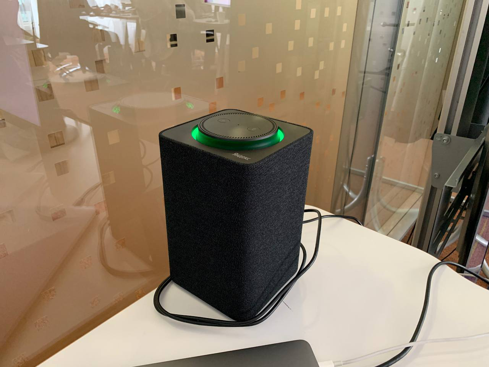

# Что такое колоночное уведомление

Колоночное уведомления это аналог обычных push уведомлений.

Если у пользователя есть непрочитанное уведомление, все устройства пользователя, на которые он разрешил отправку уведомлений, и которые подходят под фильтр уведомления, подают сигнал, пока пользователь не спросит "чего нового?".

Например, обычная колонка мигает зеленым:



## Что могут колоночные уведомления {#how_to_use}

Колоночные уведомления не зачитываются в момент их прихода на колонку (максимум проигрывают звук "дзинь"), чтобы Алиса прочитала уведомления, её надо об этом попросить.

Помимо текста уведомление может содержать действие, чтобы оно выполнилось, в тексте уведомления должен быть вопрос, подводящий пользователя к ответу "да" или "нет", и пользователь должен ответить "да".

Типичный сценарий взаимодействия с уведомлением без действия:
* Пользователь: Алиса, чего нового?
* Алиса: У вас X новых уведомлений
* Алиса: _Зачитывает уведомление_ (Например, "Просто хотела вам напомнить что все хорошо")

Типичный сценарий взаимодействия с уведомлением с действием:
* Пользователь: Алиса, чего нового?
* Алиса: У вас X новых уведомлений
* Алиса: _Зачитывает уведомление, содержащее вопрос в тексте_ (Например, "Это должно вас порадовать. У Монеточки вышел альбом Декоративно-прикладное искусство. Послушаем вместе?")
* Пользователь:
    * Да -> _Выполняется действие_ (Например, включается музыка из альбома)
    * Нет -> _Ничего не происходит_

## Как устроена фильтрация колоночных уведомлений {#filtration}

У каждого уведомления есть тип, например "Дайджест Алисы" или "Новинки Кинопоиска".







### Фильтрация по настройкам пользователя {#filtration_by_user_settings}

При помощи настроек в поисковом приложении пользователь может:
* Отказаться получать какой-то конкретный тип уведомлений
* Отказаться получать уведомления на конкретное устройство
* Полностью отказаться получать уведомления

### Фильтрация по настройкам типа уведомления  {#filtration_by_notification_type}

Для каждого типа уведомления прописан набор типов устройств на которые его можно отправлять. Например, "Новинки Кинопоиска" можно отправлять только на девайсы, которые можно подключить к экрану.

Фильтрация производится по ```/settings/(device_models|platforms)``` из настроек типов уведомлений.

## Отличие от технических пушей {#diff_with_technical_pushes}

Колоночные уведомления нужны для информирования пользователей, они просто приходят на колонку (максимум проигрывают звук "дзинь"), а триггером далнейших действий с уведомлением является пользователь (без команды пользователя уведомление никто не прочитает).

[Технические пуши](https://docs.yandex-team.ru/alice-matrix/pages/notificator/technical_pushes) же позволяют запустить почти любую команду на колонке, и исполняются в момент прихода на колонку, без каких-либо действий от пользователя.

## Как происходит доставка колоночных уведомлений {#delivery_mechanism}

Более подробно механизм доставки описан [тут](https://docs.yandex-team.ru/alice-matrix/pages/notificator/quasar_notifications/implementation)

Если коротко:
* Все уведомления для **конкретного устройства** собираются в ```notification state```
* ```notification state``` отправляется на колонку в виде [технического пуша](https://docs.yandex-team.ru/alice-matrix/pages/notificator/technical_pushes)
* Отправка ```notification state``` происходит в следующий случаях:
    * Устройство пользователя переподключилось к сети
    * ```notification state``` как-то изменился (было отправлено новое уведомления, какое-то уведомление было помечено как прочитанное, для какого-то устройства запретили отправку уведомлений, etc)

То, что рассматривается конкретное устройство, тут важно.
У одного пользователя есть только один пул уведомлений, но не все уведомления можно отправлять на все устройства (у уведомлений есть фильтры по типу устройства, пользователь может запретить отправку уведомлений на конкретное устройство, etc), так что для каждого отдельного устройства пользователя формируется отдельный ```notification state```.

Этот механизм имеет все те же [проблемы с гарантиями доставки](https://docs.yandex-team.ru/alice-matrix/pages/notificator/technical_pushes/#delivery_mechanism) доставки что и технические пуши.
Но, к счастью, в большинстве случаев они менее критичны, ибо технические пуши почти всегда надо исполнять в момент отправки, а уведомление можно задержать до переподключения устройства.
