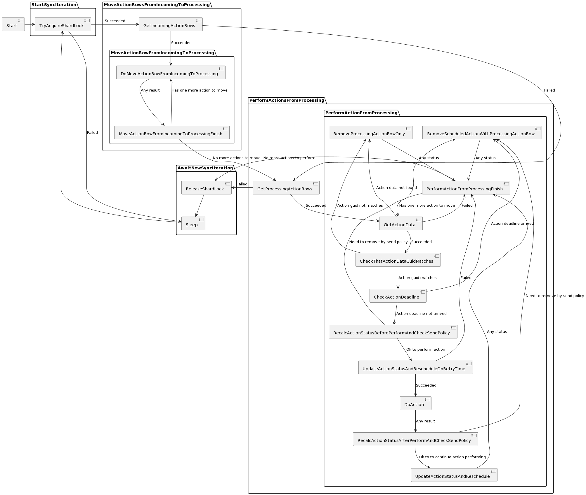

# Как работает обработка scheduled action'ов

Если очень коротко, обработка устроена так.

Есть четыре таблицы в ydb:
* ```scheduled_actions``` - таблица содержащая всю информацию о scheduled action'е (```Meta```, ```Spec```, ```Status```, поля, специально вынесенные в отдельные колонки, чтобы делать запросы без парса protobuf'ов)
* ```incoming_queue``` - входная очередь запросов, каждая строка содержит ссылку на какой-то scheduled action, таблица разделена на шарды, внутри шарда события в таблице отсортированы во времени создания
* ```processing_queue``` - очередь процессинга, каждая строка содержит ссылку на какой-то scheduled action, таблица разделена на шарды, внутри шарда события в таблице отсортированы во времени, когда их надо выполнить
* ```shard_locks``` - таблица с локами шардов

Эти четыре таблицы задают одну инсталляцию, таблицы могут лежать как в корне какой-то базы, так и в какой-то её директории, что позволят использовать одну базу для нескольких инсталляций.

Scheduler при запросе пользователя обновляет содержимое таблицы ```scheduled_actions```, а также добавляет запись в ```incoming_queue``` что scheduled action изменился.



Можно заметить, что scheduler не удаляет записи из ```incoming_queue``` и ```processing_queue```, это сделано намеренно, чтобы не замедлять запросы добавления новых scheduled action'ов. Очистка этих таблиц происходит worker'ом, он сравнивает ```Guid``` записи с ```Meta.Guid``` scheduled action'а, и, если он не совпадает, просто удаляет запись.
Именно для этого каждое изменение scheduled action scheduler'ом [меняет его ```Meta.Guid```](https://docs.yandex-team.ru/alice-matrix/pages/scheduler_and_worker/scheduled_action/#meta).

Главный инвариант базы - для каждого scheduled action'а есть **ровно одна** запись с такими же ```Meta.Id``` и ```Meta.Guid``` либо в ```incoming_queue```, либо в ```processing_queue```. При этом записей с таким же ```Meta.Id```, но другим ```Meta.Guid```, может быть сколько угодно.

Более подробно про базу, работу scheduler'а и работу worker'а написано ниже.

## Как устроена база в ydb {#ydb}

Для понимания некоторых полей таблицы, в дополнение к краткому описанию, нужно одно дополнительное знание - для каждой итерации синхронизации worker генерирует уникальный ```guid``` итерации.

### scheduled_actions {#scheduled_actions}



* ```meta_action_id_hash``` - хеш от ```Meta.Id```
* ```meta_action_id``` - ```Meta.Id```
* ```meta``` - Вся ```Meta``` в бинарном виде
* ```meta_action_guid``` - ```Meta.Guid```
* ```spec``` - Вся ```Spec``` в бинарном виде
* ```status``` - Весь ```Status``` в бинарном виде
* ```status_scheduled_at``` - ```Status.ScheduledAt```

Колонки кроме ```meta```, ```spec``` и ```status``` существуют только для удобного написания запросов к ydb без парса protobuf'а.

### incoming_queue {#incoming_queue}



* ```shard_id``` - id шарда
* ```created_at``` - момент добавления записи в базу
* ```action_id``` - ```Meta.Id``` scheduled action'а, на который ссылается запись
* ```action_guid``` - ```Meta.Guid``` scheduled action'а, на который ссылается запись
* ```scheduled_at``` - ```Status.ScheduledAt``` scheduled action'а, на который ссылается запись


### processing_queue {#processing_queue}



* ```shard_id``` - id шарда
* ```scheduled_at``` - ```Status.ScheduledAt``` scheduled action'а, на который ссылается запись
* ```action_id``` - ```Meta.Id``` scheduled action'а, на который ссылается запись
* ```action_guid``` - ```Meta.Guid``` scheduled action'а, на который ссылается запись
* ```added_to_incoming_queue_at``` - ```created_at``` строки из ```incoming_queue```, из которой была получена данная строка
* ```moved_from_incoming_to_processing_queue_by_sync_with_guid``` - ```guid``` итерации синхронизации worker'а, в рамках которой строка была перенесена из ```incoming_queue``` в ```processing_queue```
* ```moved_from_incoming_to_processing_queue_at``` - время, в которое строка была перенесена из ```incoming_queue``` в ```processing_queue```
* ```last_reschedule_by_sync_with_guid``` - ```guid``` последней итерации синхронизации worker'а, в рамках которой колонка ```scheduled_at``` была изменена
* ```last_reschedule_at``` - время, в которое в последний раз колонка ```scheduled_at``` была изменена

### shard_locks {#shard_locks}



* ```shard_id``` - id шарда
* ```locked``` - взят ли лок на шард в данный момент
* ```last_lock_guid``` -  ```guid``` итерации синхронизации worker'а, в рамках которой в последний раз был захвачен лок
* ```last_locked_by``` - human readable описание инстанса worker'а, который в последний раз захватил лок (например, ```matrix-worker-prestable-3.sas.yp-c.yandex.net/f392a0fd5a@9483913~f392a0fd5a/0x7f8ae6283700```)
* ```last_processing_start_at``` - момент последнего захвата лока
* ```last_heartbeat_at``` - момент последнего heartbeat от worker'а, захватившего лок

Лок считается не захваченным, если:

```yql
NOT locked OR (locked AND last_heartbeat_at < $min_allowed_heartbeat_time_for_acquired_lock)
```

Где ```min_allowed_heartbeat_time_for_acquired_lock = CurrentTime() - magic_const```.

## Что делает scheduler {#scheduler}

Работа scheduler'а максимально проста, в соответствии с параметрами запроса он обновляет табличку ```scheduled_actions``` и добавляет об этом запись в случайный шард ```incoming_queue```.

Каждое изменение scheduled action'а меняет ```Meta.Guid```, поэтому старые записи из ```incoming_queue``` и ```processing_queue``` не будут влиять на обновленный scheduled action.

## Что делает worker {#worker}

Если очень коротко:



Более подробная диаграмма работы worker'а:



Из важных моментов, которые в ней опущены или сказаны не очень явно:
* Из всех доступных для захвата локов шардов worker захватывает лок с минимальным ```last_processing_start_at```
* Перед каждым действием проверяется что лок все ещё захвачен
* Перемещение из ```incoming_queue``` в ```processing_queue``` происходит per row из-за того, что не хочется получать конфликты с запросами scheduler'а
* Можно увидеть, что перед ```DoAction``` есть ```Reschedule``` на время retry'я, это сделано для того, чтобы корректно делать retry'и при падениях worker'а. Так же из-за падений есть ```Recalc``` статуса после ```GetActionData``` (нужно правильно пересчитать counter'ы в ```Status``` при обнаружении прерванной попытки исполнения, которая ничего не смогла записать в статус)
