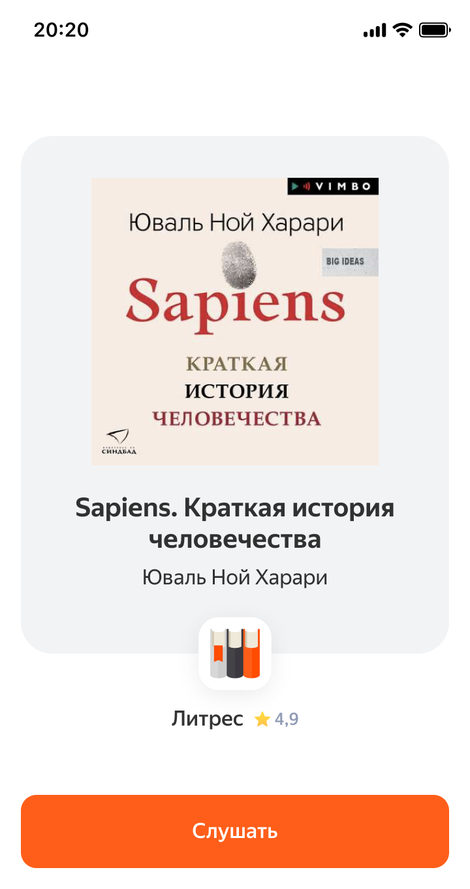

# Ссылки для запуска навыка на Станции

Пример страницы для запуска навыка:



Для создания ссылки нужно подготовить параметры для отображения сраницы и подписать их при помощи алгоритма HMAC-SHA256.
Все параметры должны передаваться в url-encoded виде.

| Параметр      | Возможные значения | Обязательный  | Описание |
| ------------- |:----|:-------------:| -----:|
| skill_id      | UUID | да  |  ID навыка, можно получить в консоли разработчика |
| image_url     | URL |да  | URL изображения |
| title_text    | произвольная строка | да  | Текст заголовка |
| signature     | произвольная строка | да  | Base64-закодированная подпись |
| subtitle_text | произвольная строка | нет | Текст подзаголовка |
| button_text   | произвольная строка | нет | Текст на кнопке запуска, по умолчанию «Запустить» |
| payload       | JSON | нет | Значение поля `payload`, которое будет передано при запуске навыка |
| required_interfaces | Список интерфейсов через запятую | нет | Список интерфейсов, которые должна поддерживать поверхность для запуска. Полный список интерфейсов приведён в [описании протокола внешних навыков](https://yandex.ru/dev/dialogs/alice/doc/protocol.html#request__meta-tree). |
| autostart | `true` или `false` | нет | Если передан параметр `autostart=true` и у пользователя есть только одна поверхность, на которой можно запустить навык, он запустится автоматически, без клика на кнопку | 

## Генерация подписи

Для генерации подписи необходимо отсортировать все параметры в лексикографическом порядке ключей, закодировать в urlencoded-строку 
и подписать получившийся массив байт при помощи HMAC SHA-256.

Пример кода на Python
```python
import base64
import hashlib
import hmac
from urllib.parse import quote, urlencode

def sign(params, secret_base64):
    sorted_params = sorted(params.items(), key = lambda pair: pair[0])
    encoded_params = urlencode(sorted_params).encode('utf-8')
    secret = base64.standard_b64decode(secret_base64)
    hmac_sha256 = hmac.new(secret, encoded_params, hashlib.sha256)
    return encoded_params, hmac_sha256.digest()


secret_base64 = 'lHZAozC03YoUpq/67mx+vZaKChxva+L9zx/uj+8+t3t8nd3HQHHf80mfj8VKkU3kHq/3dTm7qfAaUGsDEHdyaW35hVUDpryOPUUJtmGwkTveBVJCnsSR5bLYKl8H2vfT'    
params = {
    "title_text": "Заголовок",
    "subtitle_text": "Подзаголовок",
    "image_url": "https://yandex.ru/logo.png",
    "skill_id": "0c854043-6fd6-4e58-bb5f-20dae925c4d0"
}
signed_params, signature = sign(params, secret_base64)
query_string = signed_params.decode('utf-8') + quote(base64.b64encode(signature).decode('utf-8'))
url = "https://alice.ya.ru/share/skill?" + query_string
print(base64.b64encode(signature).decode('utf-8'))
print('url: ' + url)
```

После сортировки параметров будет подписан массив байт `image_url=https%3A%2F%2Fyandex.ru%2Flogo.png&skill_id=0c854043-6fd6-4e58-bb5f-20dae925c4d0&subtitle_text=%D0%9F%D0%BE%D0%B4%D0%B7%D0%B0%D0%B3%D0%BE%D0%BB%D0%BE%D0%B2%D0%BE%D0%BA&title_text=%D0%97%D0%B0%D0%B3%D0%BE%D0%BB%D0%BE%D0%B2%D0%BE%D0%BA`, 
подпись в base64 будет равна `QPdNPUhzIKUUuagqcqt+pStTtT06govPaZe19J2oPEk=`.
