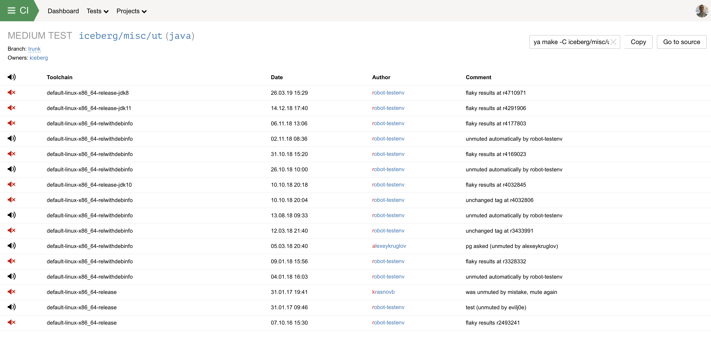
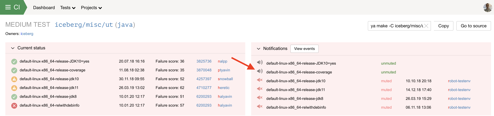
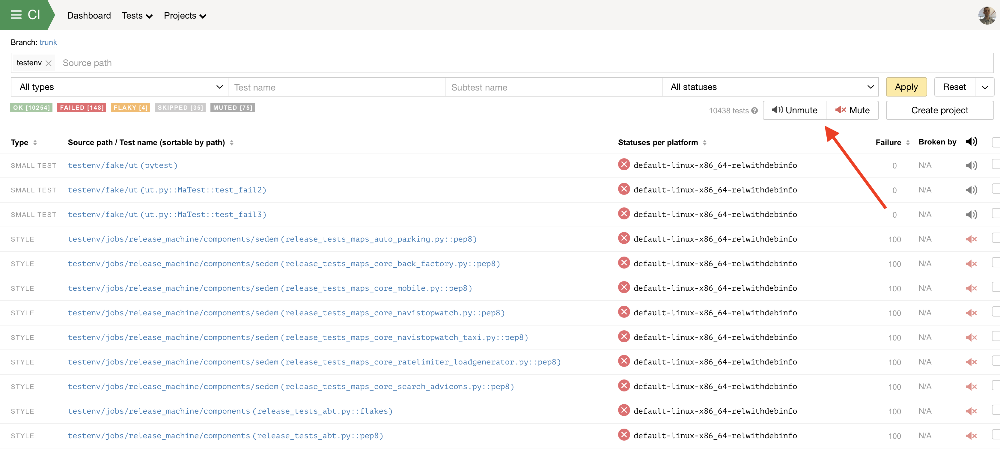

## UID
Система сборки строит внутренний граф – ориентированный граф зависимостей, где типизированы и ноды (каталог, исходный файл, артефакт сборки, сборочная команда etc) и дуги (Search, Include, BuildFrom), задающие семантику связи. К примеру, плюсовый объектник зависит и от плюсового сорца и от команды, которая умеет делать такие объектники из подобных сорцов.

Внутренний граф (можно посмотреть командой ya dump dep-graph) удобен для построения, поиска, инвалидации и кэширования зависимостей, но неудобен для выполнения (собственно сборки). Поэтому из него мы генерируем граф команд. Например, в нём команда линковки простой программы зависит от команд компиляции отдельных сорцов в объектники. Такой граф (ya dump build-plan) удобно выполнять, в том числе делать это параллельно и распределенно (чем и занимается наш distbuild).

Для кэширования результатов каждой команде в этом графе выдается/генерируется уникальный идентификатор - uid. Но делается это не произвольным образом - должны быть соблюдены следующие правила:
- если в графе произошли такие изменения, что команда должна быть исполнена снова (нельзя переиспользовать закэшированные результаты) - её uid должен поменяться. (Note: обычно это приводит и к изменению uid'ов зависимых команд);
- и наоборот: если случаются такие изменения, которые по внутреннему графу никак не связаны с результатом какой-то команды - её uid не должен меняться.

Автосборка посылает результаты запуска тестов (build, configure, test) в Stream Processor, и далее они попадают в Testenv.

## Автоматическое выключение уведомлений
Анализирует поток результатов запусков тестов из посткоммитных проверок.

Автоматически не отключаются уведомления у теста, если:
- есть тэг ya:external
- тип ошибки BROKEN DEPS или INTERNAL

Автоматически отключаются уведомления у теста, если:
- тип ошибки FLAKY на правой или левой проверке (два соседних запуска теста, например на текущей и предыдущей ревизии).
- сменился статус (BROKEN, FIXED), но не сменился uid. Эта причина отключения уведомлений называется unchanged tag.

## Автоматическое включение уведомлений
Запускается раз в 3 часа.

Автоматически не включаются уведомления, если:
- тест не в статусе OK
- прошло меньше 1 дня с момента автомьюта
- прошло меньше 30 часов с последнего запуска с типом ошибки FLAKY

Анализируются запуски теста за одну неделю.
Если за неделю был хотя бы один запуск с типом ошибки FLAKY или запуск c разными статусами на одном uid - уведомления не включаются.
Если условие выполнено - уведомления включаются.

Анализируются запуски теста за 2 недели и за 3 недели.
Если за это время не набралось 20 уникальных uid'ов - не размьючиваем.
Анализируется количество flaky-запусков и запусков с разными статусами на одном uid:
- если на 30 uid'ах было больше одного мигания - не размьючиваем
- если на 60 uid'ах было больше двух миганий - не размьючиваем
- если на 100 uid'ах было больше трех миганий - не размьючиваем

Если все условия выполнены - уведомления включаются.

## История включения и выключения уведомлений у теста
Производится в интерфейсе ci.yandex-team.ru на странице теста, если нажать Mute events:

## Ручное управление уведомлениями теста
Производится в интерфейсе ci.yandex-team.ru на странице теста:

Сразу для нескольких тестов можно включить или выключить уведомления на странице поиска тестов:

## Обработка тестов с отключенными уведомлениями
Про поломки/починки замьюченных тестов не шлются письма.

В плашке прекоммитной и посткоммитной проверки замьюченные тесты показываются в отдельном счетчике поломок/починок снизу и не влияют на цвет плашки.

Поломки и починки тестов c отключенными уведомлениями не влияют на автоматический мердж PR в Arcanum.

Авторы тестов периодически получают письмо с напоминанием, что их тесты работают нестабильно и у тестов отключили уведомления - Unstable test digest.

## FAQ
### Что делать, если мой тест постоянно автоматически мьютится
Одной из причин мигания тестов может быть неправильно настроенный таймаут теста. Увеличьте размер теста в файле ya.make. Например поменять SMALL на MEDIUM. Также можно пойти по пути ускорения исполнения теста.
[Документация](https://a.yandex-team.ru/arc/trunk/arcadia/build/docs/readme.md#macro-size-smallmediumlarge)