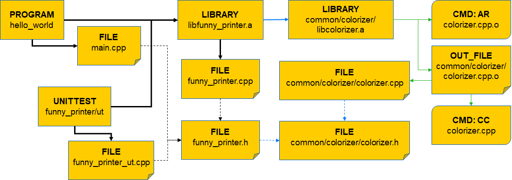
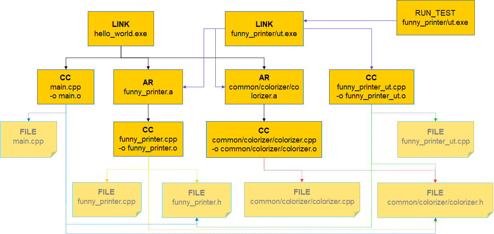
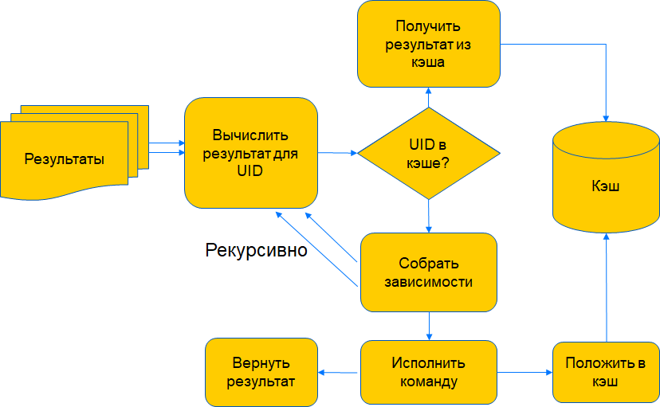

# Как работает система сборки

Задача, которую решает ya make, для наших объёмов и нашего разнообразия очень сложна. Как следствие у неё не существует идеального (точного) решения. Любое решение будет иметь компромиссы.
В нынешней реализации ya make они тоже есть и иногда заметны пользователям. Чтобы понимать в чём они заключаются и какие есть возможные решения надо понимать, как устроена наша система сборки.

## Базовая модель

Наша система сборки сейчас строится на модели, в которой все зависимости известны заранее (у нас *полностью статический граф зависимостей*).
Более того, [UIDы](base_concepts.md#conf) каждой отдельной сборочной команды рассчитываются также заранее на основе зависимостей (а не реального содержимого результатов) во время [*конфигурирования*](base_concepts.md#conf) и не меняются в процессе [*исполнения сборки*](base_concepts.md#exec).

У такой модели есть свои плюсы и минусы

__Плюсы:__

- Воспроизводимость: исполнение графа сборки на фиксированной Аркадии гарантированно даёт одинаковые результаты.
- Предсказуемость: объём работы известен заранее.
- Изоляция: зная зависимости заранее можно сделать изоляцию сборки от хоста (предоставив доступ только к необходимым файлам и директориям). Мы активно работаем над реализацией такого режима.
- Простая логика исполнения и [кэширования сборки](#build_caches).
- Устойчивость кэширования к "шуму" результатов работы инструментов (имена файлов, времена и т.п. включённые в результирующий бинарный код не влияют на *UID*).
- Очень высокая степень параллелизма в сборке: не нужно ждать окончания работы инструментов для понимания что нужно строить по зависимостям.
- Компактность представления сборочного графа (зависимости, не участвующие в сборке непосредственно, учтены в *UID*-ах и не присутствуют в графе в явном виде).
- Высокая гранулярность зависимостей: зависимости на уровне отдельных сборочных команд позволяют перекомпилировать только нужные файлы, а не целые модули.
- Простота и компактность описания: система умеет во многих случаях сама выводить зависимости из исходных файлов вместо их явного описания. В большинстве случаев описание делается на очень высоком уровне, конфигурация системы сборки скрывает детали.

__Минусы:__

1. Неточность: без запуска инструментов невозможно построить точный граф зависимостей. Поскольку упущенная зависимость хуже, чем лишняя, зависимости строятся как оценка сверху всех возможных зависимостей. Как следствие - расхождение конфигурации и сборки.
2. Неустойчивость к ошибкам описания. В тех случаях, когда зависимости невозможно узнать (напр. зависимости через генерируемые файлы), система требует точного предсказания зависимостей от пользователя. Отсутствующие зависимости сложно обнаружить, а их проявления могут быть очень разными.
3. Избыточность сборки: следствием неточности зависимостей и априорности *UID*-ов являются избыточность сборки. Например, изменения в хедере от которого зависит `protoc` приводит к пересборке всех `.proto`-файлов даже если в действительности `protoc` не поменялся. Кроме того, не важные зависимости могут приводить к ненужным пересборкам.
4. Построение графа на критическом пути. Даже сборка в которой ничего не изменилась платит цену [*конфигурирования*](base_concepts.md#conf). Это накладывает существенные ограничения на время работы стадии конфигурации, а значит и на объём работы, который она может сделать.

__Как мы справляемся (номера соответствуют минусам):__
1. Мы просто с этим живём. По возможности стараемся быть точными, но систематического решения у этой проблемы нет: она неотъемлемое свойство модели.
2. Здесь мы движемся в сторону [*строгого контроля зависимостей*](base_concepts.md#exec). Это достигается изоляцией доступов к Аркадии на уровне команд и позволяет обнаруживать ошибки ценой заметного роста размеров сборочного графа (он должен содержать информацию о всех входах для каждой из команд, в обычном случае входы из Аркадии туда не попадают). Однако это обеспечивает гарантированную воспроизводимость.
3. Хорошего решения сейчас нет, помогает кэширование, в том числе [распределённое](../usage/ya_make/yt_store.md), а также бинарная зависимость от предпостроенных инструментов — часто используемые инструменты строятся заранее и сохраняются ресурсами в Sandbox откуда система сборки их берёт. Это устраняет влияние изменений в зависимостях инструментов на ежедневную работу.
4. Это делает скорость построения графа существенным требованием. Здесь помогает специальное [*кэширование для конфигурирования*](#deps_caches). Есть несколько кэшей в этом месте и их работа по-разному настроена локально и в автосборке, однако на данный момент кэшируется далеко не всё, что нужно.
   В существенной части конфигурирования система сборки до сих пор делает работу пропорциональную всему графу, а не только изменившейся части.
   В автосборочном сценарии, где надо делать анализ зависимостей для всей Аркадии, мы используем *шардирование*. Система сборки строит отдельные графы для нескольких непересекающихся наборов целей (директорий верхнего уровня в Аркадии, содержащих списки `RECURSE`).
   Из-за пересечения по зависимостям суммарный объём работы в этом случае больше, но это заметно снижает время на критическом пути, а также делает более разумными ресурсные требования каждого отдельного конфигурирования.


## Как строится и исполняется сборочный граф { #build }

Команда `ya make` сейчас работает так:

- Для построения сборочного графа несколько раз запускается анализатор зависимостей `ymake`. Он умеет анализировать зависимости и строить граф команд ровно для одной [*конфигурации*](base_concepts.md#configs).
  Соответственно, он запускается отдельно (параллельно) для PIC и non-PIC вариантов [*целевой конфигурации*](base_concepts.md#configs) (для Linux, для других платформ в этом месте один запуск).
  Потом он отдельно запускается для целевой платформы (`tools`) только для частей доступным по зависимостям вида "результат"->"генератор"
- Выходные графы `ymake` склеиваются
- Графы обогащаются, например, сборкой документации, запуском тестов или заливкой результатов индексирования кодонавигации в YT.
- Если заказано несколько целевых [*платформ или конфигураций*](base_concepts.md#configs), то все действия выше делаются для каждой из них. И в конце все графы склеиваются в один.
- В автосборке мы строим два графа по описанным выше шагам для состояний "было" и "стало". После этого мы вычитаем графы на основе *UID*-ов, и *замыкаем* их.
- Полученный граф исполняется локальным или распределённым исполнителем.


Посмотрим подробнее на все этапы построения и исполнения сборочного графа

### Шаг 0. Подготовка и загрузка конфигурации системы сборки (ya->ymake)

Прежде чем начать [*конфигурирование*](base_concepts.md#conf) его нужно настроить. Поэтому сборка начинается с того, что система сборки строит для себя конфигурационный файл. В него попадают

- Содержимое [`build/ymake.core.conf`](https://a.yandex-team.ru/arc/trunk/arcadia/build/ymake.core.conf)
- Ряд настроек, зависящих от системы, на которой сборка запускается, а также динамическая часть настроек. Это всё генерирует [`build/ymake_conf.py`](https://a.yandex-team.ru/arc/trunk/arcadia/build/ymake_conf.py)
- Конфигурационные параметры командной строки (параметры `-D`, `--target-platform-flags`, `--musl` и т.п.)

Конфигурационный файл содержит не просто параметры. Он содержит описание большинства макросов и модулей доступных в системе сборки. Их существенно меньшая часть является встроенной или предоставляется
расширениями (plugins) на Python или C++. Код расширений на Python лежит в [`build/plugins`](https://a.yandex-team.ru/arc/trunk/arcadia/build/plugins/) и исполняется непосредственно во время конфигурирования.

Конфигурационный файл генерируется на специальном и достаточно сложном *декларативном* языке, который позволяет описывать

- Определения макросов и модулей с командами и другими свойствами для них, а также набором макросов, которые надо выполнить в рамках обработки макроса/модуля.
- Шаблоны команд для подстановки с правилами подстановки в поля шаблона.
- Граф зависимостей команд через определение входных и выходных параметров. Сами параметры интерпретируются как строки (имена файлов) и связи в графе строятся на основании совпадения имён.
- Правила вычисления переменных на основе других переменных. А также правила привязки команд к файлам по расширениям.

Поскольку анализатор зависимостей `ymake` запускается несколько раз для разных конфигураций, то для каждого из таких запусков строится отдельный файл. `ymake` зачитывает его на старте и после настройки
глобальных дефолтных конфигурационных параметров готов к тому, чтобы интерпретировать файлы `ya.make` и анализировать зависимости.



Строго говоря, бОльшая часть настроек не зависит от платформы либо зависит через значения конфигурационных переменных. Поэтому у нас в планах переработка этой части,
чтобы макросы и модули текстуально от платформы не зависели, а настраивались лишь через значения используемых переменных. А сборочная конфигурация, наоборот, определяла бы лишь набор значений переменных.
Это бы позволило с одной стороны сократить объём работы при подготовке конфигурации, а с другой кэшировать существенную часть распарсенного конфигурационного файла для ускорения обработки.



### Шаг 1. Построение графа зависимостей (ymake) { #build_deps }

После того, как конфигурация прочитана, система сборки начинает строить *граф зависимостей*. Зачитывая файлы `ya.make`. Процесс начинается с непосредственных
[*сборочных целей*](base_concepts.md#what) и продолжается по зависимостям, найденным в `ya.make` или исходных файлах.

Работает это примерно так:

1. Зачитывается и интерпретируется ya.make файл в директории сборочной цели.
2. Все связанные (по [`RECURSE`](../manual/common/macros.md#recurse) ya.make добавляются в очередь.
3. Если ya.make содержит [описание сборки модуля](../manual/syntax.md#module), то выясняются свойства его сборки и зависимости.
4. Зачитываются и интерпретируются ya.make зависимостей, [`RECURSE`-связи](../manual/common/macros.md#recurse) от них игнорируются.
5. Процесс 3-4 идёт рекурсивно пока не достигнет модуля без зависимостей, пройденные модули запоминаются в стек.
6. Если есть зависимые модули - их [глобальные свойства](../manual/index.md#global) применяются. Анализируются [зависимости модуля от файлов](../manual/#mod_to_file), формируются команды модуля. Здесь же анализируются файлы на наличие [кросс-файловых зависимостей](../manual/#file_to_file)
7. [Глобальные свойства](../manual/index.md#global) модуля фиксируются для распространения.
8. Повторяются шаги 3.4 пока не пройдены все зависимости, потом шаги 6,7.
9. При достижении дна стека берётся следующий ya.make из очереди. который ещё не обрабатывали (в обходе по зависимостям). Начальный модуль и модули из очереди называются *стартовыми*.
10. Когда очередь исчерпана построен *Граф зависимостей*.

**Граф зависимостей**:

- Отражает информацию в формате близком к описанию сборки. Это позволяет кэшировать и редактировать граф при изменениях.
- Быстро строится в ущерб точности.
  В отличие от реального препроцессирования ymake парсит хедеры и строит зависимости между хедерами. Это позволяет избежать дублирования работы в препроцессинге .cpp-файлов: каждый хедер читается ровно один раз.
  Аналогично строятся зависимости по `PEERDIR` между библиотеками: они отражают описание в ya.make-файлах, а не реальную зависимость программ от библиотек.
- Относительно компактный граф. За счёт глубины/высоты графа транзитивные связи не дублируются; команды представлены графом, где общие части объединены. Имена файлов и директорий дедуплицированы.
- Ключами узлов являются имена (файлов, артефактов, модулей, директорий, команд и т.п.). Когда простого имени недостаточно может использоваться ID модуля как часть имени (в свойствах и командах).

Наша система сборки строит *граф зависимостей* в основном за один проход DFS от целей к листьям. При этом межмодульные зависимости (`PEERDIR`) имеют приоритет в обходе по модулям.
Каждая дуга посещается один раз, а из посещений вершин по разным путям бОльшая часть работы делается в момент первого посещения. В рамках этого единственного прохода мы делаем и зачитывание
`ya.make`-файлов и парсинг зависимостей из исходных файлов и [разрешение зависимостей](#resolving): выяснение реальных файлов, стоящих за именами в `include`/`import`/...).


Нынешний алгоритм построения графа зависимостей

- Позволяет относительно надёжно распространять конфигурационные параметры со своих зависимостей на собственные узлы модуля.
- Не позволяет распространять конфигурационные параметры из с одних зависимостей на другие. Свойства модуля распространяются на обработку файлов модуля и его команды, глобальные свойства распространяются с модуля на всех, кто от него зависит.
  Изменить из модуля свойства его зависимостей нельзя, поскольку несколько модулей могло бы попытаться сделать это по-разному для одной и той же зависимости, что привело бы к *дроблению конфигураций* для неё, т.е. системе сборки пришлось бы строить эту зависимость в нескольких разных конфигурациях, в пределе - по числу использований.
- Зависеть от свойств модуля могут любые узлы (команды, файлы и модули), однако структура графа не позволяет обрабатывать один файл в разных контекстах: каждый файл в графе представлен одной вершиной, а единственный проход по дуге не даёт возможности обрабатывать одну вершину несколько раз. Кроме того, фиксация обработки в виде дополнительных дуг не позволяет эффективно разметить результаты обработки в разных контекстах.
  Чтобы обойти это ограничение, в представлении имён файлов в графе предусмотрены *ссылки* — специальные модифицированные имена, содержащие дополнительно указание на контекст. Поскольку у такого имени отдельный узел в графе, его можно отдельно обработать и при необходимости зафиксировать результат исходящими дугами.





Посмотреть как выглядит граф зависимостей для определённой сборочной цели можно командой [`ya dump dep-graph <target>`](../usage/ya_dump.md#dep-graph)





```
         [19 of 41] Dep: BuildFrom, Type: NonParsedFile, Id: 2023, Name: $B/util/_/system/context_x86.o
          [1 of 2] Dep: BuildFrom, Type: File, Id: 1042, Name: $S/util/system/context_x86.asm
           [1 of 2] Dep: Include, Type: File, Id: 1039, Name: $S/util/system/context_i686.asm
           [2 of 2] Dep: Include, Type: File, Id: 1044, Name: $S/util/system/context_x86_64.asm
          [2 of 2] Dep: BuildCommand, Type: BuildCommand, Id: 295, Name: 869:SRCSasm=(context_x86.asm)
           [1 of 1] Dep: Include, Type: BuildCommand, Id: 294, Name: 0:SRCSasm=(FILE)$_SRC____asm(${lastext:FILE} $FILE)
            [1 of 1] Dep: Include, Type: BuildCommand, Id: 296, Name: 0:_SRC____asm=(EXT, SRC, SRCFLAGS...)$_SRC(yasm $SRC $SRCFLAGS)
             [1 of 1] Dep: Include, Type: BuildCommand, Id: 297, Name: 0:_SRC____yasm=(EXT, SRC, SRCFLAGS...)$_SRC_yasm($SRC $SRCFLAGS)
              [1 of 1] Dep: Include, Type: BuildCommand, Id: 298, Name: 0:_SRC_yasm=(SRC, SRCFLAGS...)$_SRC_yasm_impl($SRC $SRCFLAGS $PREINCLUDES_KEY $YASM_PREINCLUDES_VALUE)
               [1 of 5] Dep: Include, Type: BuildCommand, Id: 299, Name: 0:PREINCLUDES_KEY=
               [2 of 5] Dep: Include, Type: BuildCommand, Id: 300, Name: 0:YASM_PREINCLUDES_VALUE=
               [3 of 5] Dep: Include, Type: BuildCommand, Id: 301, Name: 0:_SRC_yasm_impl=( PREINCLUDES..., SRC, SRCFLAGS...)${tool:"contrib/tools/yasm"} -f elf$HARDWARE_ARCH -D UNIX $YASM_DEBUG_INFO_DISABLE_CACHE__NO_UID__ -D ${pre=_;suf=_:HARDWARE_TYPE} -D_YASM_ $ASM_PREFIX_VALUE -g dwarf2 ${YASM_FLAGS} ${pre=-I :_ASM__INCLUDE} ${pre=-I :INCLUDE} ${SRCFLAGS} -o ${output;noext;suf=${OBJ_SUF}.o:SRC} ${pre=-P :PREINCLUDES} ${input;hide:PREINCLUDES} ${input:SRC} ${kv;hide:"p AS"} ${kv;hide:"pc light-green"}
                [1 of 9] Dep: Include, Type: Directory, Id: 1220, Name: $S/contrib/tools/yasm
                 [1 of 2] Dep: Include, Type: MakeFile, Id: 2042, Name: $L/MKF/$S/contrib/tools/yasm/ya.make
                  [1 of 3] Dep: Property, Type: Property, Id: 405, Name: OWNER=g:contrib g:ymake somov
                  [2 of 3] Dep: Include, Type: File, Id: 2043, Name: $S/build/prebuilt/contrib/tools/yasm/ya.make.prebuilt
                  [3 of 3] Dep: Include, Type: File, Id: 2044, Name: $S/build/prebuilt/contrib/tools/yasm/ya.make.resource
                 [2 of 2] Dep: Include*, Type: Program, Id: 2045, Name: $B/contrib/tools/yasm/yasm
                [2 of 9] Dep: Include, Type: BuildCommand, Id: 302, Name: 0:HARDWARE_ARCH=64
                [3 of 9] Dep: Include, Type: BuildCommand, Id: 303, Name: 0:YASM_DEBUG_INFO_DISABLE_CACHE__NO_UID__=
                [4 of 9] Dep: Include, Type: BuildCommand, Id: 304, Name: 0:HARDWARE_TYPE=x86_64
                [5 of 9] Dep: Include, Type: BuildCommand, Id: 305, Name: 0:ASM_PREFIX_VALUE=
                [6 of 9] Dep: Include, Type: BuildCommand, Id: 306, Name: 0:YASM_FLAGS=
                [7 of 9] Dep: Property, Type: Property, Id: 307, Name: USED_RESERVED_VAR=_ASM__INCLUDE
                [8 of 9] Dep: Property*, Type: Property, Id: 72, Name: USED_RESERVED_VAR=INCLUDE
                [9 of 9] Dep: Include*, Type: Program, Id: 2045, Name: $B/contrib/tools/yasm/yasm
               [4 of 5] Dep: Include*, Type: BuildCommand, Id: 299, Name: 0:PREINCLUDES_KEY=
               [5 of 5] Dep: Include*, Type: BuildCommand, Id: 300, Name: 0:YASM_PREINCLUDES_VALUE=
```

\* Означает, что где-то раньше в дампе подграф для этого узла уже встречался



После того, как граф построен на нём делается ряд вычислений дополнительными обходами. Они включают:

- Вывод диагностики. В определённых случаях мы не можем сконфигурировать только то, что нужно и конфигурируем с запасом. Чтобы это не было заметно ошибки конфигурирования при построении кэшируются и выводятся только
  для того, что точно будет нужно в сборке запрошенных целей.
- Транзитивные проверки — лицензии, [`PROVIDES`](../manual/common/macros.md#provides), [`CHECK_DEPENDENT_DIRS`](../manual/common/macros.md#check_dependent_dirs) и т.п.
- [Управление зависимостями](../manual/java/dependencies.md) для Java.
- [Проверки](rules.md) `include без PEERDIR`, вывод и вырезание циклов по зависимостям.
- Сбор транзитивной информации для подстановки в команды (`PEERS`, `GLOBAL_SRCS` и т.п.).


### Шаг 2. Построение графа сборочных команд (ymake->ya) { #json-graph }

После того, как граф зависимостей полностью построен и проанализировал его можно превращать в *граф сборочных команд*. Для этого мы сначала отдельным проходом строим *UID*-ы (уникальные идентификаторы
узлов с учётом зависимостей) на основе *графа зависимостей*, а потом, собственно, строим *граф команд*.

**Граф сборочных команд**

- Отражает реальные зависимости между сборочными командами.
- Каждый узел в графе — это команда или набор команд, исполняющиеся вместе (с общими входами, выходами и зависимостями).
- Каждая команда идентифицируется уникальным идентификатором (*UID*), который является хешем от текста команды, всех её входов (включая неявные) и всех зависимостей. *UID* ассоциирован с результатом работы команды:
  неизменность *UID* означает неизменность результатов команды. Изменение означает *возможное* (но не обязательное) изменение результатов.
- Зависимость (дуга) в графе означают, что команда на исходящем конце дуги зависит от результатов команды на входящем конце. Дуги фиксируются перечислением *UID*-ов зависимостей.
- В графе перечислением *UID*-ов зафиксированы **результаты** или **стартовые команды** — это команды, порождающие результаты сборки.
- В графе полностью утрачена информация о модулях и описании сборки. Информация о хедерах зачтена в *UID*-ы, сами хедеры в явном виде в
  графе не присутствуют кроме случаев, когда они являются результатами команд генерации либо при явном включении всех зависимостей в граф с целью изолированного исполнения команд.
- Граф гораздо более плоский: зависимости транзитивно замкнуты в финальных целях (или там, где нужны).
- Граф сериализуется в JSON и таким образом может быть создан на одной машине, а исполнен на другой и даже на кластере распределённой сборки.
- Из-за существенного дублирования более бедный граф по размерам сопоставим с внутренним. Внешнее представление (JSON) гораздо больше.
- Для ускорения построения графа внедрено отдельное кэширование на основе *UID*-ов (полное переиспользование) и RenderID (ускорение рендеринга текста команд). RenderID - это хэш от предполагаемого текста узла, позволяющий получить узел без перерендеринга,
  только апдейтом *UID*-ов зависимостей и другой вспомогательной информации в узле.
- Кроме собственно графовой информации (*узлов команд* и *списка результатов*) граф содержит глобальную информацию: ресурсы, доступные всем командам; информацию для исполнителей и т.п.



Каждый анализатор зависимостей `ymake` строит граф команд для одной платформы/конфигурации и отдаёт их в виде JSON в `ya make`.



Посмотреть как выглядит граф сборочных команд для определённой сборочной цели можно командой [`ya dump build-plan <target>`](../usage/ya_dump.md#build-plan) или `ya make -G -j0 <target>`.






```
        {
            "cmds": [
                {
                    "cmd_args": [
                        "$(BUILD_ROOT)/contrib/tools/yasm/yasm",
                        "-f",
                        "elf64",
                        "-D",
                        "UNIX",
                        "--replace=$(BUILD_ROOT)=/-B",
                        "--replace=$(SOURCE_ROOT)=/-S",
                        "--replace=$(TOOL_ROOT)=/-T",
                        "-D",
                        "_x86_64_",
                        "-D_YASM_",
                        "-g",
                        "dwarf2",
                        "-I",
                        "$(BUILD_ROOT)",
                        "-I",
                        "$(SOURCE_ROOT)",
                        "-I",
                        "$(SOURCE_ROOT)/contrib/libs/linux-headers",
                        "-I",
                        "$(SOURCE_ROOT)/contrib/libs/linux-headers/_nf",
                        "-o",
                        "$(BUILD_ROOT)/contrib/libs/asmlib/cpuid64.o",
                        "$(SOURCE_ROOT)/contrib/libs/asmlib/cpuid64.asm"
                    ],
                    "env": {
                        "ARCADIA_ROOT_DISTBUILD": "$(SOURCE_ROOT)"
                    }
                }
            ],
            "deps": [
                "E1a-tCHGJt2icswe3bpmhg"
            ],
            "env": {
                "ARCADIA_ROOT_DISTBUILD": "$(SOURCE_ROOT)"
            },
            "inputs": [
                "$(BUILD_ROOT)/contrib/tools/yasm/yasm",
                "$(SOURCE_ROOT)/contrib/libs/asmlib/cpuid64.asm"
            ],
            "kv": {
                "p": "AS",
                "pc": "light-green"
            },
            "outputs": [
                "$(BUILD_ROOT)/contrib/libs/asmlib/cpuid64.o"
            ],
            "platform": "default-linux-x86_64",
            "requirements": {
                "network": "restricted"
            },
            "stats_uid": "0c74aa5f347fe0de25cf0bc7ffa961da",
            "tags": [
                "debug"
            ],
            "target_properties": {

            },
            "uid": "7wKp2FJMv39s8bprfg4TgQ"
        },
```




- К данному моменту у нас есть граф сборочных команд для одной целевой платформы. От платформы зависят как минимум стадии 1., 3. (ya.make может содержать условные конструкции) и стадия 6
  (формирование свойств и команд зависит от платформы) [построения сборочного графа](#build_deps). Однако, граф сборочных команд может содержать команды сборки сборочных инструментов,
  а их надо сформировать для сборочной платформы.


### Шаг 3. Склейка, очистка, обогащение и ещё раз склейка (ya) { #enrich }

В графе команд для *целевой платформы* есть узлы соответствующие вызовам сборочных инструментов. Эти узлы обнаруживаются и для них запускается отдельный анализ зависимостей (Шаги 1. и 2.)
для *сборочной платформы*. После этого несколько графов команд склеиваются в один сборочный граф, где правильно представлены узлы для *целевой* и *сборочной* платформ.
Для Linux такой граф получается склейкой не двух, а 4х графов поскольку отдельно строятся графы для PIC и non-PIC вариантов *целевой* и *сборочной* конфигураций.



Наличие этой части связано с тем, что `ymake` не умеет строить кроссплатформенные и мульти-платформенные графы. Добавление в него соответствующих возможностей — это одно из направлений развития.



Отдельно в граф прямо кодом в `ya` добавляются узлы запуска тестов. Они строятся на основе информации, собранной в запусках `ymake` и переданной через вспомогательные файлы
в соответствующие части `ya make`, а также, собственно, *графа команд*. Файлы `ya.make` при этом не читаются, но могут читаться файлы, необходимые для запуска тестов, чтобы
правильно рассчитать *UID*-ы для создаваемых узлов.



Наличие этой части — это печальное легаси. Постепенно соответствующие возможности должны переноситься в `ymake`.



Чтобы тесты были исполнены, они добавляютмя к *результатвм* графа. Если запрошена опция `--add-result`, то к *результатам* добавляются запрошенные промежуточные результаты.

После окончания обогащения графа лишние узлы удаляются.

При построении одним вызовом ya make кода для нескольких целевых платформ, финальные графе для разных платформ ещё раз склеиваются.

- На данном этапе у нас есть полностью готовый *граф команд* и его можно исполнять.

### Шаг 4. Вычитание (опционально, автосборка)

В автоматических CI-проверках строится два результирующих графа условно "c изменениями" и "без изменений". Эти графы специальным образом вычитаются
для удаления не изменившихся узлов. В разности остаётся только те узлы, что *UID*-ы которых изменились и то, от чего эти узлы зависят. Последние остаются, чтобы граф был *замкнут*,
т.е. по нему можно было построить все описанные в нём узлы без привлечения кэшей.

Измененная часть специально помечена и только её результаты попадают в результаты проверки. Это позволяет сократить объём графа на исполнении и гарантированно не строить то, что 'не задето'.


### Шаг 5. Исполнение сборки

Исполнение сборки в ya make очень простое. Начиная от входов в *граф команд* (*результатов сборки*) выполняется такая рекурсивная процедура:

1. Если для *UID* команды её результат исполнения есть в кэше — он возвращается.
2. Если нет - повторить начиная с п.1. для зависимостей команды.
3. Выполнить команду и закэшировать результат её исполнения по *UID*.

- Шаги 1-3. могут делаться параллельно для независимых команд.
- Процесс заканчивается, когда результаты построены.




Сборка исполняет свои команды в специальных **сборочных директориях**, каждую команду в своей. Это обеспечивает **изоляцию**. Перед исполнением команды в *сборочную директорию* переносятся
результаты сборки её зависимостей. Необходимые файлы из репозитория не переносятся, по умолчанию каждая команда имеет доступ ко всему репозиторию. Однако в специальном режиме *строгого контроля зависимостей*
(задаётся ключом `--sandboxing`) система сборки даёт доступ только до файлов в репозитории, зависимость от которых известна системе сборки. Это позволяет проверять *герметичность* сборки.

Полученные там результаты попадают в отдельные директории **сборочного кэша**, а также выборочно становятся **результатами сборки** - символическими ссылками в рабочей копии и
файлами в *выходной директории*. При распределённой сборке если указано скачивание результатов, то скачиваются только *результаты сборки*, а не всё, что было построено.

Так устроено исполнение как локальное, так и на кластере распределённой сборки. Отличаются только детали — устройство планировщика, устройство кэша, предоставление репозитория и т.п.

Граф может быть отдельно создан и отдельно исполнен. Например, при локальной сборке на кластере распределённой сборки `ya make --dist` шаги 0.-3. исполняются локально на машине пользователя,
построенный граф, а также все необходимые файлы отправляются на кластер и исполнение графа  (шаг 5.) делается уже там.

## Подкапотные механизмы

### Входы, выходы, зависимости и резолвинг имён { #resolving }

В ya make связывание входов с выходами в очень многих случаях делается по именам. Т.е. чтобы команда стала зависеть от какого-то файла надо, чтобы его имя было указано как вход.
Если в другой команде *подходящее* имя указано как выход, то первая команда будет зависеть от результатов второй; если файл с *подходящим* именем найдётся на файловой системе в репозитории, то
команда будет принимать на вход файл с исходным кодом. Этот же процесс работает при анализе зависимостей для исходных файлов. Если, например, в файле `a.cpp` написано `#include b.h`,
то в зависимости от того найдём мы файл для `b.h` на файловой системе или среди результатов команд зависимость будет на исходный файл или на результат генерирующей команды.

Процесс поиска *подходящих* имён называется **разрешением зависимостей** или **резолвингом**. В общем виде работает это так:


#### Формирование имён-кандидатов

1. Проверяем не указано ли *полное имя* — имя вместе с корнем `${ARCADIA_ROOT}` или `${ARCADIA_BUILD_ROOT}`. Сюда же относятся `${CURDIR}` и `${BINDIR}`,
   но не `${MODDIR}` — оно отложено от корня Аркадии и относится ли этот путь к дереву исходного кода или сборочных результатов. Если имя полное, то *проверяем доступность*.

2. Бежим по списку *префиксов-кандидатов*, соединяем имя с префиксом и *проверяем доступность*, делаем так до первого совпадения.

3. Для резолвинга инклудов есть одно усложнение: список *префиксов-кандидатов* разбит на две части:

   - Сначала проверяется путь до файла из которого идёт `#include ""` (только для инклудов с `"..."`) и корни деревьев результатов и исходного кода (именно в таком порядке).
   - Если не получилось, то имена проверяются по специальному [списку системных инклудов](../manual/cpp/includes.md). Список содержит мапирование имён на конкретные пути (или их отсутствие)
     и позволяет решить проблему резолвинга для файлов вне репозитория (например, в тулчейнах, приезжающих ресурсами), файлов недоступных в данной конфигурации
     (например, Windows-специфичные файлы при сборке под Linux), а также для сложных случаев *неоднозначного резолвинга*.
   - Независимо от результатов предыдущего шага запускается поиск по остальным *префиксам-кандидатам*. Если в итоге этот резолвинг противоречит резолвингу через *системные инклуды*,
     то резолвинг признаётся неоднозначными и выдаётся ошибка.

#### Про префиксы-кандидаты

Каждый **префикс-кандидат** это путь с указанием **корня**, т.е. про каждый известно относится ли он к дереву исходных файлов или сборочных результатов. Списки формируются следующим образом:

Для входных файлов (параметров макросов `SRCS`, параметров `IN` в `RUN_PROGRAM` и т.п.) список состоит из:

- Корня дерева исходных файлов
- Корня дерева результатов сборки
- Всех путей, указанных в макросе `SRCDIR` в том порядке, в котором они встречены в `ya.make`. Если корень явно не указан, считается, что путь относится к дереву исходных файлов.



Исходные файлы в данном случае имеют приоритет, поскольку существуют макросы (например, `FILES`) переносящие файл из дерева исходных файлов в результаты сборки и если бы приоритет
был обратным их вход бы резолвился на их же выход.

Однако, такое поведение имеет негативный эффект: если каким-то образом в дереве исходных файлов окажется файл совпадающий по имени с генерированным, то именно он будет использован
в командах в качестве входа, а генерирующая команда станет неиспользуемой и будет удалена из сборки. Обнаруживать такие проблемы система сборки не умеет.



Для файлов, используемых в других файлах через `include`/`import`/и т.п., который добываются парсингом исходного кода или через параметр `OUTPUT_INCLUDES` список состоит из:

- Пути до файла из которого идёт `include`/`import`, если для данного типа файлов и данного `include` поддержан *локальный резолвинг*. Так в C++ для `#include "..."` он поддержан, а для `#include <...>` — нет.
- Корня дерева результатов сборки
- Корня дерева исходных файлов
- Списка всех путей из макроса `ADDINCL` для данного языка, сначала из `ya.make` текущего модуля в порядке их указания, затем из всех `ADDINCL(GLOBAL ...)` всех модулей-зависимостей в порядке
  топологической сортировки графа зависимостей.



`ADDINCL` не всегда указан явно. Так использование определённых типов файлов может добавлять `ADDINCL` на run-time поддержку генерированного из них кода. Например, указание `.cu` в `SRCS` добавит
`PEERDIR`, а вместе с ним и `ADDINCL` на CUDA-runtime. Также ряд макросов может добавлять `ADDINCL` как часть своей работы, например [`PROTO_NAMESPACE`](../manual/proto/macros.md#proto_namespace).






Для инклудов генерированные файлы имеют приоритет. Это более безопасно, поскольку случайно получить генерированный файл много сложнее чем исходный.




#### Проверка доступности

В зависимости от того *имя-кандидат* относится к дереву исходного кода или результатов сборки проверка доступности делается следующим образом:

- Для **исходного кода** проверяется наличие файла на файловой системе. Символические ссылки полностью игнорируются, выход за пределы дерева исходного кода не допускается.
- Для **результатов сборки** проверяется наличие файла среди результатов уже построенных команд. Команда может принадлежать как текущему модулю, так и другим модулям.
  **Резолвинг не проверяет достижимость**, если результат с *именем-кандидатом* есть в графе построенным к этому моменту, то он будет обхявлен резальтатом резолвинга.
  Чтобы не зависеть от порядка написания макросов, а также поскольку часть зависимостей становится известна достаточно поздно при неудачном резолвинге в момент построения команды он может
  быть отложен и повторён позже после обработки других команд модуля.

Поскольку резолвинг может получить ссылку на результат исполнения другой команды. Через этот механизм команды связываются между собой
зависимостями. Так можно написать цепочку зависимых макросов `RUN_PROGRAM`, обрабатывающих один файл в несколько этапов.

__Пример:__

```
OWNER(g:generators)

LIBRARY(mylib)
    # Ниже $S -- это ссылка на корень репозитория исходного кода
    #      $B -- это ссылка на директорию с результатами сборки
    # $B будет разный у каждой команды, но совпадение на этом уровне обеспечивает связывание между командами.
    # Перенос данных между командами осуществляется системой сборки в процессе исполнения

    # Сконвертируем a.x в a.y
    # a.x _отобразится_ на $S/libs/my/a.x как вход (IN)
    # a.y _сгенерируется_ как $B/libs/my/a.y инструментом в tool/x2y и будет _предсказан_ таким в OUT_NOAUTO
    RUN_PROGRAM(tools/x2y a IN a.x OUT_NOAUTO a.y)


    # Теперь сконвертируем a.y в a.z
    # a.y _отобразится_ на $B/libs/my/a.y как вход (IN) в силу отсутствия $S/libs/my/a.y
    # Это приведёт к зависимости от предыдущей команды (порядок команд на самом деле не важен)   
    # a.z _сгенерируется_ как $B/libs/my/a.z инструментом в tool/y2z и будет _предсказан_ таким в OUT_NOAUTO
    RUN_PROGRAM(tools/y2z a IN a.y OUT_NOAUTO a.z)

    # Теперь сконвертируем a.z в a.cpp
    # a.z _отобразится_ на $B/libs/my/a.z как вход (IN) в силу отсутствия $S/libs/my/a.z
    # Это приведёт к зависимости от предыдущей команды (порядок команд на самом деле не важен)   
    # a.cpp _сгенерируется_ как $B/libs/my/a.cpp инструментом в tool/y2z и будет _предсказан_ таким в OUT
    RUN_PROGRAM(tools/z2cpp a IN a.z OUT a.cpp)

    # Дальше в силу OUT для $B/libs/my/a.cpp и наличия автостической обработки для .cpp 
    # $B/libs/my/a.cpp будет скомпилирован в $B/libs/my/a.cpp.o
    
    # Ещё дальше в силу автоматической обработки .o на уровне модуля
    # $B/libs/my/a.cpp.o поступит на вход модульной команды и попадёт в библиотеку mylib.a
END()


```

Более того, резолвинг работает через границы модулей, поэтому поставив зависимость на библиотеку из примера выше
можно получить генерированный файл как вход в макросе в другом модуле:

__Ещё один пример:__
```
OWNER(g:generators)

LIBRARY(deplib)
    # Ниже $S -- это ссылка на корень репозитория исходного кода
    #      $B -- это ссылка на директорию с результатами сборки
    # $B будет разный у каждой команды, но совпадение на этом уровне обеспечивает связывание между командами.
    # Перенос данных между командами осуществляется системой сборки в процессе исполнения

    PEERDIR(libs/my)             # Директория, где живёт mylib в репозитории

    # Сконвертируем a.y в a.сpp
    # a.y _отобразится_ на $B/libs/my/a.y, который найдётся в силу PEERDIR
    # Он будет засчитан как зависимость и одновременно подствится в команду (в параметр --input)
    # Это приведёт к зависимости от команды из другого модуля
    # a.cpp _сгенерируется_ как $B/libs/dep/a.cpp инструментом в tool/y2cpp и будет _предсказан_ таким в OUT_NOAUTO
    # Заметим что результат будет в диретории нашего модуля и потому не совпадёт по имени с таковым у mylib
    RUN_PROGRAM(tools/y2cpp a --input a.y IN ${ARCADIA_BUILD_ROOT}/libs/my/a.y OUT_NOAUTO a.cpp)

    # Дальше всё отработает как в примере выше
END()

```




Система сборки проверяет доступность результата по зависимостям от места использования отдельным проходом. Если обнарживается недостижимость, то выдаётся диагностика [ChkPeers](../usage/ya_make/messages.md#ChkPeers)
Появление этой диагностики или ошибки резолвинга [BadIncl](../usage/ya_make/messages.md#BadIncl) при недостижимости результатов по зависимостям в общем случае зависит от того, в каком порядке строится граф и что в него попадает.
При сборке отдельного проекта чаще случается [BadIncl](../usage/ya_make/messages.md#BadIncl) в автосборке, где строится вся Аркадия чаще бывает [ChkPeers](../usage/ya_make/messages.md#ChkPeers).

Исходные заголовочные файлы в нашей системе сборки не привязаны к модулям, поэтому их достижимость по зависимостям (к сожалению) не проверяется совсем. Они безусловно доступны.



#### Резолвинг инклудов { #incl_resolve }

Инклуды файлов добываются системой сборки самостоятельно [парсингом исходного](../manual/index.md#parsing) кода, а также из указания [наведённых зависимостей](../manual/index.md#induced).

Основными способами резолвинга для инклудов являются:

- Локальный резолвинг и резолвинг от корней (дерева исходных файлов и дерева генерированного кода).  Тут важно понимать, что в большистве случаев явно указать корень, чтобы получилось *полное имя*
  не представляется возможным. Языки исходного кода просто не поддерживают такую возможность. Поэтому указание пути от корня репозитория всё равно требует резолвинга.

- Резолвиниг с использованием `ADDINCL`. При этом резолвинг для `imp.proto` и `imp.pb.h` применяются разные правила выраженные в `ADDINCL(FOR proto ...)` и `ADDINCL()` соответственно.
  Это возволяет резолвить `imp.proto` в дерево исходных файлов, а `imp.pb.h` в дерево генерированного кода.

Поскольку система сборки [парсит](../manual/index.md#parsing) каждый файл ровно один раз она игнорирует условия и использует все include как источники зависимостей. Это избыточно, но лишние зависимости лучше чем неучтённые.

Однако, это может приводить к проблеме: конкретные условия могут никогда не выполняться в рамках данной сборки и потому для [резолвинга](../general/how_it_works.md#resolving) может не быть подходящего `ADDINCL`. Для файлов в Аркадии
рекомендуется просто предоставить избыточный `ADDINCL` для такого случая, либо, что менее желательно, воспользоваться  [системными инклудами](../manual/cpp/includes.md).

Система сборки посещает каждый файл, включая хедер один раз, поэтому каждый написанный `#include` ровно один раз. [Резолвинг](../general/how_it_works.md#resolving) для него тоже случается ровно один раз,
при чём он случается *по первому использованию*, а не в контексте модуля которому по идее принадлежит этот хедер (системв сборки вообще не знает о принадлежности хедеров модулям).
Поэтому в любом месте использования для любого инклуда должен быть обеспечен однозначный [резолвинг](../general/how_it_works.md#resolving). Иначе возможны потерянные зависимости и прочие проблемы.

Если сборка устроена таким образом, что однозначный [резолвинг](../general/how_it_works.md#resolving) в какой-то позиции невозможен, используется [список системных инклудов](../manual/cpp/includes.md). Он позволяет указать
несколько различных вариантов для одного имени везде или в конкретных файлах. Как было указано выше такие резолвинги валидируются обычным через `ADDINCL` чтобы не оказалось, что какой-то вариант забыт.



Важно понимать, что все файлы из такого множественного резолвинга становятся зависимости для всех файлов в которых они применяются. Это приводит к избыточным зависимостям, но они лучше чем упущенные.




#### Связывание для модулей { #mod_resolve } 

Однако связыванием входов с выходами резолвингом делается не всегда. Файлы появляющиеся в процессе [обработки по расширениям](../manual/extensions.md#ext) подставляютсяв следующую команду 
уже с готовыми, известными именами, которым резолтвиг не нужен. Описание модуля определяет файлы с какими расширениями будут входами модульной команды (той, которая производит финальный результат модуля).
Если в этом процессе обработки по расширению появляется файл с таким расширением, то обработка останавливается и файл становится [*автоматическим входом*](../manual/extensions.md#auto)
команды сборки модуля. Все такие входы формируют список уже готовых имён и он подаётся в модульную команду. Никакой резолвинг для этого процесса не нужен.

Аналогичным образом модульная команда может получить список результатов сборки зависимых модулей (как непосредственных, так и транзитивных). В java этот список будет дополнительно
подвергнут управлению зависимостями (dependency management). Как и в предыдущем случае в список попадают уже готовые имена и никакой резолвинг не производится.

Ещё одним примером такого связывания являются результаты сборки всего, что указано в `SRCS(GLOBAL ...)`. Они также собираются в список обходим всех транзитивных зависимостей модуля, который
их замыкает и попдают в команду его сборки.

Связывание зависимостей между модулями, таких как `PEERDIR` и `DEPENDS` также обходится без резолвинга. Такие зависимости задаются указанием директории, которая всегда считается принадлежащей
дереву исходного кода. В этой директории должен находиться `ya.make`, описывающий сборку модуля на который ссылаются. Благодаря правилу *одна директория = один модуль* ссылка всегда однозначна.

- В случае [мультимодулей](../manual/index.md#multi) конкретный вариант выбирается по источнику зависимостей или типу связи.
- Ссылка в итоге получается в дерево результатов сборки — именно там находится собранный модуль, на который и делается ссылка.

В большинстве макросов ссылки на директории считаются *полными именами*, которые по умолчанию формируются или от корня дерева исходного кода (`ADDINCL` и т.п.) либо от директории в этом дереве,
где размещён ya.make с макросом (например `RECURSE`). Там, где применимо, директории в дереве результатов сборки нужно указывать с явным указанием `${ARCADIA_BUILD_ROOT}`.


### Как из макросов и переменных получаются команды

### Распространение свойств, глобальные переменные и глобальные команды

### Ресурсы глобальные и локальные

### Обогащение графа команд


## Кэширование

Система сборки предназначена для работы на больших масштабах и потому существенно опирается на кэширование, чтобы свести объём работы к обработке изменений, а не всего сборочного графа целиком.

Кэширование используется как в подсистеме анализа зависимостей, так и в подсистемах исполнения. 

### Кэши анализа зависимостей { #deps_caches }

При анализе зависимостей мы можем использовать 4 разных кэша:

- **Кэш хэшей и парсинга**: кэширует информацию из входных файлов (не `ya.make`), позволяет уменьшить количество чтений.
- **Кэш графа зависимостей**: кэширует информацию, зачитанную из `ya.make` в виде построенного [графа зависимостей](#build_deps). Позволяет не строить зависимости.
- **Кэш графа сборочных команд**: кэширует отрендеренный граф команд. Позволяет избежать рендеринга, который занимает заметное время.
- **Кэш хэшей для DATA**: кэширует информацию о файлах в макросе [`DATA`](../manual/common/data#data).

Ниже каждый кэш описан более подробно, с пояснениями о том, что и как кэшируется, как используется как инвалидируется и как отвергается.

#### Кэш хэшей и парсинга

**Что хранится**

Самый простой кэш. По ключу `<имя_файла>` сохраняет иформацию о файле, включая его присутствие, дату модификации, MD5-хэш, а также, если файл [парсится системой сборки](../manual/index.md#parsing),
то сохраняется сырая напарсенная информация (до [резолвинга](#resolving)). Это очень стабильная информация, мы сохраняем вместе с ней тип и версию парсера, но они меняются крейне редко. Тип в
подавляющем большинстве случаев определяется расширением, а код парсеров очень простой и стабильный.

**Как используется**

Информация о файле берётся из кэша, если файл не изменился. Изменение файла контролируется по дате модификации и MD5. Локально это достаточно устойчивый и быстрый источник информации. Однако,
локально этот кэш используется не сам по себе, а вместе с кэшем графа зависимостей.

Кроме того поддерживается передача изменённых файлов извне. Это используется в автосборке поскольку там репозиторий всегда новый и мы не можем пологаться на дату модификации,
а пересчёт MD5 свёл бы на нет использование этого кэша.

**Как инвалидируется**

Если файл изменился мы просто получаем всю информацию заново и записываем её, если нет - берём из кэша.

**Как отвергается**

Информация в кэше на столько стабильна, что кэш отвергается только по принудительному запросу. Информация о парсинге может быть отвергнута сменой версии парсера.


#### Кэш графа зависимостей

**Что хранится**

Самый сложный кэш. По сути в нём нет ключа. Сохраняется сериализованный образ графа зависимостей, таблиц файлов и команд, таблицы модулей а также configure-ошибки, полученные в процессе построения графа.
Вместе с таблицей файлов сохраняются хэши и кэш парсинга, как описано выше.

**Как используется**

После загрузки мы обходим закэшированный граф примерно в том же порядке, как изначальное построение. В процессе обхода мы:

- Прверяем есть ли нужная часть в кэше, если нет - достраиваем.
- Проверяем не изменились ли упомянутые исходные файлы.
- Проверяем не изменился ли [резолвинг](#resolving), для этого используем кэш парсинга.
- Проверяем не изменились ли `ya.make`-файлы. Если такой файл меняется, мы полоностью перезачитываем и перестраиваем соотвествующую часть графа зависимостей.
- Проверяем не изменились ли кросс-модульные свойства (в результате перестроения зависимых модулей).

В результате получается актуализированный граф зависмостей, который далее и используем. После актуализации мы обходим граф ещё раз, чтобы выдать достижимые в обходе configure-ошибки
(в обходе построения могут возникать недостижимые части).

Этот кэш даёт самое заметное ускорение анализа зависимостей из всех имеющихся кэшей.

**Как инвалидируется**

- При изменении только контента файлов (без изменения инклудов/импортов) граф полностью сохраняется. Разница будет зачтена при подсчёте UID-ов.
- При изменении инклудов/импортов перестраивается только подграф зависимостей для файла и распространяемые свойства ([наведённые зависимости](../manual/index.md#induced)).
- Для правильной инвалидации при добавлении файлов весь [резолвинг](#resolving) проводится заново. Связано это с тем, что появившийся файл может стать для какого-то резолвинга
  более приоретным вариантом, чем закэшированный. При этом появление файла никак не отражается на других файлах, включая `ya.make`, поэтому обработать это событие локально не
  представляется возможным. Нам мог бы помочь кэш отвергнутых вариантов резолвинга, но это бы кратно увеличило файловые таблицы поскольку [резолвинг инклудов](#resolving)
  начинается с ${ARCADIA_BUILD_ROOT} и чаще всего мы промахиваемся. Однако начинать именно со сборочного корня гораздо безопаснее в плане корректности. Изменени в резолвинге может приводить
  к изменению состава зависимостей файла, к изменению распространяемых свойств и к непосредственному разрушению модуля, если меняется резолвинг входного файла команды (это требует перестроения команды).
- Распространые свойства перераспространяются. При изменении они могут актуализироваться по месту (менять набор инклудов для файла к которому применяются) или разрушать модуль,
  если локальная актуализация невозможна.
- При изменении `ya.make` вся информация из него включая построенные подграфы модулей, перестраивается путём перезачитывания `ya.make`. Ассоциированная информация о configure-ошибках и модулях удаляется.
  Тоже самое происходит при разршуения модуля в распространении свойств или перерезолвинге. Модуль может описывать достаточно много распространяемых свойств от генерируемых заголовочных файлов до глобальных директорий поиска инклудов.
  Изменение таких свойств требует распространения и может приводить к каскадной инвалидации модулей. В худшем случае (изменение глобального свойства очень общей библиотеки), перестроение
  графа может занять больше времени, чем построение его с нуля.

**Как отвергается**

Граф зависимостей [строится](#build_deps) на основании глобальной конфигурации и правил, поэтому в кэш сохраняется хэш от глобальной конфигурации. Также сохраняется информация об ymake, которым кэш построен.
При изменении глобальной конфигурации или ymake кэш зависимостей отвергается, однако используется его часть, относящаяся к кэшу хэшей и парсинга.



Инвалидация кэша зависимостей очень сложный процесс. В нём до сих пор есть проблемы, которые мы собираем в зонтике [YMAKE-40](https://st.yandex-team.ru/YMAKE-40).
Если вам кажется, что зависимости зачлись как-то неправильно, можно использовать ключ `-xx` для того, чтобы принудительно отвергрнуть кэши.
По той же причине мы пока не используем кэш графа зависимостей в автосборке.



#### Кэш графа сборочных команд

**Что хранится**

В кэше в компактном виде (с дедупликацией строк) сохраняется [граф команд](#json-graph).

**Как используется**

У этого кэша два ключа: стандарный **UID** узла-команды и **RenderUID**, зависящий только от текста команды, но не от зависимостей или контента входных файлов узла.

UIDы рассчитываются отдельным проходом перед [рендерингом графа команд](#json-graph). После того, как они рассчитаны если в кэше есть узел для UID, он просто восстанавливается как есть,
если же его нет, но есть для **RenderID** той же команды, то текст команды берётся из кэша, а [остальная информация](#json-graph) обновляется на основе данных, полученных в обходе рассчёта UID.

**Как инвалидируется**

Узлы с совпавшим **RenderID** замещаются, остальные добавляются.

**Как отвергается**

В целом UIDы достаточно надёжный ключ, но было несколько проблем связанных с изменением рассчёта UID в ymake и теперь как
и для графа зависимостей кэш отвергается при изменении глобальной конфигурации или ymake.


#### Кэш хэшей для DATA

На этапе [обогащения графа](#enrich) по запросу в граф добавляются узлы исполнения тестов. Локально по умолчанию такие узлы имеют случайный UID,
однако в автосборке, а также по ключу `--cache-tests` для них может быть рассчитан UID на основе входных данных. Туда в частности будут зачтены
UID бинаря теста, UIDы [`DEPENDS`](../manual/tests/common#depends)-зависимостей, а также UIDы всего перечисленного в макросе [`DATA`](../manual/common/data#data).
Для случая указания файлов и директорий в репозитории от макроса [`DATA`](../manual/common/data#data) в UID попадут MD5 всех файлов (вообще все файлов из рекурсивно указанных директорий).
Чтобы не читать огромное количество файлов и считать огромное количество MD5 эта информация кэшируется.

**Что хранится**

По ключу `<имя_файла>` сохраняется его MD5. Информация для директорий не сохраняется.

**Как используется**

В отличие от кэша хэшей и парсинга данный кэш используется только в автосборке в сочетании с внешним списком изменённых файлов.
Если файл есть в списке для него информация пересчитывается, если нет - возвращается из кэша.

Информация для директорий не кэшируется и всегда аккумулируется для простоты.

**Как инвалидируется**

Инвалидация делается только по внешнему списку, для изменившихся файлов кэшируется новое значени.

**Как отвергается**

Если кэш включен (опция `--cache-fs-read`) и передан список изменённых файлов, то кэш будет безусловно использован.

### Кэши исполнения сборки { #build_caches }

#### Сборочный кэш

Во время исполнения сборки результат каждого узла графа сборочных команд кэшируется по **UID** и переиспользуется как в этой, так и в последующих сборках.

**Что хранится**

По ключу `UID` сохраняются все результаты узла, перечисленные в [его секции `"output"`](#json-graph). Хранение организовано как CAS (content addressable storage), где сами данные дедупплицированные по MD5
храняться на диске (обычно в поддиректориях директории `~/.ya/build/cache/7`), а метаданные в sqlite-базе (обычно в файле `~/.ya/build/cache/7/acdb.sqlite`).

Кроме ключа UID могут использоваться и другие ключи для тех же данных. Так, для предотвращения повторных скаичваний ресурсов с Sandbox при изменении скриптов их обработки (скачивание делает сам `ya`) ресурсы
дополнительно кэшируются по Sandbox ID. Это не приводит к росту размера кэша за счёт использования CAS с присущей ему дедупликации.

Кэшем управляет отдельный кэш-агент `ya-tc`, разделяемый между всеми одновременно исполняющимися сборочными узлами всех одновременно идущих сборок. Утилита контролирует одновременный доступ как на чтение,
так и на запись и управлет размером кэша. Он мониторит запущенные сборки для предотвращения очистки данных, которые могут им понадобиться.

Про использование и настройки локального кэша можно прочитать [здесь](../usage/ya_make/local_ya_cache).



Здесь описана организация кэша `v7`, используемого на Linux и macOS. На Windows пока используется более старый кэш `v6` из-за того, что кэш-агент (`ya-tc`) не портирован на Windows.
В кэше `v6` данные хранятся примерно также, но метаинформация живёт в файлах и `ya` сам управляет кэшем без использования отдельного агента.



**Как используется**

Процесс исполнения сборки стартует от секции `"results"` графа сборочных команд, к которой перечислены UIDы узлов, являющиеся результатами сборки. Если UID результата есть в кэше, его данные поднимаюся
в специальное пространство результатов `symres` как хардлинки на файлы в CAS и далее записываются в рабочую копию симлинками.

Если результатов (и любых других нужных узлов) в кэше нет, то проверяются UIDы `"deps"` этого узла, то что есть в кэше привозится хардлинками на CAS в сборочную директорию (`build_root`) этого узла для
дальнейшего использования в исполнении этого узла, то чего нет обрабатывается рекурсивно аналогично. Когда все `deps` привезены (или их нет), то исполняются команды в самом узле, а результаты записываются
в кэш (хардлинками) и отдаются ожидающим зависязщим узлам (тоже хардлинками).

**Как инвалидируется**

Кэш пополняется новыми UIDами, старые данные вытесняются по LRU на основе метаинформации в соотвествии с настройками размера. Очистка делается перед и в процессе сборки. После сборки кэш обычно не подчищается.

**Как отвергается**

Отказаться от кэша можно явно, использовав ключ `--rebuild`, это приведёт к пересборке без использования кэша, но не к его очистке. Также можно использовать `ya gc cache --chache-size 0`
или просто стереть директорию `~/.ya/build`. Это полностью удалит данные из кэша.

#### Кэш ресурсов и инструментов

Помимо сборочного кэша есть отдельный кэш для инструментов. Туда попадают тулчейны и общие инструменты из сборки, а также инструменты запускаемые через `ya tool`.
Этот кэш организован немного странно: он используется в двух разных версиях (v3 и v4) и кэширует данные о доступности ресурса под все платформы сразу, но сам ресурс
кэшируется для конкретной платформы.

**Что хранится**

По ключу `SandboxID` хранятся скачанные ресурсы. SandboxID не обязательно ID ресурса, может быть ID задачи или ID ресурса типа `PLATFORM_MAPPING`. Исключение составляет бинарь утилиты ya (`ya-bin`).
Всё это обычно хранится в `~/.ya/tools`. В `~/.ya/tools/4/tcdb.sqlite` хранится метаинформация, которой заведует кэш-демон `ya-tc`. Он умеет ограничивать размер кэша, но только для директории `/4`.

**Как используется**

Доступ к ресурсам предоставляет `yalibrary.tools`, также туда попадают ресурсы из модуля `RESOURCES_LIBRARY`. В графе сборки такие ресурсы упомянуты через переменную по имени ресурса и во время сборки их
переменные заменяются на пути в хранилище ресурсов.

**Как инвалидируется**

Директория `~/.ya/tools/4` находится под контролем `ya-tc` и чистится по LRU, остальные части `~/.ya/tools` можно почистить только явно командой `ya gc cache --chache-size 0` или просто стерев.


#### Распределённый сборочный кэш

Для ускорения сборок используется распределённый сборочный кэш. Он устроен также как локальный, только данные и метаданные хранятся в динамических таблицах в YT. 
Подробно об использовании распределённого кэша можно прочитать [здесь](../usage/ya_make/yt_store)

**Что хранится**

По ключу `UID` сохраняются все результаты узла, перечисленные в [его секции `"output"`](#json-graph). Хранение организовано как CAS (content addressable storage),
где сами данные дедупплицированные по MD5 хранятся в таблице `data`, а метаданные - в таблице `metatada`, которая замапирована на память как хэш-таблица средствами YT.

**Как используется**

Из-за высoкой latency проверка доступности данных по UIDам делается на старте сборки. Для доступных UIDов формируются задачи на скачивания, которые идут параллельно со сборкой
из более широкого пула потоков (`download_threads` = `--num-threads` + `--yt-store-threads`). Этот же пул используется для скачивания ресурсов из Sandbox, для сборки
использутся только `--num-threads` из него.

Скачанные данные одновеменно кэшируются локально и попадают в `build_root` ожидающих узлов (как если бы узел скачивания делал сборку).

Для прогрева кэша часто используются отдельные задачи, которые могут быть настроены на сборку только отсутствующих в кэше данных, но и обычные сборки могут писать в кэш если у
владельца сборки есть права на запись и указан ключ `--yt-put`. Заптись делается асинхронно, число потоков равно `--yt-store-threads`.

**Как инвадидируется**

Кэш чистится по LRU и/или по возрасту. Для общего кэша использованием в LRU является только запись или рефреш (отметка о том, что UID присутствовал в графе) из задачи прогрева чтобы
частотные пользовательские сборки не вымывали из кэша более старые данные, нужные для релизных сборок в Sandbox. Для общего кэша возраст данных составляет 7 дней. Очистка производится
отдельной задачей в Sandbox.

**Как отвергается**

Можно отказаться от использования общего кэша подав в сборку опцию `--no-yt-store`.


#### Сборочный кэш системы распределённой сборки

У системы распределённой сборки есть собственный сборочный кэш, похожий на локальный.

Однако, есть ряд существенных отличий.

- Кэш распределён между узлами кластера распределённой сборки. Кэш на узлах хранится локально. Система исполнения сборки анонсирует появление данных в кэше узла и при планировании исполнения сборочной команды начличие данных в кэше для зависимостей этой комнады учитывается при выборе узла кластера для исполнения.
- К ключу кэша (*UID*) добавляется ещё одно изменерение *cache namespace*, чтобы изолировать кэши разных видов сборок друг от друга и защитить наиболее критичные сборки от отравления менее критичными.
  Так собственный *cache namespace* есть у автоматических проверок (автосборки) и пользовательские запуски (как с локальных систем, так и из Sandbox) не могут ни писать, ни читать этот кэш - у них свой *cache namespace*.
- При необходмости данные из кэша соседних машин транспортируются по протоколу *sky* (похожему на torrent) в процессе подготовки к исполнению узла.


**Что хранится**

По ключу `UID`+`cache_namespace` сохраняются все результаты узла, перечисленные в [его секции `"output"`](#json-graph).

**Как используется**

- При планировании для команды выбираются узлы кластера с наилучшим *cache locality* - попаданием зависимостей в кэш на узле кластера.
- При исполнении данные зависмостей поднимаются из кэша в процессе подготовки окружения команды перед её исполнением.
- После исполнения и записи в кэш появление новых данных анонсируется.

**Как инвалидируется**

Кэш обновляется на основе LRU.

**Как отвергается**

Отказаться от кэша можно только вручную сбросом всех кэшей, что может сделать только администратор системы distbuild. Однако, при необходимости можно сменить все UID-ы в сборочных графах, поменяв значение `FAKEID`, специальной переменной,
подмешиваемой к хэшам при рассчёте UID. Это приведёт к тому, что все новые сборки перестанут попадать в кэши, старых (до смены `FAKEID`), это запустит пересборку всего, данные осядут в кэшах под новыми UID-ами и старые данные постепенно
вымоются.
