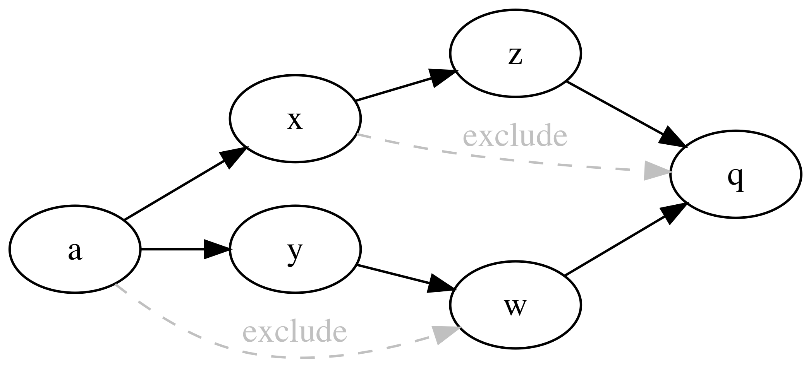

# Java : управление зависимостями

## Выбор одной версии для каждой зависимости
Если в транзитивное замыкание модуля X попадает несколько версий одной и той же библиотеки, мы выбираем ту версию, которая достижима из модуля X по кратчайшему пути. Если кратчайшие пути до нескольких разных версий имеют одинаковую длину, мы выбираем версию, которая встречается первой при обходе в глубину из модуля Х.

## EXCLUDE
```
EXCLUDE(
    lib/prefix1
    lib/prefix2
    ...
)
```
Если в транзитивном замыкании модуля есть библиотеки, чей путь начинается с одного из `library/prefixN`, они будут исключены из classpath. В classpath также не попадут их зависимости, если они стали недостижимыми после удаления этих библиотек из графа.


**Идеальным EXCLUDE** мы считаем такой механизм, что библиотека `X` попадает в `classpath(A)` тогда и только тогда, когда в графе зависимостей существует путь `A-->X` такой, что никакой его подпуть не может быть заменен на EXCLUDE-ребро.

Рассмотрим пример

Библиотека q может попасть в classpath(a) только по двум путям:
```
1) a --> x --> z --> q
2) a --> y --> w --> q
```
Но в первом пути подпуть `x --> z --> q` может быть заменен на EXCLUDE-ребро `x --> q`, а во втором пути подпуть `a --> y --> w` может быть заменен на EXCLUDE-ребро `a --> w`. Таким образом, в идеальном случае `q` не принадлежит `classpath(a)`.

Мы не умеем решать задачу **идеального EXCLUDE** без перебора путей, поэтому используем приближенное эвристическое решение.

Допустим, мы хотим вычислить `classpath(a)`. Для этого мы сначала вычисляем множество допустимых вершин для `a`:
```
allowed(a) = {a} + classpath(x) + classpath(y)
```
Затем из всего графа зависимостей `G(a)` удаляем все вершины, не вошедшие в `allowed(a)`, а также удаляем все вершины из `excludes(a)`. Все, что после этого осталось достижимым из `a` - это `classpath(a)`.

Для данного примера сначала вычислится `allowed(a)`:
```
allowed(a) = {a} + {x, z} + {y, w, q} = {a, x, y, z, w, q}
```
В данном случае все вершины графа зависимостей `G(a)` принадлежат `allowed(a)`, поэтому мы удаляем только `excludes(a) = {w}`. Все, что остается достижимым после этого – это `classpath(a) = {a, x, y, z, q}`. В частности, `q` осталось достижимым по пути `a --> x --> z --> q`. На самом деле это нелегальный путь, так как `excludes(x) = {q}`, но `q` попало в `allowed(a)` через `y`, поэтому далее путь `a --> x --> z --> q` снова попадал в рассмотрение.

Этим наш механизм отличается от идеального. Он гарантирует, что если в модуле `a` написано `EXCLUDE(x)`, то в `classpath(a)` не попадет ни сам `x` ни зависимости `x`, которые становятся недостижимыми после удаления `x`. Это правильное поведение. Если же `b` зависит от этого `a`, то при некоторых обстоятельствах из-за того, что `x` достижим из `a`, `x` может попасть в `classpath(b)`. Этого всегда можно избежать, дописав необходимый `EXCLUDE` в `b`.



## DEPENDENCY_MANAGEMENT
```
DEPENDENCY_MANAGEMENT(
    path/to/lib1
    path/to/lib2
    ...
)
```

Это аналог мавеновского `dependencyManagement`. Выполняет две функции.
1. Позволяет зафиксировать версии библиотек из `contrib/java` в одном месте, а во всех модулях проекта при написании `PEERDIR` не указывать версию.
   Например, если в модуле написано `PEERDIR(contrib/java/junit/junit)`, причем написано `DEPENDENCY_MANAGEMENT(contrib/java/junit/junit/4.12)`, то `PEERDIR` автоматически заменяется на `contrib/java/junit/junit/4.12`.
   Данное свойство **передается транзитивно**. То есть, если модуль A зависит от модуля B, а в B написано `PEERDIR(contrib/java/junit/junit)`, и этот junit подменился на junit-4.12, то в A через B приедет junit-4.12.
2. Позволяет зафиксировать версии библиотек из `contrib/java`, попадающих в classpath транзитивно.
   Например, если в модуле написано `DEPENDENCY_MANAGEMENT(contrib/java/junit/junit/4.12)`, но не написано соответствующего `PEERDIR(contrib/java/junit/junit)`, то
   * если по зависимостям притягивается, например, `contrib/java/junit/junit/4.11`, он будет заменен на `contrib/java/junit/junit/4.12`
   * если по зависимостям не притягивается никакой junit, этот `DEPENDECY_MANAGEMENT` не имеет эффекта
   Данное свойство **не передается транзитивно**. То есть, если модуль A зависит от B, а B подменил себе транзитивно приезжающий junit-4.11 на junit-4.12, то в A через B все равно приедет junit-4.11.

В случае, когда в модуле написано одновременно `DEPENDENCY_MANAGEMENT(contrib/java/junit/junit/4.12)` и `PEERDIR(contrib/java/junit/junit/4.11)`, побеждает `PEERDIR`.

Версия некоторых библиотек жёстко зафиксирована.
В данный момент запрет на альтернативные версии введён для:

* `contrib/java/com/google/flatbuffers/flatbuffers-java` (всех версий, отличных от `${JAVA_FLATBUFFERS_VERSION}`)
* `contrib/java/com/google/protobuf/protobuf-java` (всех версий, отличных от `${JAVA_PROTO_RUNTIME_VERSION}`)
* `contrib/java/com/google/protobuf/protobuf-javalite` (всех версий, отличных от `${JAVA_PROTO_RUNTIME_VERSION}`)
* `contrib/java/com/google/protobuf/protobuf-java-util` (всех версий, отличных от `${JAVA_PROTO_RUNTIME_VERSION}`)

Версии данных библиотек контролируются через «подковёрный» `DEPENDENCY_MANAGEMENT` в ymake.core.conf
Для исправления ошибки сборки _forbids direct or indirect PEERDIR dependency to module_,
нужно удалить пользовательский `DEPENDENCY_MANAGEMENT`,
управляющий версиями указанных в сообщении библиотек.
