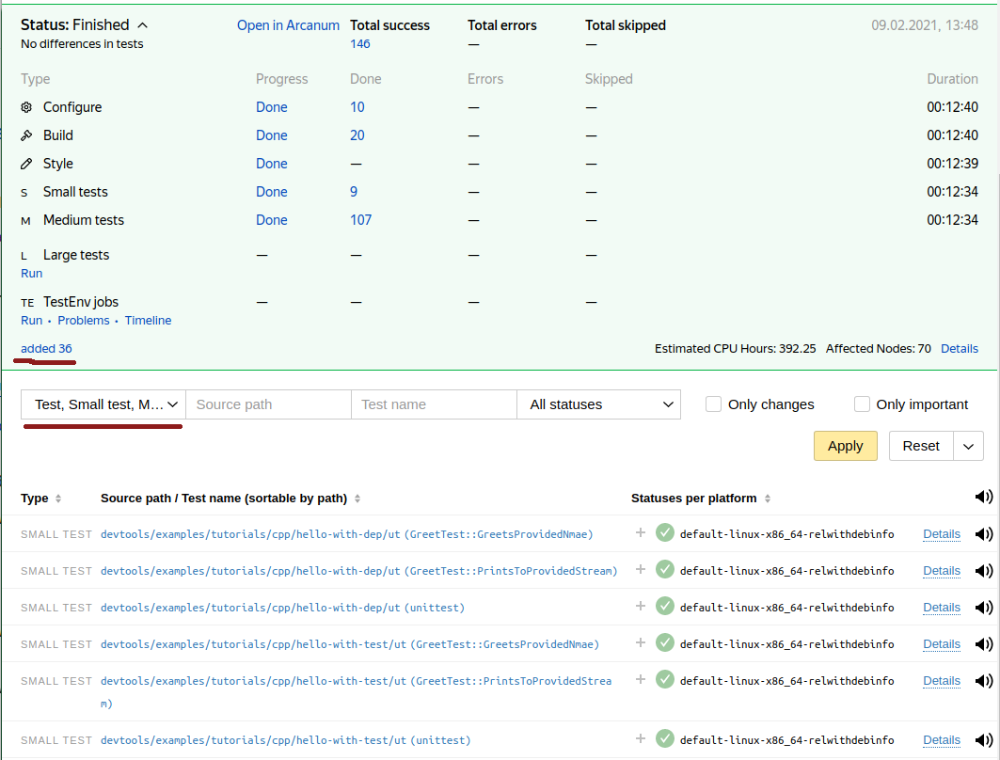

# Как создать проект на C++

## Прежде чем начать

Далее предполагается, что
- Локально имеется рабочая копия Аркадии полученная по [инструкции](https://docs.yandex-team.ru/devtools/intro/quick-start-guide).
- Разработчик знает в каком он проекте с точки зрения Аркадии (в какой папке верхнего уровня будет его код).
- Разработчик уже включён в одну из групп Арканум.

## Hello, World!

По традиции все руководства по связанным с программированием вещам начинаются с него: [devtools/examples/tutorials/cpp/hello](https://a.yandex-team.ru/arc_vcs/devtools/examples/tutorials/cpp/hello)

Структура директории проекта очень проста единственный исходный файл и единственный файл описывающий сборку:
```
devtools/examples/tutorials/cpp/hello/
├── main.cpp
└── ya.make
```
Компилируемый исходный код:



И описание проекта:



Теперь можно собрать и запустить приложение описанное данным проектом:
```
$ ya make devtools/examples/tutorials/cpp/hello
Ok
$ ./devtools/examples/tutorials/cpp/hello/hello
Hello world
```
Поскольку в Аркадии принято правило "одна директория - один модуль", то для сборки надо указывать директорию, где модуль (в данном случае программа) описан. Если вы уже находитесь в этой директории, то путь можно не указывать.



Если не указать имя директории, находясь в корне Аркадии, то будет сделана попытка собрать всю Аркадию. Это может быть ооочень долго и вряд ли вам такое может понадобиться.



Как результат в директории модуля создаётся символическая ссылка на собранное в директории сборки приложения (сама сборка выполняется вне рабочей копии и там же сохраняется кэш для ускорения дальнейших сборок).

## Hello world c библиотекой

В процессе развития кодовой базы приложения часть классов и функций неизбежно потребуется выносить в библиотеку как минимум для покрытия их unit тестами, а в каких-то случаях и для переиспользования их в других приложениях сервиса или компании. Для примера выделим вывод строки приветствия в отдельную функцию и унесём её в библиотеку получив чуть более сложную версию hello world проекта: [devtools/examples/tutorials/cpp/hello-with-lib](https://a.yandex-team.ru/arc_vcs/devtools/examples/tutorials/cpp/hello-with-lib)

Так как в одной директории может быть описан только один модуль, то библиотечную часть и описание сборки программы необходимо разнести по разным директориям. Например вот так:
```
devtools/examples/tutorials/cpp/hello-with-lib/
├── bin
│   ├── main.cpp
│   └── ya.make
├── greet.cpp
├── greet.h
└── ya.make
```

В корне проекта размещается библиотека в которой содержится весь реальный функционал приложения, поверх которого может быть написан тривиальный `main`:





Описание сборки для этой библиотеки выглядит так:



Содержимое поддиректории bin это сам тривиальный `main`:



и сборка приложения из него:



Важно не забыть поставить зависимость от приложения на библиотеку содержащую реальную реализацию функционала с помощью макроса `PEERDIR` и в корневой директории проекта добавить `RECURSE` на сам проект собирающий финальное приложение.

Сборки и запуск полученного проекта происходит следующим образом:
```
$ ya make devtools/examples/tutorials/cpp/hello-with-lib
Ok
$ ./devtools/examples/tutorials/cpp/hello-with-lib/bin/hello 
Hello World
```

## Hello world c библиотекой и юнит-тестом

Разбив приложение на реализацию, живущую в библиотеке, и компактный `main` можно и нужно писать тесты на классы и функции, реализующие непосредственную логику работы приложения.
В данном примере приложение из предыдущего раздела преобразуется к следующему виду: [devtools/examples/tutorials/cpp/hello-with-test](https://a.yandex-team.ru/arc_vcs/devtools/examples/tutorials/cpp/hello-with-test).

В структуре проекта появится дополнительно папка `ut`, содержащая собственно код тестов и описание их сборки. Итоговая директория проекта будет выглядеть следующим образом:
```
devtools/examples/tutorials/cpp/hello-with-test/
├── bin
│   ├── main.cpp
│   └── ya.make
├── greet.cpp
├── greet.h
├── ut
│   ├── greet_ut.cpp
│   └── ya.make
└── ya.make
```

В корневом ya.make добавляется `RECURSE_FOR_TESTS(ut)`, который добавляет тестовый проект в сборку если запрошен запуск тестов. Возможно использовать просто `RECURSE(ut)` если хочется собирать тесты всегда, даже когда не требуется их запускать. Полная версия корневого ya.make становится следующей:



Сам код теста в данном примере выглядит следующим образом:



а описание сборки:



Он почти полностью совпадает с описанием сборки приложения, за исключением типа модуля: вместо `PROGRAM` используется `UNITTEST`. Так же как и при описании сборки приложения важно не забыть прописать зависимость от тестируемой библиотеки с помощью макроса `PEERDIR`.

Сборка и запуск приложения из данного примера выполняется ровно так же, как и сборка предыдущего примера, а сборка с запуском теста выполняется следующим образом:
```
$ ya make -t devtools/examples/tutorials/cpp/hello-with-test
Total 1 suite:
	1 - GOOD
Total 2 tests:
	2 - GOOD
Ok
```

По факту запуска тестов выводится краткая статистика о количестве запущенных тестов и их статусе. В случае если какие-то из тестов не прошли, в выводе сборки будут содержаться логи упавших тестов.

## Hello world c внешней библиотекой

В любом реальном проекте всегда используется какое-то количество внешних по отношению к нему самому библиотек. Проект, разрабатывающийся в Аркадии, сразу имеет доступ к огромному количеству библиотек, как написанных внутри Яндекса, так и популярным open source библиотекам написанным на C++. Для того, чтобы начать использовать в своём проекте библиотеку, живущую в Аркадии и использующую Аркадийную систему сборки, всё что требуется это добавить в свой проект `PEERDIR` на неё.
Например, для того, чтобы использовать opensource библиотеку [fmtlib](https://a.yandex-team.ru/arc/trunk/arcadia/contrib/libs/fmt) достаточно `PEERDIR`:



И можно внедрять использование библиотеки в коде:



Сборка, прогон тестов и запуск финального приложения при этом не изменяются:

```
$ ya make -t devtools/examples/tutorials/cpp/hello-with-dep
Total 1 suite:
	1 - GOOD
Total 2 tests:
	2 - GOOD
Ok
$ ./devtools/examples/tutorials/cpp/hello-with-dep/bin/hello 
Hello World
```

Полный код примера можно найти [здесь](https://a.yandex-team.ru/arc_vcs/devtools/examples/tutorials/cpp/hello-with-dep).

## Подключение к CI

Чтобы код можно было закоммитить в Аркадию и он проверялся там на регулярной основе надо подключить его к CI.

Делается это уже знакомым нам макросом `RECURSE`. Чтобы модуль (программа/пакет/тесты) был доступен в CI он должен быть достижим от проекта autocheck по цепочке макросов `RECURSE`, `RECURSE_FOR_TESTS` и т.п. Обычно, однако, проекты более верхнего уровня уже подключены к CI и потому достаточно дописать свой к списку `RECURSE`-ов проекта. При этом `RECURSE` который мы сделали для тестов тоже будет учтён. Таким образом подключив к CI пакет, его тесты тоже подключатся.

Например, примеры проектов используемые в данном документе, подключены к автосборке вот так:



Когда код написан, локально протестирован и подключен к CI его можно отправлять на ревью. На плашке проверки в нижнем левом углу интерфейса PR должно отобразиться добавление сборок и тестов виде ссылки с текстом `added: 100500`. По клику по данной ссылке можно увидеть полный список добавленных проверок, а с помощью фильтров в интерфейсе CI можно посмотреть какие именно тесты были добавлены в текущем ревью.
Например, в плашке ревью, добавившего примеры из данной статьи, можно увидеть что описанные тесты успешно исполнялись в автосборке:


