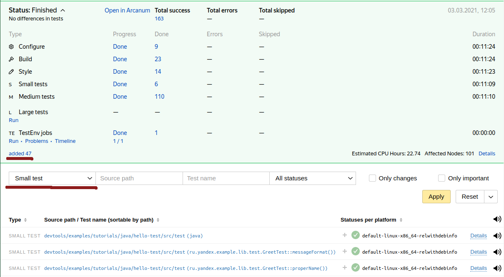

# Как создать проект на Java

Далее предполагается, что
- Локально имеется рабочая копия Аркадии полученная по [инструкции](https://docs.yandex-team.ru/devtools/intro/quick-start-guide).
- Разработчик знает в каком он проекте с точки зрения Аркадии (в какой папке верхнего уровня будет его код).
- Разработчик уже включён в одну из групп Арканум.

## Hello world

По традиции все руководства по связанным с программированием вещам начинаются с него: [devtools/examples/tutorials/java/hello-world](https://a.yandex-team.ru/arc_vcs/devtools/examples/tutorials/java/hello-world)

Структура директории проекта очень проста единственный исходный файл и единственный файл описывающий сборку:
```
devtools/examples/tutorials/java/hello-world
├── src
│   └── main
│       └── java
│           └── ru
│               └── yandex
│                   └── example
│                       └── Hello.java
└── ya.make
```
Компилируемый исходный код:



И описание проекта:



Теперь можно собрать и запустить приложение описанное данным проектом:
```
$ ya make -t devtools/examples/tutorials/java/hello-world

Total 1 suite:
	1 - GOOD
Total 1 test:
	1 - GOOD
Ok
$ cd devtools/examples/tutorials/java/hello-world
$ ./run.sh ru.yandex.example.Hello
Using java from ya build system: /home/svidyuk/.ya/tools/v4/1903522585/bin/java
Hello world
```
Поскольку в Аркадии принято правило "одна директория - один модуль", то для сборки надо указывать директорию, где модуль описан. Если вы уже находитесь в этой директории, то путь можно не указывать.



Если не указать имя директории находясь в корне Аркадии, то будет сделана попытка собрать всю Аркадию. Это может быть ооочень долго и вряд ли вам такое может понадобиться.



Как результат в директории модуля создаётся символические ссылки на артефакты лежащие в директории сборки: собранный jar файл, его зависимости и скрипт для запуска JAVA приложения в правильном окружении (сама сборка выполняется вне рабочей копии и там же сохраняется кэш для ускорения дальнейших сборок).



В приведённом выше примере команды сборки использовался ключ `-t`, который отвечает за сборку и запуск тестов в процессе сборки. Не смотря на то, что в текущем примере нет тестов, тем не менее есть автоматически добавленные системой сборки тесты соответствия кода принятым в Аркадии стилям оформления.



## Hello world с ресурсом

В силу специфики Java мира Аркадийная система ресурсов несовместима с со сборкой Java библиотек и приложений, но при этом мы поддерживаем родной для Java способ запаковки ресурсов в собираемый артефакт. Для примера модифицируем приложение выше так, чтобы имя для приветствия не было захардкожено, а бралось из property файла, лежащего в ресурсах.

Структура директорий может быть организована следующим образом:
```
devtools/examples/tutorials/java/hello-resource
├── src
│   └── main
│       ├── java
│       │   └── ru
│       │       └── yandex
│       │           └── example
│       │               └── Hello.java
│       └── resources
│           └── myapp.properties
└── ya.make
```

Код примера теперь выглядит так:



Файл с property ресурсом:



А описание проекта:



## Hello world c зависимостью

С ростом проекта часть функционала неизбежно начинает выноситься в библиотеки, которые переиспользуются в нескольких разных относительно независимых подпроектом отдела или в разных проектах компании. В качестве примера того, как в Java проекте в аркадии разбивать код на отдельные пригодные к переиспользованию модули возьмём немного усложнённый вариант Hello World проекта, в котором печать приветствия человека с произвольным именем в произвольный поток вывода вынесена в отдельную библиотеку.

Структура директорий может быть организована следующим образом:
```
devtools/examples/tutorials/java/hello-dep
├── lib
│   ├── src
│   │   └── main
│   │       └── java
│   │           └── ru
│   │               └── yandex
│   │                   └── example
│   │                       └── lib
│   │                           └── Greet.java
│   └── ya.make
├── prog
│   ├── src
│   │   └── main
│   │       └── java
│   │           └── ru
│   │               └── yandex
│   │                   └── example
│   │                       └── Hello.java
│   └── ya.make
└── ya.make
```

Код точки входа в приложение теперь выглядит так:



А код библиотечного класса:



В отличии от сборки приложения, для сборки библиотеки нужно использовать модуль `JAVA_LIBRARY`, а не `JAVA_PROGRAM` как в предыдущих примерах, в остальном же файл описания сборки похож на `ya.make` файлы из предыдущих примеров:



В описании сборке приложения теперь нужно прописать зависимость от новой добавленной библиотеки используя макрос `PEERDIR`:



Чтобы оба модуля было проще собирать, в корне структуры тестовых проектов есть ещё один `ya.make` файл, который не описывает модулей для сборки, а только перечисляет проекты, которые нужно собирать вместе, используя для этого макрос `RECURSE`:



## Hello tests

Писать и поддерживать сколь-нибудь значимый продукт без тестов не самая лучшая идея. Давайте рассмотрим, что нужно, чтобы написать тесты на библиотеку из предыдущего примера.

Так как в системе сборки Аркадии в одной директории может быть только один модуль, а тесты описываются в виде отдельного модуля, то потребуется завести отдельный ya.make файл в дереве каталогов проекта. Структура директорий может быть организована следующим образом:
```
devtools/examples/tutorials/java/hello-test
├── src
│   ├── main
│   │   └── java
│   │       └── ru
│   │           └── yandex
│   │               └── example
│   │                   └── lib
│   │                       └── Greet.java
│   └── test
│       ├── java
│       │   └── ru
│       │       └── yandex
│       │           └── example
│       │               └── lib
│       │                   └── test
│       │                       └── GreetTest.java
│       └── ya.make
└── ya.make
```

Код библиотечного класса остался неизменным:



А в описании его сборки мы подключаем тестовый модуль используя макрос `RECURSE_FOR_TEST`:



Код самого теста может выглядеть, например вот так:



А в описании его сборки мы должны использовать один из тестовых модулей для Java сборки `JTEST` (junit4) или `JUNIT5`. В текущем примере используется 'JUNIT5' и описание сборки выглядит следующим образом:



Если требуется использовать junit4, то в описании сборки достаточно будет заменить тип модуля, всё остальное будет работать так же.

## Hello world и версии зависимостей

Разные версии внешних библиотек могут иметь несовместимы изменения в API или зависеть от конкретных версий других библиотек. Для Java сборки заставить все проекты в аркадии зависеть от одной единственной (в идеале самой свежей) версии каждой библиотеки не реализуемо. Поэтому нужно уметь управлять версиями используемых сторонних библиотек. В Аркадийной сборе для этого используется макрос `DEPENDENCY_MANAGEMENT`. Он позволяет указать конкретную версию используемой библиотеки как в случае прямой зависимости от неё, так и транзитивной. Для примера рассмотрим приложение, которое распечатывает свои аргументы командной строки в виде YAML массива, используя библиотеку [contrib/java/org/yaml/snakeyaml](https://a.yandex-team.ru/arc_vcs/contrib/java/org/yaml/snakeyaml):



При описании её сборки мы описываем зависимость от библиотеки через `PEERDIR`, а версию через `DEPENDENCY_MANAGEMENT`:





Несмотря на то, что версию библиотеки можно было сразу указать в макросе `PEERDIR` чаще всего поступают именно так, вынося вызов макроса `DEPENDENCY_MANAGEMENT` в отдельный файл, включаемый через `INCLUDE` в множество модулей, относящихся к одному проекту. Это позволяет централизованно в одном месте переходить к новым версиям библиотек.



## Подключение в автосборку

Следующим шагом после написания кода и его тестов является настройка CI. В случае Аркадийной сборки рабочий CI доступен для проекта сразу. Достаточно, чтобы проект был достижим по `RECURSE` от корня Аркадии. В PR который добавляет модуль в автосборку в плашке можно всегда увидеть новые проверки в CI плашке по ссылке в нижнем левом углу, а с помощью фильтров найти конкретные тесты, которые были добавлены:


