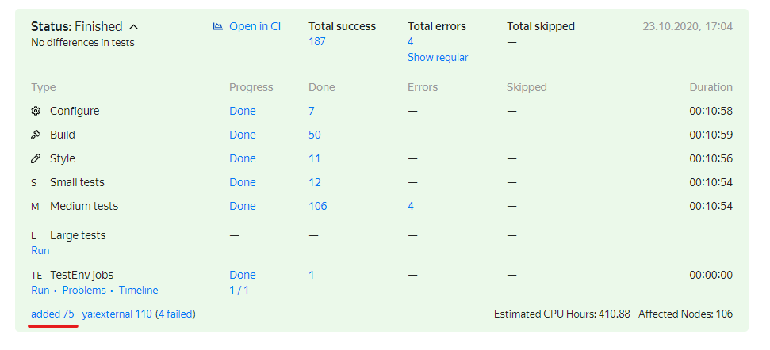
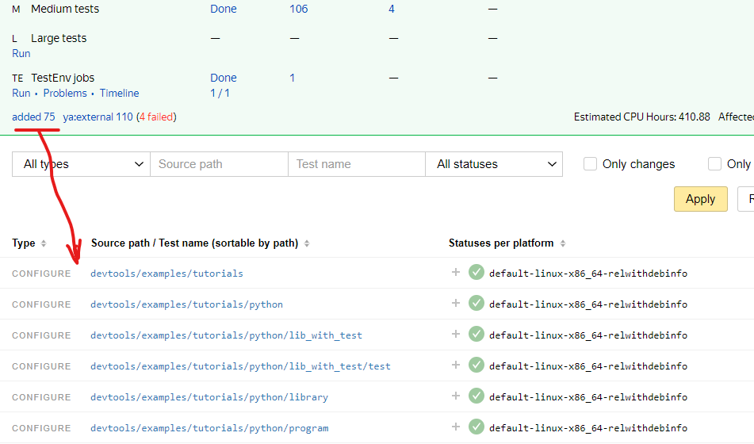

# Руководство по сборке кода на Python

С целью облегчения деплоя и фиксирования окружения в Аркадии Python собирается в исполняемые программы.
Эти программы содержат весь необходимый для запуска код на Python включая пакеты внешних зависимостей,
а также интерпретатор, который собственно этот код исполняет. В связи с этим сборка Python-кода должна
быть специальным образом описана.

Это краткая базовая инструкция о том, как описать сборку Python для `ya make`.

**Чему она учит**
- Как создать проект на Python в Аркадии
- Как описать, собрать и исполнить простейший код на Python
- Как создавать пакеты на Python в Аркадии и сразу проверять их
- Как использовать свои и чужие пакеты
- Как тестировать код на Python
- Как подключить код к CI

## Прежде чем начать

Далее предполагается, что
- Локально имеется рабочая копия Аркадии полученная по [инструкции](https://docs.yandex-team.ru/devtools/intro/quick-start-guide)
- Разработчик знает в каком он проекте с точки зрения Аркадии (в какой папке верхнего уровня будет его код).
- Разработчик уже включён в одну из групп Арканум.
- Разработчик прочитал [правила жизни Python в Аркадии](https://docs.yandex-team.ru/arcadia-python/) и о том, [как писать код на Python в Аркадии](https://docs.yandex-team.ru/arcadia-python/python_style_guide)

## Создаём первый проект

Каждый пакет в Аркадии должен находиться в собственной директории. Поэтому первым делом надо выбрать место внутри директории проекта и создать поддиректорию в которой будет жить код пакета.



В Аркадии принято именование пакетов от корня. Поскольку все слоги в импорте являются идентификаторами, все директории в пути и само имя файла должны удовлетворять правилам именования идентификаторов:
- Содержать только латинские буквы, цифры и знак `_`.
- Начинаться только с букв или знака `_`.



В эту директорию кладём файлы с исходным кодом, а также файл ya.make.
Каждый ya.make в Аркадии должен содержать владельца кода - того, к кому можно обратиться для исправления ошибок и одобрения изменений. Для этого служит макрос [OWNER](../manual/common/macros.md#owner). Желательно указывать сразу группу, чтобы владелец не терялся на время отпуска или при переходе в соседние подразделения.

Начнём мы с кода, который можно сразу запустить, поэтому минимальный `ya.make` будет выглядеть так:

```
OWNER(g:<your_group>)
PY3_PROGRAM()

END()
```

Здесь `PY3_PRORGAM()` говорит, что в этой директории будет располагаться именно запускаемая программа (а не пакет для использования в других программах).

**Более подробно:**

- [Об `OWNER` (eng, !TODO!)](../manual/common/macros.md#owner)
- [О `PY3_PROGRAM`](../manual/python/modules.md#py3_program)
- [О сборке Python в программы](../manual/python/index.md)


## Hello world

Первой программой у нас традиционно будет `hello world`. Для сборки в Аркадии выглядеть это будет так:

```
<project>/program/
          +--- main.py
          +--- ya.make
```

Например  [devtools/examples/tutorials/python/program](https://a.yandex-team.ru/arc/trunk/arcadia/devtools/examples/tutorials/python/program/)

Собственно код `main.py`:



И `ya.make`



В макросе [`PY_SRCS`](../manual/python/macros.md#py_srcs) надо перечислять исходные файлы для программы или пакета. В данном случае наш исходный файл содержит точку входа в программу, поэтому он указан как `MAIN`.
Это означает, что запуск программы начнётся с функции `def main():` в этом исходном файле.



В сборку попадают только файлы, перечисленные в [`PY_SRCS`](../manual/python/macros.md#py_srcs). Если забыть добавить туда файл, он не попадёт в программу и во время исполнения случится ошибка импорта.



Программа написана, её можно собрать:
```
[=] cd <arcadia_root>
[=] ya make <project>/hello
```

Поскольку в Аркадии принято правило *"одна директория - один модуль"*, то для сборки надо указывать директорию, где модуль (в данном случае программа) описан.
Если вы уже находитесь в этой директории, то путь можно не указывать.



Если не указать имя директории находясь в корне Аркадии, то будет сделана попытка собрать всю Аркадии. Это может быть ооочень долго и вряд ли вам такое может понадобиться.




**Например:**

```
[=] ya make devtools/examples/tutorials/python/program
Ok

[=] ls devtools/examples/tutorials/python/program
main.py  program  ya.make

[=] devtools/examples/tutorials/python/program/program
Hello, world!
```

**Или**
```
[=] cd devtools/examples/tutorials/python/program
[=] ya make
Ok

[=] ls
main.py  program  ya.make

[=] ./program
Hello, world!
```

Как результат в директории проекта создался файл (точнее символьная ссылка) `program`. Это и есть наша первая программа на Python. Её можно запустить и увидеть `Hello, world!`.
По умолчанию имя программы совпадает с последним слогом пути к её описанию. Имя может быть переопределено параметром [`PY3_PROGRAM`](../manual/python/modules.md#py3_program).
На одном из следующих шагов будет такой пример.



Символьная ссылка в директории проекта появится только для `Linux` и `Darwin`. При построении на `Windows` ссылка на артефакт сборки не создаётся внутри рабочей копии. Чтобы получить артефакт сборки воспользуйтесь дополнительными флагами `ya make`: `-o <output-dir>` или `-I <output-dir>`. ***Важно! не указывайте в качестве `<output-dir>` директорию внутри рабочей копии Аркадии.***



Для программ автоматически создаются тесты стиля и импортов. Чтобы убедиться, что у вас нет проблем со стилем кода нужно запустить сборку с флагом `-t`.

**Пример**

```
[=] ya make -t devtools/examples/tutorials/python/program

Total 2 suites:
        2 - GOOD
Total 2 tests:
        2 - GOOD
Ok
```

**Более подробно:**

- [О `PY3_PROGRAM`](../manual/python/modules.md#py3_program)
- [О `PY_SRCS`](../manual/python/macros.md#py_srcs)
- [Об указании точки входа в программу](../manual/python/macros.md#py_main)
- [О сборке Python в программы](../manual/python/index.md)
- [О тестах стиля](../manual/tests/style.md)


## Пакет для Hello world

Допустим нам нужно создать какой-то пакет для использования в разных программах. В терминах Аркадийной системы сборки пакет - это `PY3_LIBRARY`
(или `PY23_LIBRARY`, если хочется использовать его и из существующих программ или пакетов на Python 2). Описание пакета не сильно отличается от программы:

Структура файлов
```
<project>/package/
          +--- module py
          +--- ya.make
```

Например [devtools/examples/tutorials/python/library](https://a.yandex-team.ru/arc/trunk/arcadia/devtools/examples/tutorials/python/library/).


- При использовании весь путь до описания пакета по умолчанию будет формировать имя пакета, а имена файлов - станут именами модулей.
- `__init__.py` не обязателен, но если существует и указан в [`PY_SRCS`](../manual/python/macros.md#py_srcs), то написанное в нём можно использовать на уровне пакета.
- Как и в случае программы, все исходные файлы пакета должны быть указаны в макросе [`PY_SRCS`](../manual/python/macros.md#py_srcs).
- Чтобы использовать пакет надо обязательно указать путь до него в макросе `PEERDIR`.

Собственно код:



И `ya.make`



В этом примере видно не только как написать пакет, но и как использовать другие пакеты: у нас есть `PEERDIR` в `ya.make` и `import` в коде. В данном случае мы использовали общий
внешний пакет [contrib/python/color](https://a.yandex-team.ru/arc/trunk/arcadia/contrib/python/color)

Также как программу пакет можно собрать командой `ya make` и проверить, что всё в порядке со стилем командой `ya make -t`.

**Пример**

```
[=] ya make -t devtools/examples/tutorials/python/library

Total 1 suite:
        1 - GOOD
Total 1 test:
        1 - GOOD
Ok
```




Сборка `PY3_LIBRARY` порождает либо библиотеку, либо объектные файлы. Это не означает компиляцию Python в исполняемый код: эти файлы содержат данные.  Никакого разумного применения у них нет,
они используются только для сборки Python в программы системой сборки `ya make`. Поэтому здесь не приведён листинг директории после сборки.





Импорты проверяются только для программ целиком. Для библиотек проверяется только стиль. Поэтому в примере для программы сюит две, а для библиотеки - одна.



Пакет написан, со стилем проблем нет, но нам бы хотелось проверить его работоспособность.
Это можно сделать написав программу с использованием пакета, или написав тесты. Об этом будет чуть ниже.

Чтобы непосредственно в интерпретаторе проверить работоспособность кода, можно использовать команду `ya py`.
Она соберёт интерпретатор с предустановленным пакетом и всеми необходимыми зависимостями.

**Например:**

```
[=] ya py devtools/examples/tutorials/python/library
Creating temporary PY3_PROGRAM /home/spreis/ws/arcadia/junk/spreis/_ya_py
Baking shell with:
 devtools/examples/tutorials/python/library
Ok
Python 3.8.6 (default, Oct 22 2020, 07:19:45)
Type 'copyright', 'credits' or 'license' for more information
IPython 7.18.1 -- An enhanced Interactive Python. Type '?' for help.

In [1]: import devtools.examples.tutorials.python.library.decorate as deco

In [2]: deco.capitalize('just a test')
Out[2]: 'JUST A TEST'

```

**Более подробно:**

- [О `PY3_LIBRARY`](../manual/python/modules.md#py3_library)
- [О `PY23_LIBRARY`](../manual/python/modules.md#py23_library)
- [О `PY_SRCS`](../manual/python/macros.md#py_srcs)
- [О `PEERDIR` (eng, !TODO!)](https://a.yandex-team.ru/arc/trunk/arcadia/build/docs#macro_PEERDIR)
- [О `ya py` (!TODO!)](../manual/python/commands.md#ya_py)
- [О сборке Python в программы](../manual/python/index.md)
- [О тестах стиля](../manual/tests/style.md)
- [Общие пакеты Yandex для Python](https://a.yandex-team.ru/arc/trunk/arcadia/library/python)
- [Внешние пакеты для Python в Аркадии](https://a.yandex-team.ru/arc/trunk/arcadia/contrib/python)


## Улучшеный Hello world

У нас есть пакет для 'украшения' строк, теперь мы можем воспользоваться им в программе. Чтобы сделать пример интереснее пусть наша программа теперь состоит из двух файлов.
`main.py` отвечает за разбор опций, а `hello.py` за логику.

Всё вместе у нас выглядит, например, так:
[devtools/examples/tutorials/python/library](https://a.yandex-team.ru/arc/trunk/arcadia/devtools/examples/tutorials/python/library/)
[devtools/examples/tutorials/python/program_with_lib](https://a.yandex-team.ru/arc/trunk/arcadia/devtools/examples/tutorials/python/program_with_lib)


```
<project>/library/
          +--- decorate.py
          +--- ya.make

<project>/program_with_lib/
          +--- hello.py
          +--- main.py
          +--- ya.make
```

Код в `main.py`:



Здесь видно, что нам доступны системные модули. Для них не нужны `PEERDIR`. Также нам доступны другие модули из нашего пакета. Их можно было бы импортировать по полному пути,
но можно воспользоваться относительным импортом, так намного короче.

Код в `hello.py`:



Здесь видно как импортировать и использовать другие пакеты из Аркадии.

Описание сборки в `ya.make`:



Здесь видно, что:

- Мы дали нашей программе имя. Теперь результат сборки будет называться `hello` (`hello.exe` на Windows).
- Мы поставили зависимость (`PEERDIR`) на нашу библиотеку. В `PEERDIR` надо всегда указывать путь от корня Аркадии.
- Мы не забыли указать оба наших файла в `PY_SRCS` и указали точку входа.

Соберём программу, проверим её стиль и импорты. Теперь у нас есть зависимости, так что проверка импортов обретает смысл.

```
[=] cd devtools/examples/tutorials/python/program_with_lib
[=] ya make -t

Total 2 suites:
        2 - GOOD
Total 3 tests:
        3 - GOOD
Ok

[=] ls
hello  hello.py  main.py  ya.make

[=] ./hello
Hello, world!

[=] ./hello -C
HELLO, WORLD!

[=] ./hello -C -c red
HELLO, WORLD!          # this one is red
```

**Более подробно**

- [О `PY3_PROGRAM`](../manual/python/modules.md#py3_program)
- [О `PY_SRCS`](../manual/python/macros.md#py_srcs)
- [Об указании точки входа в программу](../manual/python/macros.md#py_main)
- [О `PEERDIR` (eng, !TODO!)](https://a.yandex-team.ru/arc/trunk/arcadia/build/docs#macro_PEERDIR)
- [О сборке Python в программы](../manual/python/index.md)
- [О тестах стиля](../manual/tests/style.md)


## Тесты для пакета

Каждому пакету нужны тесты. В Аркадии описание тестов должно быть в отдельном `ya.make` а значит должно лежать в отдельной директории.
Обычно эту директорию кладут внутрь директории пакета, к которому относятся тесты.

Структура файлов

```
<project>/package/
          +--- tests/
               +--- test_decorate.py
               +--- ya.make
          +--- module py
          +--- ya.make
```

Например [devtools/examples/tutorials/python/lib_with_test](https://a.yandex-team.ru/arc/trunk/arcadia/devtools/examples/tutorials/python/lib_with_test/).

Код самого пакета здесь такой же, как и в предыдущем примере, поэтому дублировать его не будем. Посмотрим на код и описание теста:



В нём используется такой же импорт, как и в примере с программой. В качестве тестового фреймворка используется `pytest`. Доступны все базовые возможности этого фреймворка.
Имена тестовых функций должны начинаться с `test_`, именно они и будут индивидуальными тестами. Сюитой будет весь тестовый пакет, описанный в `ya.make`.

И `ya.make`



Здесь видно, что тестовый пакет описывается как [`PY3TEST`](../manual/python/modules.md#pytestpy3test). В Аркадии можно также встретить
[`PY2TEST`](../manual/python/modules.md#pytestpy3test) для кода на Python 2 и [`PY23_TEST`](../manual/python/modules.md#py23_test) для тестирования 2-3-совместимого кода в обоих режимах.
Файлы, в которых будут искаться тесты перечисляются в макросе [`TEST_SRCS`](../manual/python/macros.md#test_srcs). Требования к именованию файлов в тесте нет, будут анализироваться файлы с любыми именами, написанные в `TEST_SRCS`.



И в пакетах, и в тестах доступно оба макроса для описания исходного кода [`PY_SRCS`](../manual/python/macros.md#py_srcs) и [`TEST_SRCS`](../manual/python/macros.md#test_srcs). Вне зависимости от того, где они написаны, он работают одинаково.
[`PY_SRCS`](../manual/python/macros.md#py_srcs) добавляет код в сборку, а [`TEST_SRCS`](../manual/python/macros.md#test_srcs) делает функции, начинающиеся с `test_` собственно тестами.
Это значит, что функции `test_` из файлов в [`PY_SRCS`](../manual/python/macros.md#py_srcs) тестами не станут, даже если написаны в [`PY3TEST`](../manual/python/modules.md#pytestpy3test).
А вот функции `test_` из файлов в [`TEST_SRCS`](../manual/python/macros.md#test_srcs) станут тестами даже если написаны в [`PY3_LIBRARY`](../manual/python/modules.md#py3_library),
которая используется в [`PY3TEST`](../manual/python/modules.md#pytestpy3test).



Собираются и запускаются тесты командой `ya make -t` с которой мы уже встречались раньше. Кроме статуса в консоли запуск создаёт поддиректорию (более точно - символьную ссылку на директорию)
с результатами запуска `test-results`. В ней можно найти логи запуска сюиты, каждого теста и файлы, которые могут оставаться от запуска (например, если тест сам пишет логи).


Структура директории примерно такая:

```
<project>/package/tests/test-results/
                 +--- <suite1> /
                      +--- testing_out_staff/
                           +--- <testname1>.log
                           +--- <testname2>.log
                           +--- run.log
                           +--- ...
                      +--- run_test.log         # Лог всего запуска
                      +--- ytest.report.trace   # Метрики и трейсы запуска
                      +--- meta.json            # Информация о запуске
                 +--- <suite2>/
                 . . .
```

**Пример:**

```
[=] cd devtools/examples/tutorials/python/lib_with_tests/test
[=] ya make -t

Total 3 suites:
        3 - GOOD
Total 4 tests:
        4 - GOOD
Ok

[=] ls
examples-tutorials-python-lib_with_test-test  test_decorate.py  test-results  ya.make

[=] ls test-results
flake8.py3  import_test  py3test   ## Запустилось 3 сюиты: наша - py3test, тесты стиля и импортов

[=] ls test-results/py3test
meta.json  run_test.log  testing_out_stuff  ytest.report.trace

[=] ls test-results/py3test/testing_out_stuff/
run.log  stderr  stdout  test_decorate.py.test_capitalize.log  test_decorate.py.test_colorize.log

[=] cat test-results/py3test/testing_out_stuff/run.log
2020-10-23 08:44:27,595 - INFO - ya.test - pytest_runtest_setup: ####################################################################################################
2020-10-23 08:44:27,595 - INFO - ya.test - pytest_runtest_setup: test_capitalize
2020-10-23 08:44:27,595 - INFO - ya.test - pytest_runtest_setup: ####################################################################################################
2020-10-23 08:44:27,595 - INFO - ya.test - pytest_runtest_setup: Test setup
2020-10-23 08:44:27,596 - INFO - ya.test - pytest_runtest_call: Test call (class_name: test_decorate.py, test_name: test_capitalize)
2020-10-23 08:44:27,597 - INFO - ya.test - pytest_runtest_teardown: Test teardown
2020-10-23 08:44:27,600 - INFO - ya.test - pytest_runtest_setup: ####################################################################################################
2020-10-23 08:44:27,600 - INFO - ya.test - pytest_runtest_setup: test_colorize
2020-10-23 08:44:27,600 - INFO - ya.test - pytest_runtest_setup: ####################################################################################################
2020-10-23 08:44:27,600 - INFO - ya.test - pytest_runtest_setup: Test setup
2020-10-23 08:44:27,601 - INFO - ya.test - pytest_runtest_call: Test call (class_name: test_decorate.py, test_name: test_colorize)
2020-10-23 08:44:27,602 - INFO - ya.test - pytest_runtest_teardown: Test teardown
```

Чтобы тесты строились и запускались вместе со сборкой/тестированием пакета используют макрос `RECURSE` или `RECURSE_FOR_TESTS` в `ya.make` библиотеки. Эти макросы говорят о том, что запрос на
сборку директории, в `ya.make` котрой они написаны надо распространить на поддиректории написанные в макросе.

Отличие между этими макросами в поведении при сборке без тестирования - в первом случае тесты будут всегда собираться при сборке библиотеки, во втором - только при сборке с тестированием.
Однозначной рекомендации что использовать здесь нет, можно выбрать что удобнее.

**Пример**



* Здесь при сборке `<project>/lib_with_tests` будет также строиться `<project>/lib_with_tests/test`.

```
[=] cd devtools/examples/tutorials/python/lib_with_tests
[=] ya make -t

Total 4 suites:
        4 - GOOD
Total 5 tests:
        5 - GOOD
Ok
```

Здесь добавилось тестирования стиля самого пакета, как было описано в [выше](#lib), поэтому сюит 4, а не 3.


**Более подробно**
- [Руководство по написанию тестов (!TODO!)](tests.md)
- [О `PY3TEST`](../manual/python/modules.md#pytestpy3test)
- [О `PY23_TEST`](../manual/python/modules.md#py23_test)
- [О `TEST_SRCS`](../manual/python/macros.md#test_srcs)
- [О `RECURSE` (eng, !TODO!)](https://a.yandex-team.ru/arc/trunk/arcadia/build/docs#macro_RECURSE)
- [О `RECURSE_FOR_TESTS` (eng, !TODO!)](https://a.yandex-team.ru/arc/trunk/arcadia/build/docs#macro_RECURSE_FOR_TESTS)
- [О поддержке тестирования в ya make](../manual/tests/index.md)
- [О Python-тестах в ya make](../manual/tests/python.md)

## Подключение к CI

Чтобы код можно было закоммитить в Аркадию и он проверялся там на регулярной основе надо подключить его к CI.

Делается это уже знакомым нам макросом `RECURSE`. Чтобы модуль (программа/пакет/тесты) был доступен в CI он должен быть достижим от проекта `autocheck` по цепочке макросов `RECURSE`, `RECURSE_FOR_TESTS` и т.п.
Обычно, однако, проекты более верхнего уровня уже подключены к CI и потому достаточно дописать свой к списку `RECURSE`-ов проекта. При этом `RECURSE` который мы сделали для тестов тоже будет учтён.
Таким образом подключив к CI пакет, его тесты тоже подключатся.

**Пример**



Когда код написан, локально протестирован и подключен к CI его можно отправлять на ревью. На плашке проверке в интерфейсе PR должно отобразиться добавление сборок и тестов.




Список добавленных сборок и тестов можно посмотреть в CI нажав на индикаторы добавленного.






Из-за особенностей работы CI добавленными могут засчитаться не только ваши код и тесты, но и их зависимости. Проконтролировать, что у вас было добавлено всё, что нужно можно используя фильтр по путям.



## Что дальше

- [Руководство по написанию тестов (!TODO!)](tests.md)
- [Руководство по ипользованию `protobuf` (!TODO!)](protobuf.md)
- [Примеры проектов на Python](../manual/python/examples.md)
- [Побробно o сборке Python](../manual/python/index.md)
- [Сборник полезных рецептов Python](https://docs.yandex-team.ru/arcadia-python/python_cookbook)
- [Чат взаимопомощи для разработчиков в Аркадии](https://nda.ya.ru/t/aTSWSiDN3Yefky)
- [Служба поддержки devtools](https://nda.ya.ru/t/4Kmcc9KK3Vuft6) 

