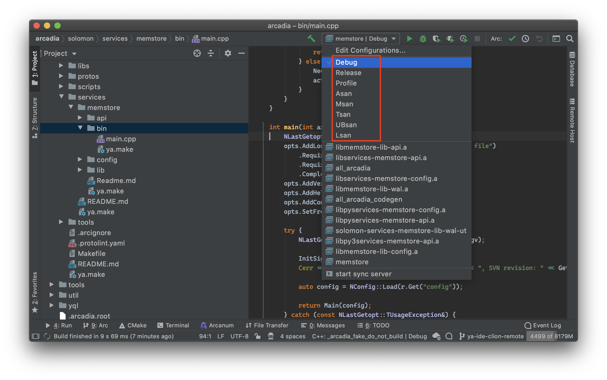
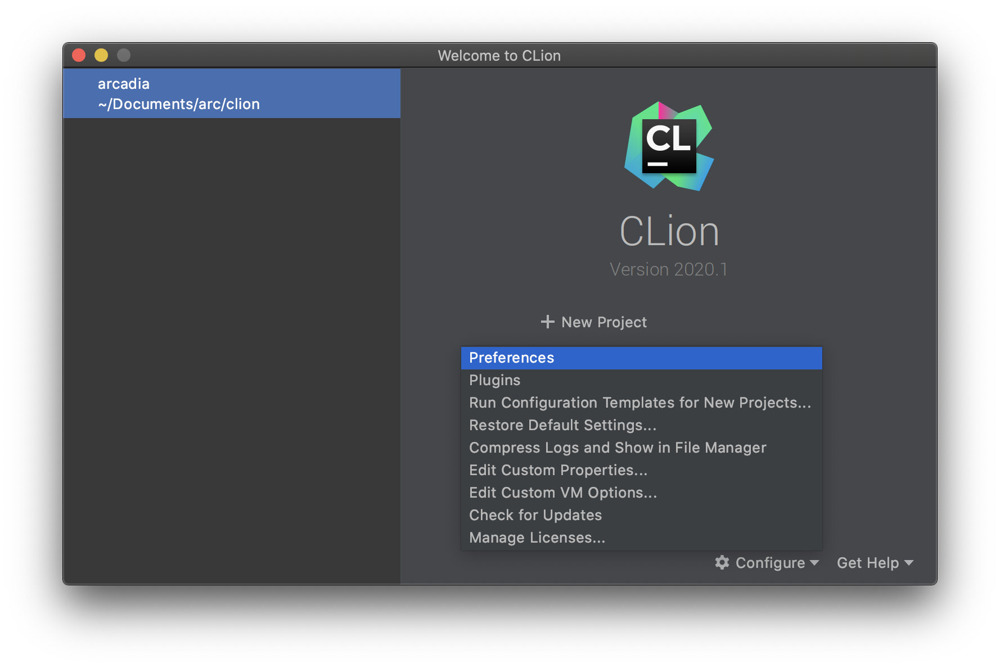
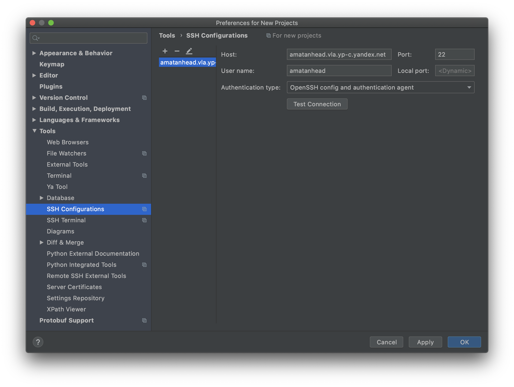
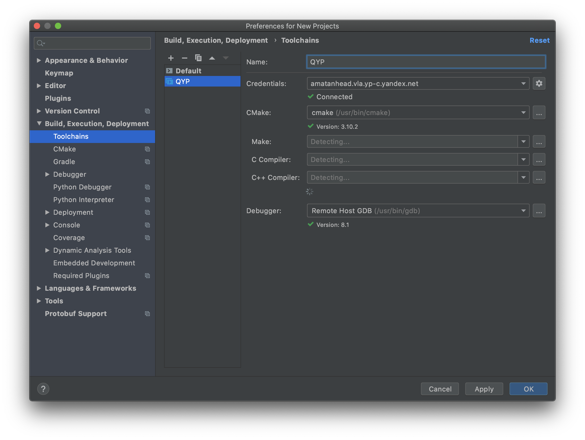
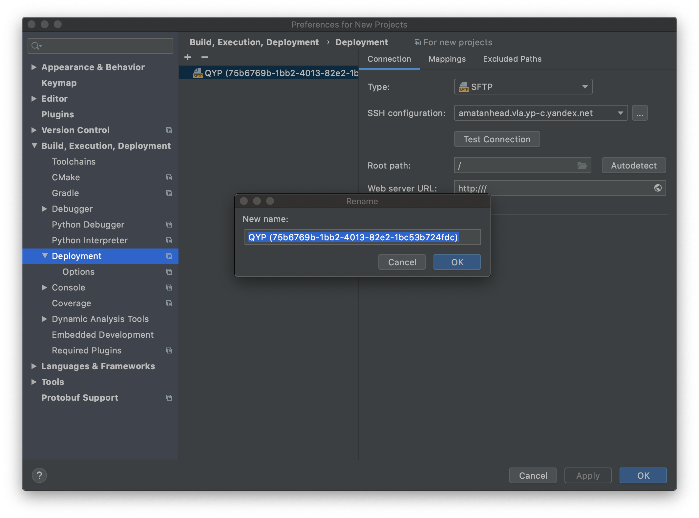
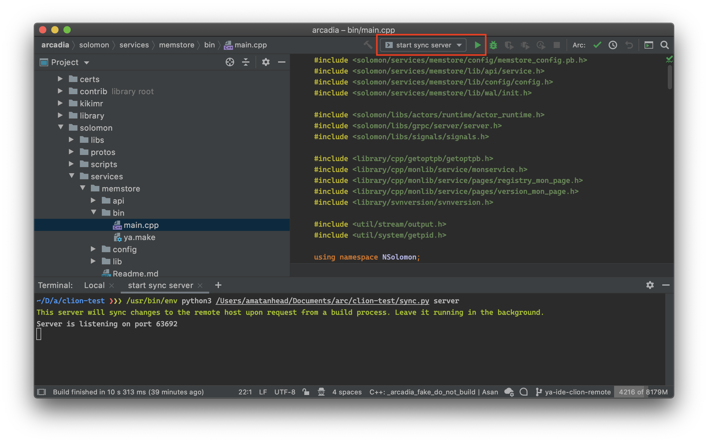
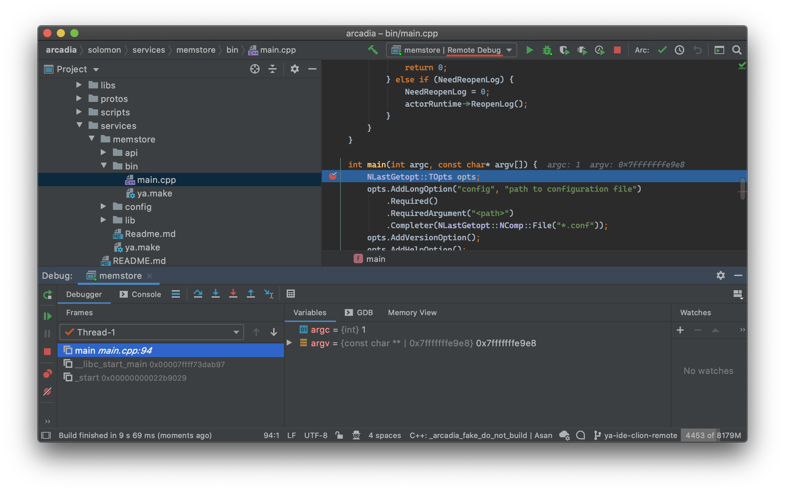
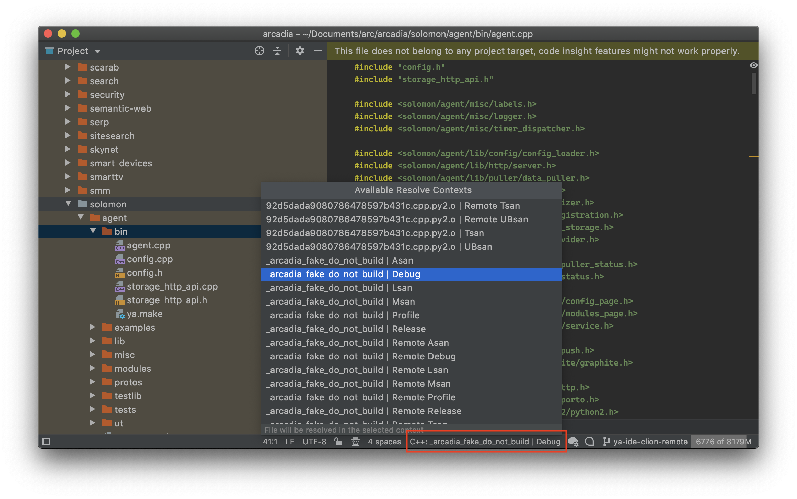
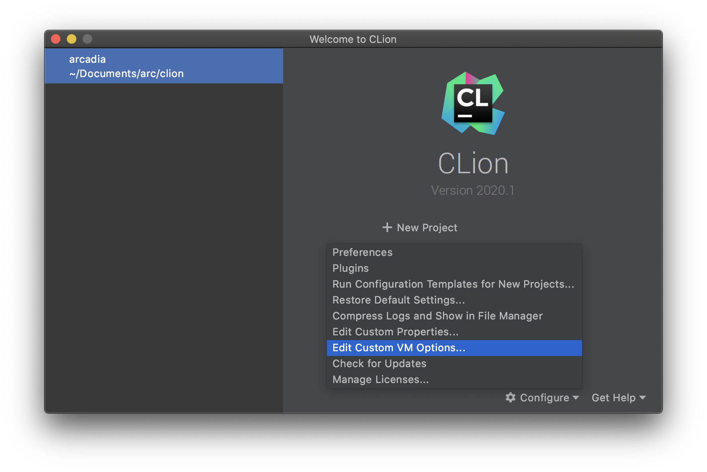
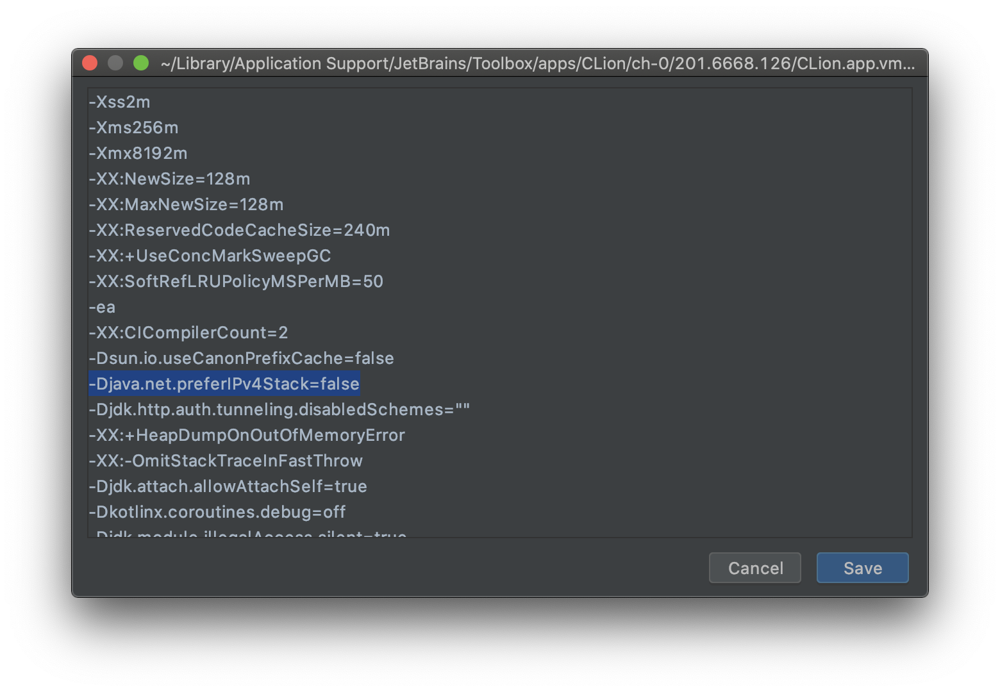

# ya ide clion : генерация проекта для JetBrains CLion
`ya ide clion` — утилита, позволяющая подружить CLion и систему сборки `ya make`. Эта утилита генерирует файл `CMakeLists.txt` и настройки проекта, в результате CLion считает, что перед ним обычный проект CMake. Работают все привычные фичи: навигация по коду, подсветка ошибок, сборка, запуск и дебаг.

### Поддерживаемые флаги
* `-T=PROJECT_TITLE, --project-title=PROJECT_TITLE`: Имя проекта в IDE(по умолчанию:  arcadia).
* `-P=PROJECT_OUTPUT, --project-output=PROJECT_OUTPUT`: Директория, в которой будут располагаться сгенерированные проектные файлы.
* `-f=FILTERS, --filter=FILTERS`: Включает только указанные подпроекты указанной цели.
* `-m, --mini`: Легковесный режим для проекта.
* `--remote-toolchain=REMOTE_TOOLCHAIN`: Сгенерировать конфигурацию для удаленного тулчейна с данным именем.
* `--remote-deploy-config=REMOTE_DEPLOY_CONFIG`: Имя конфигурации удаленного сервера для удаленного тулчейна.
* `--remote-repo-path=REMOTE_REPO_PATH`: Путь до репозитория arc на удаленном хосте.
* `--remote-build-path=REMOTE_BUILD_PATH`: Путь до директории с результатом CMake на удаленном хосте.
* `--remote-host=REMOTE_DEPLOY_HOST`: Имя хоста, ассоциированного с конфигурацией удаленного сервера.
* `--use-sync-server`: Деплоить локальные файлы через sync-сервер, вместо FileWatchers.
* `-r=CONTENT_ROOT, --project-root=CONTENT_ROOT`: Корневая директория для проекта CLion (по умолчанию корень Аркадии).
* `-C=BUILD_TARGETS, --target=BUILD_TARGETS`: Цели для сборки.
* `--make-src-links`: Создавать симлинки для ya make в дереве исходников.
* `--dist`: Использовать DistBuild.
* `--make-args=YA_MAKE_EXTRA`: Дополнительные аргументы запуска ya make.
* `--setup-tidy`: Включает для проекта clang-tidy проверки, используя аркадийный [конфиг](https://a.yandex-team.ru/arc_vcs/build/config/tests/clang_tidy/config.yaml). Подробней о clang-tidy в Аркадии можно почитать в [документации](https://docs.yandex-team.ru/ya-make/manual/tests/style#clang_tidy).


## Начало

_Если вы используете MacOS, предварительно установите инструменты разработчика: `xcode-select --install`._

Выберите директорию, в которой будет располагаться проект CLion. Эта директория должна находиться вне репозитория. Запустите в ней `ya ide clion`. В аргументах укажите список целей, которые будете собирать. Можно указать любую директорию с файлом `ya.make`, тогда в CLion будет доступна сборка всех целей, достижимых из этой директории по `RECURSE`. Можно указать несколько директорий. Не рекомендуется указывать корень Аркадии или корень крупного проекта — CLion не всегда справляется с таким большим количеством исходников.

Например, если репозиторий располагается в `~/arc/arcadia`, и мы хотим собирать `util/` и `library/cpp/yson/`:

```bash
ya ide clion ~/arc/arcadia/util ~/arc/arcadia/library/cpp/yson
```

В текущей директории будет создан файл `CMakeLists.txt` и директория `.idea` с первоначальной настройкой проекта. Если в текущей директории уже инициализирован проект CLion, `ya ide clion` постарается обновить его, не трогая пользовательские настройки. Таким образом, можно запускать `ya ide clion` в одной и той же директории несколько раз, обновляя список исходников.

После выполнения команды можно открывать получившийся проект и начинать работу. Чтобы в IDE появились генерируемые в процессе сборки файлы (например, протобуфы) и заработала навигация, нужно собрать цель `all_arcadia_codegen` (может потребоваться перезагрузка проекта: **File | Reload CMake Project**).

Дополнительные настройки:

- **--make-args** — опции, с которыми будет вызываться ya make;
- **--make-src-links** — создавать в Аркадии симлинки на результаты сборки, имитируя ya make;
- **--filter** — включает в сгенерированный проект только указанные подпроекты указанной цели. Например: `ya ide clion target/ -f target/dir1 -f target/dir2`.

## YT cache, DistBuild и отладка
Если вы используете YT cache в целях ускорения сборки, у вас могут быть проблемы с отладкой из Clion: при запуске под отладчиком все выставленные точки прерывания будут игнорироваться как если бы исходники полностью не соответствовали запущенному бинарнику. Это связано с режимом консистентного дебага, заменяющего полный путь до файла на путь с подстановкой, к примеру `/-S/arc/local/actions/stash.cpp`. Чтобы это починить, надо сконфигурировать используемый вами отладчик.
1. Для LLDB необходимо создать файл `~/.lldbinit` и прописать в нем `settings set target.source-map /-S/ /path/to/arcadia`.
2. Для GDB необходимо создать файл `~/.gdbinit` и добавить в него `set substitute-path /-S/ /path/to/arcadia`
[Тикет на автоматизацию](https://st.yandex-team.ru/DEVTOOLS-8548)

## Плагин для работы с Аркадией

У нас есть [плагин для intellij-based IDE], упрощающий работу с Аркадией. Он добавляет поддержку Arc VCS, позволяет создавать и просматривать ревью прямо из IDE, и делает много других полезных вещей.

В частности, он добавляет возможность запустить `ya ide clion` и перегенерировать проект, не покидая IDE. Для этого нужно запустить **Build | Regenerate and Reload: ya ide**.

Можно повесить это действие на горячую клавишу, это делается в **Preferences | Keymap | Plug-ins | Arcadia Plugin for IntelliJ | Regenerate and Reload: ya ide**.

## Разные профили сборки

Ya ide clion генерирует несколько разных профилей сборки. Переключаясь между ними, можно собирать приложение в release mode или со включенными санитайзерами:



## Синхронизация файлов на удалённую машину
Синхронизация аркадии через стандартный Deployment выполняется неприлично долго, поэтому его стоит отключить.

### Синхронизация через Arc sync 
Для решения задачи синхронизации исходного кода с локальной машины на удалённую удобно использовать [arc sync](https://docs.yandex-team.ru/arc/ref/commands#sync).

```bash
cd $LOCAL_ARC_DIR
arc sync begin --force-follow --remote-follow $REMOTE_HOST:$REMOTE_ARC_DIR # Удалить все лишние файлы из arc-папки на удалённой машине и начать синхронизацию с локальной машины на удалённую.
```

arc sync по умолчанию синхронизирует только файлы, добавленные в систему контроля версий - для новых файлов нужно будет сделать arc add чтобы они появились на удалённом сервере (для синхронизации достаточно добавить файл, коммитить - не надо).
Можно добавить флаг ```--include-untracked``` - тогда неотслеживаемые файлы тоже будут синхронизироваться.

### Синхронизация через python-скрипт 
Использовалась до появления синхронизации через arc и может использоваться если вы arc не пользуетесь.
Python-скрипт будет узнавать хэш последнего комита в локальном репозитории, идти по ssh на удаленную машинку и делать там force checkout на этот комит, а незакомиченные файлы досылать при помощи rsync.

Скрипт можно запускать автоматически, есть два разных способа.

1. После каждого изменения, при помощи плагина [FileWatchers](https://plugins.jetbrains.com/plugin/7177-file-watchers).

   Плюс этого способа в том, что на виртуалке всегда свежая версия файлов.

   Минусов несколько. Во-первых, [FileWatchers](https://plugins.jetbrains.com/plugin/7177-file-watchers) не запустится после изменений в игнорируемых ([Excluded](https://www.jetbrains.com/help/clion/controlling-source-library-and-exclude-directories.html)) файлах. Во-вторых, процессы сборки и синхронизации файлов независимы. Это значит, что если вы отредактируете файл и быстро запустите сборку, синхронизация может не успеть отработать до сборки.

2. При помощи сервера синхронизации.

   Идея следующая. Запустим на локальной машинке HTTP сервер, который будет синхронизировать файлы по запросу. Пробросим порт этого сервера на удаленную машинку при помощи ssh. В коде цели CMake будем дергать сервер и ждать синхронизации перед тем, как запустить ya make.

   Плюс этого способа в том, что он более надежный. Сборка всегда происходит на свежих файлах; если синхронизация не удалась, сборка падает. Если запущена локальная сборка, синхронизация не происходит.

   Минус в том, что приходится постоянно держать в фоне сервер и ssh соединение. Впрочем, хлеба они не просят, сервер умеет самостоятельно запускать ssh и перезапускать его при проблемах с сетью.


[Обсуждение](https://intellij-support.jetbrains.com/hc/en-us/community/posts/360008191060-Run-user-script-on-a-local-machine-before-remote-build?flash_digest=3bd981c954108be8fd71a098af45f20693f89f37) вызова скрипта синхронизации до remote build со стороны CLion.

Итак, системные требования:

- свежий CLion;
- по желанию, плагин [FileWatchers](https://plugins.jetbrains.com/plugin/7177-file-watchers);
- arc, rsync и python 3 на локальной машинке;
- arc и свежий CMake (3.8 или выше) на удаленной машинке.

## Удалённая сборка 
В CLion существует механизм Remote Toolchains, позволяющий собирать, запускать и отлаживать приложения на удаленной машинке. Для его работы требуется синхронизация дерева исходников (из раздела выше).

### Шаг 1: подготовка удаленной машинки

На удаленной машинке нужно [настроить репозиторий arc](https://doc.yandex-team.ru/arc/setup/arc/install.html#podkliuchenie-rabochego-dereva), а также создать директорию, в которую CLion будет складывать CMake файлы и результаты сборки:

```bash
mkdir -p ~/arc_rembuild/arcadia ~/arc_rembuild/store ~/arc_rembuild/clion
arc mount -m ~/arc_rembuild/arcadia -S ~/arc_rembuild/store
```

Рекомендуется на каждый проект CLion создавать отдельный репозиторий, так как состояние репозитория будет постоянно сбрасываться.

### Шаг 2: создание Remote Toolchain

1. Откройте настройки CLion.


2. В **Preferences | Tools | SSH Configurations** создайте конфигурацию для своей виртуалки.
   

   Если у вас IPv6-only хост (а это, скорее всего, именно так), в настройках JVM может понадобиться переключить параметр `-Djava.net.preferIPv4Stack` в `false` — см. [ниже](#clionnemozhetpodkljuchitsjakudalennomuxostu).

3. Перейдите в **Preferences | Build, Execution, Deployment | Toolchains** и создайте там Remote Toolchain.
   


4. Нажмите Apply, но не закрывайте меню настроек.

5. Перейдите в **Preferences | Build, Execution, Deployment | Deployment**. После нажатия Apply здесь появилась конфигурация Deploy для только что созданного Toolchain.

   Важно: не переименовывайте эту конфигурацию и не изменяйте ее настроек.

   Ее название понадобится в шаге 3, поэтому скопируйте его куда-нибудь.
   


### Шаг 3: запуск ya ide clion

При запуске `ya ide clion` нужно указать дополнительные ключи:

- **--remote-repo-path** — абсолютный путь к репозиторию arc на удаленном хосте. У меня это `/home/amatanhead/arc/arcadia`;
- **--remote-build-path** — абсолютный путь к директории, где будут лежать служебные файлы CLion. У меня это `/home/amatanhead/arc/clion`;
- **--remote-toolchain** — название Remote Toolchain, которй создали на шаге 2. У меня это `QYP`;
- **--remote-deploy-config** — название Deploy конфигурации, связанной с нашим Remote Toolchain. У меня это 'QYP (75b6769b-1bb2-4013-82e2-1bc53b724fdc)';
- **--remote-host** — хост удаленной машинки. У меня это `amatanhead.vla.yp-c.yandex.net`.
- **--use-sync-server** — если вы хотите использовать сервер синхронизации. Этот флаг добавит в скрипт сборки запрос к серверу, сборка будет падать если сервер недоступен.

Например:

```bash
ya ide clion \
    -P ~/Documents/arc/clion \
    ~/Documents/arc/arcadia/junk/amatanhead \
    --remote-repo-path /home/amatanhead/arc/arcadia \
    --remote-build-path /home/amatanhead/arc/clion \
    --remote-toolchain 'QYP' \
    --remote-deploy-config 'QYP (75b6769b-1bb2-4013-82e2-1bc53b724fdc)' \
    --remote-host 'amatanhead.vla.yp-c.yandex.net' \
    --use-sync-server
```

Готово. Откройте проект в CLion, подождите, пока загрузятся конфигурации CMake.

Если использовали `--use-sync-server`, перед удаленной сборкой понадобится запустить цель `start sync server`:



Теперь можно выбрать любую remote конфигурацию и попробовать собрать/запустить/подебажить:



### Дополнительно: как отключить File Watcher

Если вы работаете без интернета или VPN, автоматическая синхронизация будет мешаться. Ее [можно отключить]. Для этого снимите чекбокс с Watcher'а `sync local changes` в меню **Preferences | Tools | File Watchers**.

### Дополнительно: запуск синхронизации руками по кнопке

Иногда возникает необходимость запустить синхронизацию файлов руками. Для того, чтобы делать это было легче, можно создать [external tool](https://www.jetbrains.com/help/clion/settings-tools-external-tools.html) с такими настройками:

- **Program** — файл `sync.py`, находится рядом с `CMakeLists.txt`. Например, `/Users/amatanhead/Documents/arc/clion/sync.py`;
- **Arguments** — не требуется;
- **Synchronize files after execution** в разделе **Advanced** — выключить.

Опционально, можно повесить наш External Tool на горячую клавишу. Это делается в **Preferences | Keymap | External Tools**.

Также всегда есть возможность запустить `sync.py` из консоли.

### Дополнительно: автоматический запуск сервера синхронизации при открытии проекта

Если вы используете sync server, можно настроить автоматический запуск сервера при открытии проекта. Это делается с помощью [Startup Task](https://www.jetbrains.com/help/clion/settings-tools-startup-tasks.html) — создайте его в **Preferences | Tools | Startup Tasks**, вам нужна конфигурация `start sync server`.

### Альтернативы

- утилита [Krya](https://wiki.yandex-team.ru/dmitrijjermolov/krja/) от ermolovd@ — вдохновитель способа, описанного выше. Позволяет собирать удаленно, не позволяет запускать или дебажить из CLion;
- если работаете с svn и используете селективный checkout, стандартного механизма deployment может хватить. По вики разбросана куча гайдов, например, [вот](https://wiki.yandex-team.ru/users/ivigns/clionremotebuild/) или [вот](https://wiki.yandex-team.ru/advmachine/clion-remote-build/);
- если по какой-то причине не заводится Remote Toolchain, можно попробовать использовать gdb server — про него тоже много написано на вики и в этушке.

## Устранение неполадок

### В некоторых файлах не работает поиск include, всё красное

Если файл явно не указан в CMakeLists, CLion неправильно определяет контекст сборки, из-за чего не работает поиск include файлов. Если такое произошло, переключите контекст на `_arcadia_fake_do_not_build | Debug`:



Тикет в jetbrains: https://youtrack.jetbrains.com/issue/CPP-1028

### CLion не может подключиться к удаленному хосту

Если у вас IPv6-only хост (а это, скорее всего, именно так), в настройках JVM может понадобиться переключить параметр `-Djava.net.preferIPv4Stack` в `false`.

Это делается вот тут...


...вот так.


Можно еще дописать `-Djava.net.preferIPv6Stack=true`.

### Долгий процесс «Refreshing Files» после сборки

Помогает выбрать в качестве корневой директории проекта не всю Аркадию, а только то место, над которым работаете. Это делается при помощи опции `--project-root`.

Тикет в jetbrains: https://youtrack.jetbrains.com/issue/CPP-18968

### Тормозит работа с SVN

Если используется полностью счекаученная Аркадия, то CLion будет вызывать SVN от ее корня, что небыстро. Директории, с которыми будет работать SVN, можно указать в меню **Preferences | Version Control**.

### При удаленной сборке: Warn: Failed to get token: No SSH keys found

Возьмите свой токен для ya по ссылке, которую `ya make` выводит в предупреждении, и положите его в файл `~/.ya_token` на удаленной машинке. Не забудьте сделать `chmod 600 ~/.ya_token`.

### При удаленной сборке: Sync local changes... curl: (7) Couldn't connect to server
Не запущен сервер синхронизации. Запустите цель `start sync server`, убедитесь, что в консоли нет ошибок.

### При удаленной сборке: curl: option --unix-socket: is unknown
Чуть более полный пример:
```
====================[ Build | router | Remote Debug ]===========================
/home/avpotapov/cmake/cmake-3.15.2/bin/cmake --build /home/avpotapov/arc/router/cmake-build-remote-debug --target router -- -j 9
Sync local changes...
curl: option --unix-socket: is unknown
curl: try 'curl --help' or 'curl --manual' for more information
make[3]: *** [CMakeFiles/_arcadia_remote_sync] Error 2
make[2]: *** [CMakeFiles/_arcadia_remote_sync.dir/all] Error 2
make[1]: *** [CMakeFiles/router.dir/rule] Error 2
make: *** [router] Error 2
```
Значит пришла пора обновлять curl на удаленной машине. Опция поддерживается с версии 7.40.

