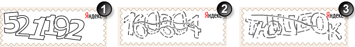

# Функциональное описание

В разделе описаны функции капча-сервера.

## Генерация изображений {#imgen}

Капча-сервер непрерывно формирует и сохраняет на диске зашумленные изображения символов. Их хранение организовано по принципу кольцевого буфера: новые изображения помещаются в каталог и последовательно перезаписывают старые. Благодаря этому буфер постоянно обновляется, что гарантирует неповторяемость выдаваемых изображений даже при очень высокой частоте запросов к капча-серверу.

Одновременно формируются изображения трех типов — упрощенные, обычные, из букв русского алфавита. Их пример показан ниже.
Рисунок 1. Примеры капчи: 1 — упрощенная, 2 — обычная, 3 — из букв русского алфавита.

Упрощенная капча комфортнее для восприятия, но имеет более слабую защиту против декодирования роботами. Капча из букв русского алфавита по зашумленности соответствует обычной капче, но вместо цифр содержит заглавные буквы.

## Выдача ключей и ссылок на изображения {#image-issue}

Метод [generate](generate.md) капча-сервера возвращает идентификатор изображения (ключ капчи) и ссылку на само изображение. Данную ссылку сервис без изменений размещает на HTML-странице, которую отправляет пользователю. Браузер получает по данной ссылке изображение напрямую с капча-сервера.

При вызове метода [generate](generate.md) можно указать, сколько раз сервис предполагает проверять ответ пользователя (аргумент `checks`). Многократные проверки используются в особых случаях (см. [Тест с многократной проверкой ответа](schema.md#multichecks)). Если аргумент `checks` не указан, капча-сервер допускает только одну проверку.

## Выдача изображений {#image}

Ссылка имеет формат запроса HTTP GET, с помощью которого вызывается метод [image](image.md) капча-сервера. Этот метод возвращает изображение капчи, если не истек тайм-аут теста (60 минут). По истечении тайм-аута возвращается сообщение об ошибке.

## Проверка ответов {#answer}

Для проверки ответа пользователя сервис вызывает метод [check](check.md) капча-сервера. В качестве аргументов указывается ключ капчи, ответ пользователя и тип капчи, выбранный при вызове метода [generate](generate.md).

Капча-сервер ожидает ответ пользователя в течение тайм-аута, а затем удаляет ключ капчи. При последующих вызовах метода [check](check.md) с данным ключом капча-сервер возвращает отрицательный результат проверки.

Капча-сервер удаляет ключ капчи после неуспешной проверки и после заданного количества успешных проверок (аргумент `checks` метода [generate](generate.md)). Если количество проверок не было указано, ключ удаляется после первой проверки независимо от ее успешности.

