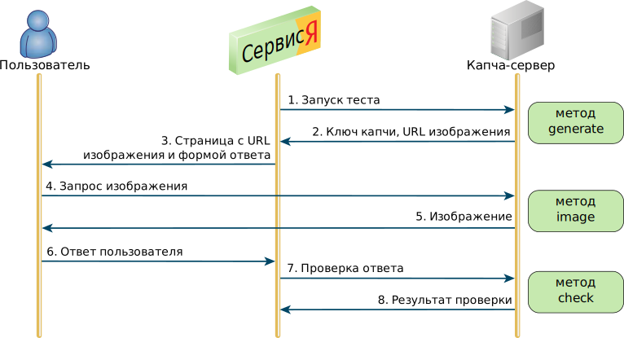

# Алгоритм тестирования

В разделе описан алгоритм теста на распознавание символов и действия сторон, участвующих в тесте.

Существуют две схемы проведения теста: с однократной и с многократной проверкой ответа пользователя. Схема с однократной проверкой применяется в большинстве случаев, если сервис запускает тест изнутри сети Яндекса. Вторая схема (обычно с двукратной проверкой) применяется сервисами, запускающими тест на стороне пользователя с помощью JavaScript. Обе схемы описаны ниже.

## Тест с однократной проверкой ответа  {#text}

Тестирование с однократной проверкой ответа выполняется, если сервис запускает тест изнутри сети Яндекса. Получаемый результат тестирования считается надежным, поскольку не выходит за пределы доверенной сети.

При возникновении определенных условий, например при высокой интерактивности пользователя, сервис запускает тест на распознавание символов. На следующем рисунке показаны этапы взаимодействия сервиса, капча-сервера и пользователя.

Сервис выполняет следующие действия (в скобках указаны номера этапов на схеме):

- вызывает метод [generate](generate.md) капча-сервера (1);
- сохраняет полученный ключ капчи, отдает пользователю HTML-страницу со ссылкой на изображение (3);
- вызывает метод [check](check.md) капча-сервера, передавая ключ капчи и ответ пользователя (7).

На стороне пользователя выполняются следующие действия:

- браузер пользователя вызывает метод [image](image.md) капча-сервера для получения изображения капчи (4);
- пользователь вводит символы с изображения и отправляет ответ сервису (6).

Капча-сервер выполняет следующие действия:

- выдает ключ капчи и URL изображения по запросу сервиса (2);
- выдает изображение по запросу браузера (5);
- проверяет ответ пользователя и сообщает о результатах проверки сервису (8).

По результатам теста сервис предпринимает действия в соответствии с алгоритмом своей работы.

## Тест с многократной проверкой ответа {#multichecks}

Тестирование с многократной проверкой ответа применяется сервисами, которым по каким-либо причинам требуется запускать тест на стороне пользователя с помощью JavaScript. Браузерные скрипты получают результат тестирования, однако он не считается надежным, поскольку за пределами сети Яндекса результат может быть перехвачен и подделан.

Чтобы обезопаситься от подделки результата, серверная часть сервиса запоминает ответ пользователя и проверяет его еще раз, но уже изнутри сети Яндекса. Если результат второй проверки оказывается отрицательным, сервис может заблокировать доступ к данным, или сообщить браузерным скриптам о необходимости нового тестирования, или предпринять другие защитные меры.



Повторная проверка должна выполняться в течение тайм-аута (60 минут от начала тестирования), иначе капча-сервер удалит ключ капчи и возвратит отрицательный результат.



Со стороны капча-сервера данная схема идентична предыдущей, за исключением того, что в запросе [generate](generate.md) капча-серверу указывают количество проверок. Если это не сделано, капча-сервер допускает только одну проверку, после чего удаляет ключ капчи.

Для сервиса данная схема выглядит сложнее, чем предыдущая, поскольку доступ к капча-серверу закрыт извне сети Яндекса (кроме получения изображения капчи). Сервис должен обеспечить проксирование запросов [generate](generate.md) и [check](check.md) от браузерных скриптов на капча-сервер, а также обратное проксирование результатов. При этом сервису необходимо запоминать ключи капчи и ответы пользователей для повторной проверки ответов.

