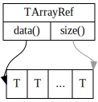
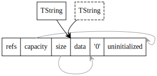
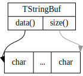

# Hitchhiker's Guide to C++ in Arcadia: Simple Containers


## Непрерывные владеющие контейнеры

* TVector
* std::vector
  * итераторы это указатели,
  * `resize_uninitialized()`.
* TBuffer
* TBlob
* ::Reserve(size_t)

## Непрерывные невладеющие контейнеры

Кроме владения памятью на неё можно ссылаться без владения. В С++20 данную задачу решает класс [std::span](https://en.cppreference.com/w/cpp/container/span). У нас, ввиду отсутствия поддержки С++20 имеется своя реализация: [TArrayRef](https://a.yandex-team.ru/arc/trunk/arcadia/util/generic/array_ref.h). Она устроена следующим образом:



`data()` хранит указатель на начало выделенной области памяти, `size()` означает размер (измеряется, понятное дело, в количестве элементов, а не в байтах).

Главная цель этих классов — убрать глупые ошибки, когда указатель берётся на одну память, а размер от другого куска.
Чем в большем количестве мест указатель и размер ходят в паре — тем меньше вероятность что-нибудь перепутать и проехаться по памяти.
В качестве бонуса появляется возможность итерации, слайсинга и конструирование из всего разумного.
В отличие от `TStringBuf` / `std::string_view` (про них см. ниже) позволяет ссылаться на неконстантные регионы памяти и изменять их.



Измерения показывают, что такие небольшие типы лучше передавать в функции по значению, а не по ссылке.
В этом случае оба восьмибайтовых поля попадут в регистры и код станет несколько быстрее за счёт отсутствия косвенного обращения к памяти.



## Текстовые контейнеры



Большинство написанных внутри Яндекса библиотек используют тип `TString` для представления текстовых данных. Он существенно отличается от `std::string`.

Информацию по работе с текстами см. [тут](texts).



`TString` — это _copy-on-write_ строка: при копировании строки вместо медленного копирования памяти происходит атомарное увеличение счётчика ссылок. Это делает копирование строк достаточно дешёвой операцией, хоть и добавляет проблем в других местах. Стандарт C++ с помощью ограничений на инвалидацию итераторов запрещает copy-on-write поведение для `std::string`.

Класс устроен следующим образом:



Вот ключевые особенности данного класса:

* `TString` всю информацию про ссылки и размер хранит вместе с данными. Таким образом размер самого `TString` равен размеру указателя.
* Внутри хранится указатель на начало данных, а не начало аллоцированного блока. Это делает операцию `data()` простой и быстрой, но запутывает анализатор памяти `valgrind`. Можно воспользоваться `ya tool valgrind`, который правильно обрабатывает данную ситуацию.
* `TString` всегда терминируется нулевым символом — даже если данные бинарные и содержат нулевой символ.
* `TString` хранит пустую строку в виде синглтона, а не в виде `nullptr` в `data()`.
* `TString` не поддерживает [small/short string optimization](https://stackoverflow.com/questions/10315041). Для хранения любой непустой строки будет выполнена аллокация.
* `TString` аллоцирует (и реаллоцирует) память большими блоками и является крайне неэффективным способом хранения большого числа неизменяемых данных. Для такого хранения намного лучше подходит класс TMemoryPool из [util/memory/pool.h](https://a.yandex-team.ru/arc/trunk/arcadia/util/memory/pool.h).



Одним из последствий COW-характера TString является инвалидация итераторов при неконстантных вызовах `begin()`, `operator[]` и аналогичных. Как следствие:

* Код

    ```cpp
    auto end = string.end();
    for (auto it = string.begin(); it != end; ++it) {
        print(*it);
    }
    ```

    приведёт к проезду по памяти, если `string` не был уникальной копией.

    Безопасным способом итерации по строке является _range-based for_:
    ```cpp
    for (auto ch: string) {
        print(ch);
    }
    ```
* Код `std::copy(string.begin(), string.end(), ...)` является _unspecified behavior_ (в С++17 аргументы вычисляются слева направо **ИЛИ** справа налево) и может привести к проезду по памяти.
* Случайные вызовы `TString::begin()` приводят к ненужным копированиям данных; в результате код работает не так эффективно.



Как и `std::string`, `TString` имеет версии для других типов символов:

* `TUtf16String` для текста в кодировке `UTF-16`,
* `TUtf32String` для `UTF-32`.

Кроме владеющего текстового контейнера, существуют два невладеющих контейнера, предназначенных для работы с текстом: `std::string_view` и `TStringBuf`. Оба класса устроены подобным образом:



[std::string_view](https://en.cppreference.com/w/cpp/string/basic_string_view) — константная невладеющая версия `std::string` (по сути — `std::span<const char>`, расширенный специфичными для работы с текстом методами).

В отличие от `std::string` и `TString`, `std::string_view` не гарантирует наличие символа `\0` в байте, следующем за концом строки. Отсутствие такого инварианта позволяет быстро нарезать `std::string_view` на любые другие `std::string_view` с помощью методов `substr()`, `remove_prefix()`, `remove_suffix()`. Аллокаций и копирования памяти при этом не происходит.

[TStringBuf](https://a.yandex-team.ru/arc/trunk/arcadia/util/generic/strbuf.h) — наш аналог [std::string_view](https://en.cppreference.com/w/cpp/string/basic_string_view) с расширенным API.

TODO: описать API после закрытия тикета [IGNIETFERRO-1198](https://st.yandex-team.ru/IGNIETFERRO-1198).

Аналогично `TString`, `TStringBuf` имеет версии для других типов символов:

* `TWtringBuf` для текста в кодировке `UTF-16`,
* `TUtf32StringBuf` для `UTF-32`.



Измерения показывают, что такие небольшие типы лучше передавать в функции по значению, а не по ссылке.
В этом случае оба восьмибайтовых поля попадут в регистры и код станет несколько быстрее за счёт отсутствия косвенного обращения к памяти.



## Ассоциативные контейнеры

* TMap
* TMultiMap
* THashMap
* TFlatHashMap
* FindPtr

## Микровелосипедики

* TStack
* TList
* TQueue
* TPriorityQueue
* TSet
