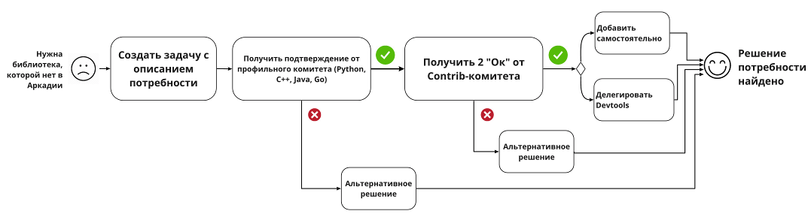
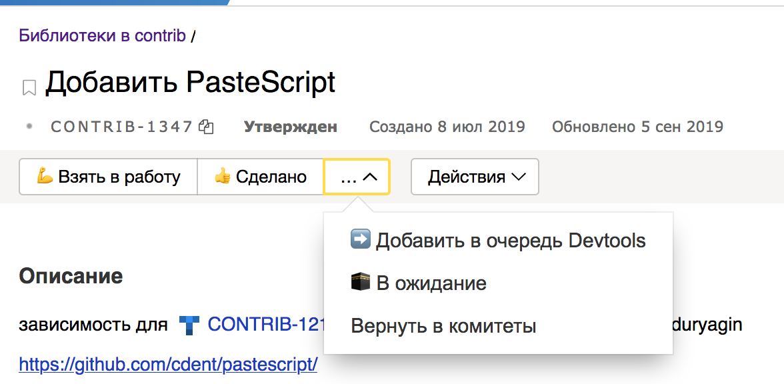

# Добавление внешних библиотек

Проекты в едином репозитории часто зависят от внешних библиотек, которые берутся из Интернета. Такие библиотеки также называются contrib (от англ. external **contrib**ution) и хранятся в каталоге [contrib](https://a.yandex-team.ru/arc/trunk/arcadia/contrib), например:

* [С++](https://a.yandex-team.ru/arc/trunk/arcadia/contrib/libs)
* [Go](https://a.yandex-team.ru/arc/trunk/arcadia/vendor)
* [Java](https://a.yandex-team.ru/arc/trunk/arcadia/contrib/java)
* [Python](https://a.yandex-team.ru/arc/trunk/arcadia/contrib/python)
* [Разные компиляторы и утилиты](https://a.yandex-team.ru/arc/trunk/arcadia/contrib/tools)



Все внешние зависимости для всех проектов единого репозитория хранятся в одном каталоге **contrib**. Создание аналогичных каталогов на уровне отдельных проектов не допускается. Допускается **временно** хранить внешние зависимости в процессе заезда проекта в единый репозиторий.



## Как добавить внешнюю библиотеку { #add }

Одной из проблем, с которой компании приходилось сталкиваться в прошлом, было **бесконтрольное использование внешних библиотек**. Разные команды использовали разные библиотеки или несовместимые по API версии одной и той же библиотеки для выполнения одних и тех же действий. Это приводило к множеству проблем. В процессе внедрения единого репозитория договорились, что в качестве внешних зависимостей можно использовать ограниченный набор внешних библиотек, использование которых рекомендуется [комитетами по разработке](../intro.md#committee). Таким образом, перед добавлением любой внешней библиотеки нужно убедиться, что библиотека действительно полезна.

Процедура добавления внешней библиотеки состоит из следующих шагов:

1. [Создаем](https://st.yandex-team.ru/createTicket?queue=CONTRIB&_form=12959) задачу в очереди [CONTRIB](https://st.yandex-team.ru/CONTRIB) с описанием необходимой функциональности, которая есть во внешних библиотеках. В задаче следует указать:
    * Название вашего проекта
    * Какой функциональности внешних библиотек вам не хватает
    * Под какие платформы требуется собирать исходные коды

2. Комитет, отвечающий за данный язык программирования, (например, C++ или Python комитет) рассматривает задачу и подтверждает добавление внешней библиотеки. Если в репозитории уже есть рекомендуемая библиотека с такой же функциональностью, то комитет может порекомендовать использовать её. Этот шаг должен занимать **не более 5 рабочих дней**.

3. В сложных случаях (есть сомнения, проблемы с лицензиями) в задачу могут призываться представители специального [комитета по использованию внешних библиотек](../intro.md#contrib-committee), которые тоже должны одобрить добавление или предложить альтернативное решение. Этот шаг также должен занимать **не более 5 рабочих дней**.

4. После того как нужные одобрения получены, происходит непосредственное добавление исходного кода внешней библиотеки в единый репозиторий.
    * В простых случаях добавить новую библиотеку можно **самостоятельно**, отправив пулл-реквест обычным способом. 
    * В сложных случаях, когда внешняя библиотека используется во множестве проектов (например, [openssl](https://a.yandex-team.ru/arc/trunk/arcadia/contrib/libs/openssl)), можно **попросить помощи** у команды разработки единого репозитория. Для этого нужно нажать кнопку "Добавить в очередь Devtools" в соответствующей задачу из очереди [CONTRIB](https://st.yandex-team.ru/CONTRIB):

Для добавления внешней библиотеки в репозиторий рекомендуется использовать один из следующих инструментов:

* [Yamaker](https://a.yandex-team.ru/arc/trunk/arcadia/devtools/yamaker/README.md) для C++
* [Yo](https://a.yandex-team.ru/arc/trunk/arcadia/library/go/yo) для Go
* Команду **ya maven-import** для Java
* [Pip2arc](https://a.yandex-team.ru/arc/trunk/arcadia/devtools/pip2arc/) для Python

## Как обновить внешнюю библиотеку { #update }

* **Минорные обновления** библиотек (исправления ошибок без изменения API) или обновления библиотек, используемых всего в нескольких проектах, можно делать сразу через пулл-реквест.

* **Мажорные обновления** библиотек или обновления библиотек, затрагивающих множество проектов в едином репозитории лучше делать через очередь [CONTRIB](https://st.yandex-team.ru/CONTRIB).

