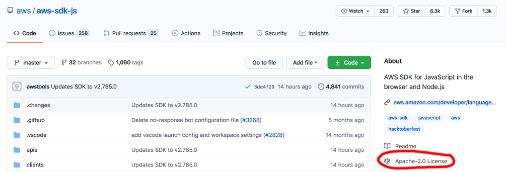
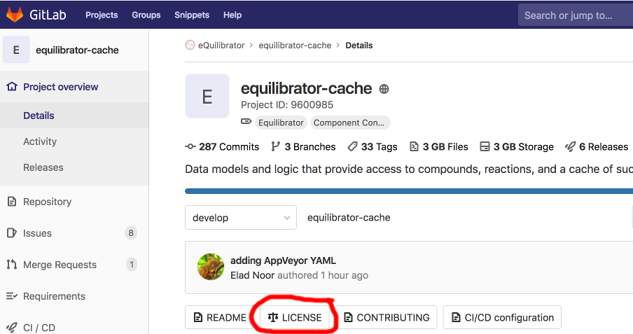

# Лицензии

Весь код, в том числе и любых внешних библиотек, охраняется авторским правом.
Для внешних библиотек это означает, что если мы их используем, то должны выполнять требования их лицензий.
В противном случае мы столкнёмся с ответственностью за нарушение авторского права.

Мы должны контролировать соблюдение лицензионных требований и не допускать их нарушения. Поэтому мы стремимся к тому, чтобы:
* Все сторонние компоненты были снабжены информацией об их лицензиях;
* Не было использования сторонних компонентов, лицензии которых содержат недопустимые для Яндекса требования.

В этом отношении мы различаем:
* Запрещённые лицензии. Эти лицензии содержат требования, неприемлемые для Яндекса в любой ситуации. Библиотеки с такими лицензиями нельзя добавлять в единый репозиторий и использовать.
* Разрешённые лицензии. Требования таких лицензий приемлемы во всех общепринятых в Яндексе сценариях использования.
* Лицензии с ограничениями. Библиотеки с такими лицензиями могут быть использованы только в определённых сценариях, или накладывают дополнительные ограничения.

В исключительных случаях некоторые сторонние компоненты могут иметь запрещённую лицензию или не иметь лицензии. Все такие случаи должны быть письменно согласованы, в том числе и с юристами.

Для того чтобы согласовать лицензию, создайте задачу в очередь [LEGAL](https://st.yandex-team.ru/LEGAL) и проставьте ей компонент **Open Source**.

## Правила соблюдения лицензионных требований { #license-rules }

При добавлении или обновлении внешнего компонента следует руководствоваться правилами:

1. При необходимости использовать внешний компонент, убедитесь, что он обладает лицензией;
2. Убедитесь, что лицензия входит в список разрешённых лицензий;
3. Если необходимо использовать компонент без лицензии, на условиях запрещённой лицензии или лицензии, которая не указана в числе разрешённых или запрещённых - согласуйте это с юристами;
4. При добавлении нового компонента, убедитесь, что внесена информация и о его лицензии;
5. При обновлении компонентов нужно каждый раз явно убедиться в том, что лицензия в новой версии такого компонента не поменялась. Если лицензия поменялась, то все равно должна входить в список разрешённых лицензий. Например, [новая лицензия MongoDB](https://www.mongodb.com/press/mongodb-issues-new-server-side-public-license-for-mongodb-community-server) входит в список запрещённых;
6. Соблюдайте условия лицензий внешних компонентов, которые вы используете.

## Разрешённые лицензии

К разрешённым относятся лицензии, которые:

1. **Не требуют** раскрытия исходного кода при его использовании / распространении (в том числе на стороне нашего серверного ПО);
2. **Не требуют** распространения исходного кода продукта, в который включен внешний компонент, на условиях его лицензии (т.н. вирусная лицензия);
3. **Разрешают** использование кода в коммерческих целях.

**Список:**

1. [MIT](https://opensource.org/licenses/MIT)
2. [Apache 2.0](https://www.apache.org/licenses/LICENSE-2.0)
3. [BSD-2-Clause](https://opensource.org/licenses/BSD-2-Clause), [BSD-3-Clause](https://opensource.org/licenses/BSD-3-Clause)
4. [The Unlicense](https://choosealicense.com/licenses/unlicense/)
5. [CC0 1.0](https://creativecommons.org/publicdomain/zero/1.0/)
6. [OpenLDAP](http://www.openldap.org/software/release/license.html)

## Запрещённые лицензии

К запрещённым относятся лицензии, которые:

1. **Требуют** раскрытия исходного кода при распространении готового продукта (например, в AppStore или Google Play);
2. **Требуют** распространения исходного кода продукта, в который включен внешний компонент, на условиях его лицензии (т.н. вирусная лицензия);
3. **Не разрешают** использование кода в коммерческих целях.

**Список:**

1. Лицензии семейства GNU: [GPL](https://www.gnu.org/licenses/gpl-3.0.ru.html)
2. Часть лицензий Creative Commons: [CC BY-SA](https://creativecommons.org/licenses/by-sa/3.0/), [CC BY-NC-SA](https://creativecommons.org/licenses/by-nc-sa/2.0/)
3. Иные лицензии: [GFDL](https://www.gnu.org/licenses/fdl-1.3.html), [CDDL](https://opensource.org/licenses/CDDL-1.0), [OSL](https://opensource.org/licenses/OSL-3.0), [NPOSL](https://opensource.org/licenses/NPOSL-3.0), [EPL](https://www.eclipse.org/legal/epl-v10.html), [EUPL](http://ec.europa.eu/idabc/servlets/Docbb6d.pdf?id=31979), [LPPL](https://www.latex-project.org/lppl/lppl-1-3c/), [MPL](https://www.mozilla.org/en-US/MPL/2.0/), [Ms-RL](https://opensource.org/licenses/MS-RL), [Artistic-1.0](https://spdx.org/licenses/Artistic-1.0)

### Лицензия Artistic-1.0 { #artistic-1.0 }

В тексте лицензии Artistic-1.0 есть неясные моменты, которые не позволяют однозначно отнести её к разрешённым, поэтому она считается разрешённой. Обсуждение велось в рамках [ARCADIAWGSUP-32](https://st.yandex-team.ru/ARCADIAWGSUP-32).

## Лицензии с ограничениями

### Семейство лицензий LGPL { #lgpl }

1. Использовать готовые программы под GPL / LGPL допустимо.

2. В случае библиотек данная лицензия применяется [по-разному](https://www.gnu.org/licenses/gpl-faq.ru.html#LGPLStaticVsDynamic) в зависимости от того подключается ли библиотека путем **статической** или **динамической линковки**. Система сборки Аркадии умеет учитывать, используется ли библиотека статически или динамически, и правильно применять соответствующие лицензионные ограничения. При статическом использовании LGPL будет считаться запрещённой, при динамическом — разрешённой.

Использование и добавление библиотек под данной лицензией всегда нужно согласовывать с юристами.

## Двойное лицензирование

Внешние компоненты могут распространяться на условиях двойного лицензирования, когда сам пользователь вправе определять, на условиях какой из лицензий он берет и использует такой компонент: [пример №1](https://www.qt.io/download), [пример №2](https://github.com/log4cplus/log4cplus/blob/master/LICENSE).
Если, компонент доступен одновременно на условиях двух лицензий, то:

1. Убеждаемся, что можно свободно выбирать, какую лицензию применять. Часто бывает указано, что в коммерческих целях допустимо использовать библиотеку только за плату.
 2. Если одна из доступных лицензий разрешена, то использование такой внешней библиотеки **допустимо**. При добавлении кода внешней библиотеки обязательно нужно сделать пометку, что у кода двойное лицензирование, и указать, какая именно лицензия была выбрана.

## Как найти и разметить лицензии { #find-license }

### Зачем искать лицензии

На первый взгляд кажется, что искать лицензию не нужно.
Лицензия часто бывает указана явно, например, в специальном поле у проекта
на GitHub или в метаданных пакета из пакетного менеджера. В крайнем случае,
файл с лицензией лежит в корне проекта и называется `LICENSE` или другим
известным именем.

На практике (особенно часто у проектов на C/C++) ситуация гораздо хуже.
Файлы с лицензиями не обязательно лежат в корне.
Даже если они там есть, то могут быть дополнительные лицензии в поддиректориях.
Эти файлы могут иметь необщепринятые имена.
И самое неприятное: встречаются дополнительные лицензии и в самих файлах с исходным кодом,
часто в случае, если эти файлы были позаимствованы из других проектов.

Поэтому просто так доверять метаданным или какому-нибудь очевидному файлу лицензии нельзя.
Лицензии нужно искать по всему проекту, и для этого желательно иметь автоматический инструмент.
Такой инструмент у нас есть: `ya tool license_analyzer`.

### license_analyzer

Задача определить, является ли какой-либо блок текста лицензией, не имеет точного решения.
Во внешнем мире её решают приблизительно, при помощи нечёткого поиска по шаблонам или других эвристик.
При таком подходе появляется выбор:
можно определять лицензии более строго, но есть риск не выявить некоторые из настоящих лицензий.
Либо можно наоборот определять лицензии более гибко, получая большее количество ложных положительных срабатываний.
Тогда мы будем находить лишние «лицензии» в блоках текста, на самом деле не являющихся лицензией.

Мы хотим максимально уменьшить вероятность пропуска настоящих лицензий,
даже в том случае, если пользователь решит полностью довериться автоматическим инструментам.
Это может привести к тому, что по умолчанию библиотеке могут быть приписаны лишние лицензии,
и она будет иметь в наших лицензионных проверках больше ограничений, чем у неё есть в реальности.

Наш инструмент позволяет в удобном виде просмотреть результат анализа и исправить его вручную.
Решение, принятое пользователем, сохраняется в репозитории и может быть автоматически использовано при дальнейшем обновлении библиотеки.

#### Java { #find-license-java }

Java-комитет принял решение не использовать автоматический анализатор при импорте Java-библиотек утилитой `ya maven-import`. По умолчанию лицензии проставляются на базе информации из `pom.xml` артефакта (см. [пост в этушке](https://clubs.at.yandex-team.ru/arcadia/26173)). В процессе работы `ya maven-import` используется обработчик `ya tool license_analyzer canonize`.

#### Python { #find-license-python }

Python-комитет принял решение не использовать автоматический анализатор лицензий и доверять информации о лицензиях, указанной в метаданных PyPI-пакетов.

#### Go { #find-license-go }

Библиотеки на Go импортируют утилитой [yo](https://a.yandex-team.ru/arc_vcs/library/go/yo), которую поддерживает Go-комитет. Эта утилита автоматически определяет лицензии, используя https://github.com/google/licensecheck.

#### Копирайты (они же Credits)

Большинство лицензий библиотек требуют при их использовании в каком-либо продукте распространять текст самих лицензий и их копирайтов вместе с самим продуктом.
Наш инструмент при поиске и прописывании лицензий также выделяет и сохраняет их текст и копирайты, и ручные исправления пользователя при этом также учитываются.

В некоторых случаях (Java и Python) использование нашего анализатора не является обязательным. Вследствие этого, информация о копирайтах для таких библиотек по умолчанию не разбирается и не сохраняется. Если такая информация нужна (например, при сборке `ya make --with-credits`), следует выполнить разметку самостоятельно, используя наши инструменты, для всех сторонних библиотек попавших в сборку.

### ya tool license_analyzer { #ya-tool-license-analyzer }

`ya tool license_analyzer` — утилита для поиска в **исходном коде библиотеки** лицензий, а также **полуавтоматической разметки** их идентификаторами `ya.make` файлов и генерации `CREDITS`. Она имеет 4 обработчика:

* `scan` сканирует директорию, сохраняет промежуточный отчёт `devtools.licenses.report` в поддиректорию `.yandex_meta`

* `apply` считывает репорт, записывает идентификаторы лицензий в макрос `LICENSE` в `ya.make` файлах, генерирует `CREDITS`

* `javascan` сканирует Java-контрибы. Java-контрибы в Аркадии хранятся не исходным кодом, готовыми артефактами (jar), которые залиты в Sandbox, поэтому требуют особой логики.

* `canonize` пытается канонизировать имена лицензий (нужно для импорта Java-библиотек)

#### Сценарий использования

_В примерах `$library` обозначает путь к анализируемой библиотеке. По умолчанию используется текущая директория._

1. Сканируем библиотеку: `ya tool license_analyzer scan $library`

    Результатом запуска будут файлы в директории `$library/.yandex_meta` с результатами сканирования: `devtools.licenses.report` про лицензии и `devtools.copyrights.report` про копирайты. В этих файлах показаны все места во всех файлах библиотеки, в которых license analyzer заподозрил наличие лицензии.

2. (Опционально) Просматриваем и редактируем `$library/.yandex_meta/devtools.licenses.report` и `$library/.yandex_meta/devtools.copyrights.report` с результатами анализа, при необходимости корректируя принятые автоматикой решения.

    Можно этот шаг полностью пропустить и довериться автоматике.
    В худшем случае в `ya.make` попадут лишние записи о лицензиях
    и сработает проверка на использование недопустимых лицензий,
    после чего можно будет провести повторное сканирование и ручную разметку лицензий.

3. Применяем результат анализа: `ya tool license_analyzer apply $library`. Идентификаторы лицензий записываются в файлы `ya.make`.
Дополнительно создаётся файл `.yandex_meta/licenses.list.txt`, содержащий копирайты и тексты лицензий.

4. Коммитим полученные изменения, включая файлы в директории `.yandex_meta`.

Файлы `devtools.licenses.report` и `devtools.copyrights.report` содержат информацию о найденных лицензиях и копирайтах, а также пользовательские выборы (например, оставить или игнорировать лицензию, определённую автоматикой). Формат этих файлов описан подробнее ниже.

License analyzer умеет подгружать уже существующий в файловой системе отчёт и объединять его с текущим результатом анализа.

Формат отчёта позволяет указывать комментарии, в которых можно записать, почему было принято то или иное решение.
Поскольку отчёт сохраняется в репозитории, то тем самым будет доступна и история принятия этих решений вместе с их авторством.

#### Артефакты работы

Все артефакты работы сохраняются в служебной поддиректории `.yandex_meta`.

##### devtools.licenses.report и devtools.copyrights.report

Результат работы обработчика `scan`. Источник данных для обработчика `apply`. `devtools.licenses.report` содержит информацию о найденных лицензиях, `devtools.copyrights.report` о копирайтах. Мы считаем, что анализ лицензий и копирайтов является идеологически различной работой, поэтому для удобства разделили отчёты. Структурно оба файла идентичны.

Представляют собой набор блоков вида:

    KEEP | SKIP | REMOVE {license ids} {hash}
    BELONGS {ya.make} {some/subdir/ya.make} ...
    FILE_INCLUDE | FILE_IGNORE file1
    FILE_INCLUDE | FILE_IGNORE file2
    # user commentaries
    generic commentaries



    KEEP     MIT                  5debb370f50e1dfd24ff5144233a2ef6
    BELONGS libcxx/ya.make
    FILE_IGNORE libcxx/include/any found in files: libcxx/LICENSE.TXT at line 295
    FILE_IGNORE libcxx/include/experimental/any found in files: libcxx/LICENSE.TXT at line 295
    FILE_INCLUDE libcxxrt/AUTHORS found in files: libcxx/LICENSE.TXT at line 308
    FILE_INCLUDE libcxxrt/COPYRIGHT found in files: libcxx/LICENSE.TXT at line 308
    # any - just word, not file reference
        License text:
            Note: matched license text is too long. Read it in the source files.
        Scancode info:
            Original SPDX id: MIT
            Score           : 100.00
            Match type      : TEXT
            Links           : http://opensource.org/licenses/mit-license.php, https://spdx.org/licenses/MIT
        Files with this license:
            libcxx/LICENSE.TXT [295:311]

    KEEP     COPYRIGHT_SERVICE_LABEL 5efdfd987a88b455d2c1b8018df2035e
    BELONGS libcxxrt/ya.make
        License text:
             * Copyright 2012 David Chisnall. All rights reserved.
        Scancode info:
            Original SPDX id: COPYRIGHT_SERVICE_LABEL
            Score           : 100.00
            Match type      : COPYRIGHT
        Files with this license:
            libcxxrt/cxxabi.h [2:2]



**Редактируемые поля:**

* `KEEP | SKIP | REMOVE` — пользовательское решение, что делать с предложенными утилитой идентификатором и текстом лицензии по итогам вызова `apply`. Варианты:

  * `KEEP` (по умолчанию) — сохранить — `{license ids}` будут прописаны в макрос `LICENSE`. Тексты лицензий — в `licenses.list.txt`

  * `SKIP` — не сохранять — выявленный текст лицензий не является, либо не имеет отношения к этому проекту (например, оставшийся файл лицензии от положенной в проект зависимости — мы такие зависимости кладём как отдельные проекты).

  * `REMOVE` — не сохранять, файл содержащий данный текст удалить. Файл не является частью контриба или не должен лежать в Аракадии (например, запчасти от configure или shell-скрипты).

* `{license ids}` — один или несколько идентификаторов лицензий. Можно исправить на любой другой нужный идентификатор. Если лицензий несколько, по умолчанию они объединяются оператором `AND` (указан прямо в списке). Оператор `AND` можно заменять на `OR` в случае двойного лицензирования, например: `MIT OR GPL`.
  * Ситуация, когда одному блоку текста приписывается несколько лицензий, вполне обычная. Редактировать такой список не обязательно, и он будет корректно объединён со списками лицензий, найденными в других частях библиотеки. В том числе и в случае, если в списке из-за особенности работы автоматики присутствует несколько одинаковых идентификаторов.
  * В некоторых случаях, когда ScanCode не может выдать SPDX id, присутствуют внутренние идентификаторы вида `LicenseRef-scancode-some-internal-id`. Их всегда нужно менять на что-то осмысленное или пропускать.
  * Идентификатор `COPYRIGHT_SERVICE_LABEL` является служебным (для обозначения копирайта) и в макрос `LICENSE` не попадает.

* `{ya.make} {some/subdir/ya.make}` (в секции `BELONGS`) — к каким `ya.make` файлам относится найденная лицензия. По умолчанию берется ближайший модульный (`LIBRARY`, `PROGRAM`, `PY_LIBRARY` и т.д.) `ya.make`. Если такого нет (файл `license.txt` в основной директории, а `LIBRARY` в поддиректориях) — автоматически выбираются все модульные `ya.make` файлы в поддиректориях.
  * В случае повторного сканирования, например при обновлении библиотеки, список `ya.make`, к которым относится лицензия, не меняется автоматически. Мы считаем, что структура библиотеки изменяется очень редко, и просто оставляем старый список, который к тому же мог быть отредактирован вручную. Тем не менее, если инструмент считает, что список должен быть другим, в комментариях будет присутствовать секция `Belongs difference`, в которой будет указано возможное отличие. Можно указать флаг `--force-update-belongs`, в этом случае все списки будут обновлены.

* `FILE_INCLUDE | FILE_IGNORE` — когда в тексте лицензии упоминается имя какого-то файла, текст из этого файла может являться частью лицензии или копирайта. В примере выше: `AUTHORS` — ссылка на файл с авторами, `any` — просто слово, но так как в проекте присутствует файл с именем `any` — утилита считает это возможной отсылкой.

  * `FILE_INCLUDE` (по умолчанию) — включить файл в `licenses.list.txt`

  * `FILE_IGNORE` — не включать файл в `licenses.list.txt`

* `# user commentaries` - любой текст, начинающийся с `#`. Секция с пользовтельским комментариями располагается под `FILE_*` (если их нет, то под `BELONGS`) и над генерируемыми комментариями

**Комментарии анализатора:**

Нужны для того, чтобы можно было понять, является ли предложенный текст лицензией, по возможности не заглядывая в исходный файл. Состоят из следующих частей:

* `License text` — найденный текст, если он небольшой (чтобы не засорять отчёт). Если текст большой, то комментарий об этом вместо самого текста.

* `Scancode info` — полезная метаинформация от scancode:

  * `Original SPDX id` — оригинальный идентификтор лицензии. По нему можно понять, были ли вручную исправлены `{license ids}`

  * `Score` — степень соответствия найденного текста шаблону (в процентах)

  * `Match type` — тип совпадения — возможные значения `TEXT`, `REFERENCE`, `NOTICE`, `TAG`, `INTRO`, `COPYRIGHT`

* `Files with this license` — список файлов содержащих выявленную лицензию. Формат `{имя файла}[{первая найденная строка}:{последняя найденная строка}]`

**Игнорирование отдельных файлов**

Иногда в библиотеках попадаются файлы, которые не относятся к библиотеке как таковой, а несут справочную информацию (например, `ChangeLog`). В таких файлах может содержаться текст, подпадающий под шаблоны лицензий (например «в версии 100.500 мы сменили лицензию проекта с GPL на APACHE»). Для удобной работы с такого рода файлами реализована директива

    IGNORE_FILES {file1.txt} {file2.md} ...

Писать ее нужно перед первым блоком с лицензиями. Все лицензии, которые могли бы быть найдены в соответствующих файлах, будут пропущены.

После добавления этой директивы нужно повторно запустить `scan`, чтобы из отчёта были удалены все блоки, относящиеся к указанным файлам.

**Переименование лицензий в ya.make**

Существуют лицензии, которые обладают определенными свойствами только в определленном контексте. Например [Musl-exception](https://a.yandex-team.ru/arc_vcs/contrib/libs/musl/COPYRIGHT?rev=43efc7d9cbe80ed0b078df4d9076af39af5f83b1#L171-176) - разрешение свободно использовать конкретный список файлов из конкретной библиотеки. Для поддержки этого сценария мы добавляем кастомный идентификатор в нашу систему сборки и помещаем его в нужную группу (которая нужна в искомом контексте). После этого в конкретной библиотеке мы пишем этот кастомный идентификатор вместо оригинального.

Для поддержки данного сценария реализована директива

    RENAME original license id TO custom license id # user commentaries

Данная директива позволяет автоматически переименовывать лицензии при их экспорте в ya.make файл.

##### licenses.list.txt

Файл с текстами разобранных и подтвержденных пользователем (см. `devtools.licenses.report` и `devtools.copyrights.report`) лицензий и копирайтов. Разеделителем являются строки вида:

`===================={идентификатор лицензии}====================`

Ссылка на этот файл содержится в макросе `LICENSE_TEXTS`

В дальнейшем файлы из `LICENSE_TEXTS` будут использоваться как источники для CREDITS (при помощи простой конкатенации).

##### Пользовательские лицензии

Существует возможность добавить идентификаторы и тексты лицензий, которые по какой-то причине не может выявить scancode toolkit. Это можно сделать, прописав собственный текст в специальных файлах (создавайте их в соответствующих `.yandex_meta`):

* Для добавления идентификатора — `devtools.licenses.custom.spdx.txt` (`\n` - разделитель).

* Для добавления текста лицензии — `devtools.licenses.custom.text.txt` (файл as is будет скопирован в `licenses.list.txt`)

#### Запуск утилиты

В какой именно директории запускать license analyzer — существенно. Отчёт анализатора будет одним файлом, даже если поддиректории содержат много файлов `ya.make`, и он будет храниться (и также повторно использоваться) именно в поддиректории `.yandex_meta` в директории запуска. Если запустить анализатор в одной из поддиректорий, предыдущий отчёт не будет найден и использован. К тому же, лицензия, приписываемая `ya.make` в одной из поддиректорий, может сама находиться в директории верхнего уровня, и при запуске анализатора в этой поддиректории не будет найдена.

Для проектов, обновляемых yamaker-ом, запускать анализатор нужно в той же директории, которая указывается в `yamaker import`. Таким образом, yamaker будет корректно использовать предыдущие отчёты при автоматических обновлениях.

##### scan

Просканировать директорию(и). Директории передаются свободными аргументами. Если ни одна не указана, сканируется текущая директория.

    usage: license_analyzer scan [-h] [-t TOOLS_DIR] [-j JOBS] [-c CACHE_DIR] [-m FILE_TIMEOUT] [-i] [-u] [-s] [-b] [dirs ...]

* `-j JOBS`, `--jobs JOBS` — количество потоков (процессов) для scancode. По умолчанию cpu_count / 2 + 1

* `-m FILE_TIMEOUT`, `--file-timeout FILE_TIMEOUT` — таймаут на сканирование одного файла для scancode (в секундах). По умолчанию — 120

* `-i`, `--scancode-ignore-exit-code` — игнорировать код выхода scancode. Может быть полезен, если какой-то файл не укладывается в таймаут (пользователь берет на себя ответственность в проставлении лицензионной информации из этого файла).

* `-u`, `--unsafe-cache` — использовать стабильную директорию для кэша scancode (в туловой директории ya). По умолчанию scancode каждый раз запускается в чистом окружении, чтобы исключить любые возможные наводки. Первичная инициализация занимает какое-то время: порядка 30-40 секунд на типовом рабочем ноутбуке. Флаг позволяет ее избегать. Существуют ли наводки от предыдущих запусков, на 100% неизвестно, исследование не проводилось. **Используйте на свой страх и риск**.

* `-s`, `--summary` — печать краткий отчет в консоль по итогам сканирования. Отчет содержит список найденных лицензий (вместе со score) и пометки о новых найденных/не найденных идентификаторах относительно упомянутых в ya.make файлах текущего контриба.

* `-b`, `--force-update-belongs` — принудительно перезаписать секции `BELONGS`. По умолчанию они сохраняются от предыдущего отчёта.

**Отладочные флаги**

* `-c CACHE_DIR`, `--cache-dir CACHE_DIR` — директория кэша scancode

* `-t TOOLS_DIR`, `--tools-dir TOOLS_DIR` — директория, из которой берутся исполняемые файлы scancode и google licensecheck

Итогом работы является генерация отчётов `devtools.licenses.report`, `devtools.copyrights.report` и временного кэша (`.devtools.licenses.cache/*`) в директории `.yandex_meta`. **Будьте осторожны, не сохраняйте `.devtools.licenses.cache` в репозиторий**. Кэш будет удалён автоматически во время работы обработчика `apply`.

##### apply

«Применить» `devtools.licenses.report` к библиотеке (поправить `ya.make` и сгенерировать `licenses.list.txt`). В процессе работы удаляет временный кэш.

    usage: license_analyzer apply [-h] [-d] [-k] [-i] [dirs ...]

Все флаги опциональные

* `-d`, `--dry-run` — ничего не менять в файлах. Просто напечать предполагаемый результат.

* `-i`, `--ignore-problems` — игнорировать некоторые проблемы в `devtools.licenses.report`. На текущий момент единственная такая проблема — незаполненый `BELONGS`.

* `-k`, `--keep-cache` — не удалять временный кеш. **Флаг для отладки**.

##### javascan

Обработчик для работы с Java-контрибами. В Аркадии они лежат собранными артефактами в Sandbox и поэтому требуют особой логики.

    usage: license_analyzer javascan [-h] [-t TOOLS_DIR] [-j JOBS] [-c CACHE_DIR] [-m FILE_TIMEOUT] [-i] [-d] [-r DESCRIBE_REPORT_FILE] [-u] [dirs ...]

Все флаги опциональные

* `-j JOBS`, `--jobs JOBS` - количество потоков (процессов) scancode. По умолчанию cpu_count / 2 + 1

* `-m FILE_TIMEOUT`, `--file-timeout FILE_TIMEOUT` — таймаут на сканирование одного файла для scancode (в секундах). По умолчанию — 120

* `-i`, `--scancode-ignore-exit-code` игнорировать код выхода scancode. Может быть полезен, если какой-то файл не укладывается в таймаут (пользователь берет на себя ответственность в проставлении лицензионной информации из этого файла).

* `-d`, `--dry-run` — ничего не менять в файлах. Просто напечать предполагаемый результат.

* `-r DESCRIBE_REPORT_FILE`, `--describe-report-file DESCRIBE_REPORT_FILE` — куда напечатать файл-репорт. По умолчанию — stdout.

* `-u`, `--unsafe-cache` — использовать стабильную директорию для кэша scancode (в туловой директории ya). По умолчанию scancode каждый раз запускается в чистом окружении (чтобы исключить любые возможные наводки). Первичная инициализация занимает какое-то время (порядка 30-40 секунд на типовом рабочем ноутбуке). Флаг позволяет ее избегать. Существуют ли наводки от предыдущих запусков — на 100% неизвестно (исследование не проводилось). **Используйте на свой страх и риск**.

**Отладочные флаги**

* `-t TOOLS_DIR`, `--tools-dir TOOLS_DIR` — директория, где ищутся бинарники scancode и google licensecheck. **Флаг для отладки**
* `-c CACHE_DIR`, `--cache-dir CACHE_DIR` — директория кэша scancode. **Флаг для отладки**

##### canonize

Служебный обработчик — требуется для канонизации имен лицензий в процессе работы `ya maven-import`. Подробнее: https://clubs.at.yandex-team.ru/arcadia/26173

##### scan_single_file

Вспомогательный обработчик для сканирования одного файла. Результат выводится в stdout.

    usage: license_analyzer scan_single_file --input-file [input_file]

#### Технические детали

В качестве анализатора лицензий мы используем следующие проекты

* [ScanCode toolkit](https://github.com/nexB/scancode-toolkit)

* [Google Licensecheck](https://github.com/google/licensecheck)

Идентификаторы и тексты лицензий берутся из результатов работы scancode-toolkit. После этого выполняется запуск google licensecheck и результаты сравниваются. Утилита от google содержит меньше шаблонов для поиска, а также не умеет выдавать тексты лицензий, поэтому используется только для валидации результатов scancode. Принцип следующий: множество идентификаторов, найденных google licensecheck должно быть подмножеством идентификаторов scancode-toolkit.

### Github { #license-github }

Информация о лицензии отображается на странице репозитория:

Если информация о лицензии не отображается, то нужно поискать в репозитории файл с именем `LICENSE`, `LICENSING`, `COPYING` или `COPYRIGHT`. Если таких файлов нет, то следует посмотреть информацию об этом в `README.md`. Если лицензии нигде нет, значит, код выложен без лицензии.

### Gitlab { #license-gitlab }

Аналогично Github на странице репозитория при наличии лицензии появляется кнопка `LICENSE`, открывающая файл с лицензией. Если кнопка не появляется, то нужно поискать файлы с именами, аналогичными Github.

### Bitbucket, SourceForge и другие репозитории { #license-other }

В этих репозиториях не отображается информация о лицензии, поэтому нужно искать файл (`LICENSE`, `LICENSING`, `COPYING` или `COPYRIGHT`) или отдельную страницу с информацией о лицензии, например, [раз](https://bitbucket.org/atlassian_tutorial/space-plugin-example/src/master/LICENSE), [два](http://swig.sourceforge.net/legal.html), [три](http://zziplib.sourceforge.net/copying.html).

### Если лицензия отсутствует

Если вы не нашли лицензию к интересующей вас внешней библиотеке, использовать такую библиотеку **не стоит**. Варианты дальнейших действий:

* Попросите разработчиков библиотеки добавить лицензию. Если в коде нет явного указания на то, что лицензия не добавлена умышленно, скорее всего это было сделано по ошибке. Сообщите об этом автору (например, через тикет) или предложите подходящую лицензию.
* Не используйте данный код и попробуйте найти альтернативную реализацию.
* Поговорите с юристом: возможно, есть вариант договориться о предоставлении частной лицензии разработчиком, которую автор библиотеки может отправить вам по почте.
