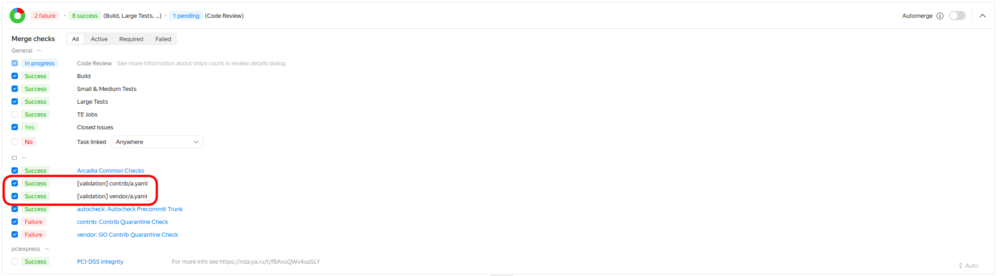

# Карантин

К сожалению, сложившаяся политическая ситуация повлияла на мир opensource. Это выразилось в появлении [protestware](https://github.com/open-source-peace/protestware-list#what-is-protestware). В качестве ответной реакции были предприняты следующие меры:

1. Создан [реестр](https://a.yandex-team.ru/arcadia/security/yadi/blacklist/blacklist.json), содержащий библиотеки с такого рода проблемами. Администриуется силами СИБ.
2. Введен обязательный двухнедельный карантин для контрибов перед добавлением их в Аркадию. Он отсчитывается от даты релиза конкретной версии.
3. Введено требование обязательного аппрува коммитов в [contrib](https://a.yandex-team.ru/arcadia/contrib/) и [vendor](https://a.yandex-team.ru/arcadia/vendor/) со стороны дежурного [сервиса "Общие компоненты Аркадии"](https://abc.yandex-team.ru/services/cc). Дежурный контролирует отсутствие библиотеки в реестре СИБ и окончание карантина.

# Изменения в процедуре обновления контрибов

1. Контрибы из реестра СИБ добавлять/обновлять на скомпрометированные версии запрещается. Если проблема будет обнаружена СИБ'ом задним числом - коммит с обновлением/добавлением будет отреверчен.
2. Pr'ы с библиотеками, находящимися на карантине (вышедшими менее 14 дней назад) не будут аппрувиться со стороны сервиса общих компонент. Создавать такие реквесты можно (например с целью вычинки Аркадийных зависимостей), но вливание будет временно "заморожено".

Если по какой-то причине требуется обновить контриб не дожидаясь окончания карантина (например в случае обнаружения критической уязвимости) - вы должны самостоятельно (или при помощи тематического языкового комитета) вычитать патч. Делается это под ответственность заказчика обновления. По согласованию с СИБ, смотреть надо на коммиты, сделанные за последние 2 недели. Если вы готовы пойти этим путем - по итогам вычитки напишите соответсвующий комментарий в контрибный тикет.

## Автоматика

Командой сервиса общих компонентов реализована автоматика, которая прекоммитно проверяет дату выхода заносимой версии а также ее наличие в реестре СИБ'а. Она представляет собой кастомные прекоммитные [ci проверки](https://docs.yandex-team.ru/ci/). По техническим причинам go-контрибы обрабатываются отдельно.

В случае обнаружения проблем мерж-требование сфейлится и в pr появится комментарий от имени [robot-contrib@](https://staff.yandex-team.ru/robot-contrib) с подробным описанием. Для некоторых контрибов мы не можем однозначно определить дату релиза, поэтому возможны false-positive результаты проверки (исходим из параноидальных соображений - если не занем дату - предполагаем худшее).

