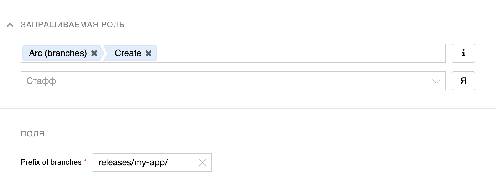

# Ветки и теги

Arc предоставляет большие возможности по созданию веток и тегов.

## Какие бывают ветки и теги { #types }

Аналогично Git в Arc существует два типа веток и тегов: 

1. **Локальные** ветки и теги хранятся у разработчика на ноутбуке. 
2. **Удалённые** (remote) ветки и теги хранятся на сервере единого репозитория.

## Работа с локальными ветками { #local-branch }

Для создания ветки используется команда `arc branch`:

```bash
(trunk) $ arc branch my-feature # Создаем ветку
```

Для переключения между ветками используется команда `arc checkout`:

```bash
(trunk) $ arc checkout my-feature # Переключаемся на нее
(my-feature) $ arc add file.txt # Работаем с веткой
```

Аналогичного результата можно добиться, используя сокращение:

```bash
(trunk) $ arc checkout -b my-feature
(my-feature) $ arc add file.txt
(my-feature) $ arc commit -m 'Added file.txt'
```

Можно вливать изменения из одной ветки в другую:

```bash
(my-feature) $ arc rebase trunk
```

Можно переносить отдельные коммиты из одной ветки в другую:

```bash
(my-feature) $ arc cherry-pick a8fdc205a9f19cc1c7507a60c4f01b13d11d7fd0
```

По завершении работы с веткой можно ее удалить:

```bash
(my-feature) $ arc checkout trunk
(trunk) $ arc branch -D my-feature
```

## Работа с локальными тегами { #local-tag }

Для создания локального тега используется команда `arc tag`:

```bash
(trunk) $ arc tag v1.0.0 # Указывает на текущий коммит
(trunk) $ arc tag v1.0.0 a8fdc205a9f19cc1c7507a60c4f01b13d11d7fd0 # Указывает на конкретный коммит
```

Для переключения на тег - команда `arc checkout`:
```bash
(trunk) $ arc checkout v1.0.0
```

Для удаления локального тега:

```bash
(trunk) $ arc tag -d v1.0.0
```

## Работа с удалёнными ветками { #remote-branch }

Любую локальную ветку можно опубликовать на сервере:

```bash
(my-feature) $ arc push -u users/username/my-feature
```

Можно полностью перезаписать все изменения в ветке:

```bash
(my-feature) $ arc push -f users/username/my-feature # force-push
```

Для того, чтобы скачать изменения из ветки `users/username/my-feature` на сервере:

```bash
(my-feature) $ arc fetch users/username/my-feature
```

Чтобы скачать все доступные ветки и теги с определенным префиксом:

```bash
$ arc fetch users/my-username/
$ arc fetch releases/my-project/
```

Если необходимо переключиться на ветку, которой ещё нет локально (например, на чужую ветку, или на опубликованную с другой машины):

```bash
(trunk) $ arc fetch users/colleague/his-feature
(trunk) $ arc checkout -b his-feature users/colleague/his-feature # Создаем новую ветку из содержимого ветки с сервера
```

Если вы уже делали `arc push -u` или переключились на ветку, которой не было локально, то ветка связывается с удаленной веткой и можно выполнять команды без указания имени удаленной ветки:

```bash
(my-feature) $ arc fetch
(my-feature) $ arc pull
(my-feature) $ arc push
```

Для удаления ветки с сервера:

```bash
$ arc push -d users/username/my-feature
```

## Работа с удаленными тегами { #remote-tag }

Для того, чтобы создать тег на сервере и указать им на какой-то коммит:

```bash
$ arc push a8fdc205a9f19cc1c7507a60c4f01b13d11d7fd0:tags/users/username/v1.0.0
$ arc push v1.0.0:tags/users/username/v1.0.0
$ arc push v1.0.0:tags/releases/myapp/v1.0.0
```

Для удаления тега на сервере:

```bash
$ arc push -d tags/users/username/v1.0.0
```

## Права доступа к веткам и тегам { #acl }

С точки зрения прав доступа **ветки и теги на сервере** можно разделить на 2 типа:

1. **Пользовательские ветки и теги** - могут использоваться только их владельцем. В имени такой ветки или тега всегда есть слово `users`, например, `users/username/my-feature` или `tags/users/username/v1.0.0`.
2. **Релизные ветки и теги** - нужны для фиксации изменений, соответствующих какому-то релизу с возможностью добавлять исправления. Могут использовать несколькими разработчиками одновременно. В имени такой ветки или тега всегда есть слово `releases`, например, `releases/myapp/1.x` или `tags/releases/myapp/v1.0.0`.

Основные отличия пользовательских веток и тегов от релизных:

1. Доступ на **чтение** любых веток имеют все пользователи.
2. Доступ на **запись и удаление** пользовательских веток и тегов имеет только их владелец.
3. Доступ к релизным веткам выдается через IDM в системе [Arc (branches)](https://idm.yandex-team.ru/system/arc-vcs/roles).
4. **Нельзя** поменять коммит, от которого отводится релизная ветка (т.е. сделать `arc rebase`).
5. **Нельзя** вливать релизную ветку обратно в `trunk`.
6. **Нельзя** делать force-push и удалять релизную ветку.
7. **Нельзя** удалять или менять релизный тег.

При выдаче прав доступа к релизным веткам определены следующие роли:

* **Read** - право на чтение (в настоящий момент есть всегда);
* **Create** - право на создание веток в указанном префиксе;
* **Delete** - право на удаление веток в указанном префиксе;
* **Fast-forward push** - право на прямой push в ветку, но только fast-forward;
* **Force push** - право на force-push в ветку;
* **Prefix admin** - право на подтверждение ролей для данного префикса.



Каждая из указанных ролей выдается по-отдельности на **префикс**, т.е. на все ветки, название которых начинается с определенной строки (префикса), например, `releases/myapp/`. Префикс должен обязательно оканчиваться на `/`.

## Работа с релизными ветками { #release-branches }

### Начало работы

1. Получить в IDM роль **Prefix admin** на нужный префикс (например, `releases/myapp/`). Эта роль позволяет управлять правами на все ветки в префиксе и выдавать права разработчикам.
2. Выдавать права разработчикам (**Create** или **Fast-forward push**).
3. Релизные теги живут в префиксе `tags/` и права на них настраиваются отдельно. Получить права администратора на префикс `tags/releases/myapp/` и выдать роль **Create** нужным разработчикам.



Релизные ветки нельзя удалять и в них нельзя делать force push.
Учитывайте это, когда проектируете сценарии их использования.



### Как сделать хот-фикс в релизную ветку

#### Если прямой push в релизную ветку запрещён (нет роли **Fast-forward push** на префикс релизной ветки)

1. Отводим пользовательскую ветку от релизной ветки:
    ```bash
    (trunk) $ arc fetch releases/myapp/some-release
    (trunk) $ arc checkout --no-track -b my-release-branch releases/myapp/some-release
    ```
    
    
    Отводить ветку надо именно от той релизной ветки, в которую планируются изменения (или от ветки отведённой от этой ветки). Создавать пулл-реквест в релизную ветку из ветки отведённой от trunk или другой релизной ветки нельзя. Создавать пулл-реквест в trunk из ветки, отведённой от релизной ветки тоже нельзя.
    
    
   
2. Пишем код и коммитим.
3. Создаём пулл-реквест:
    ```bash
    (my-release-branch) $ arc pr create --push --to releases/myapp/some-release
    ```

#### Если прямой push разрешен

1. Переключаемся на релизную ветку:
    ```bash
    (trunk) $ arc fetch releases/myapp/some-release
    (trunk) $ arc checkout releases/myapp/some-release
    ```
   
2. Пишем код и коммитим.
3. Отправляем изменения:
    ```bash
    (releases/myapp/some-release) $ arc push
    ```

### Как перенести хот-фикс из транка в релизную ветку

1. Отводим пользовательскую ветку от релизной ветки или переключаемся на релизную ветку:
    ```bash
    (trunk) $ arc fetch releases/myapp/some-release
    (trunk) $ arc checkout --no-track -b my-release-branch releases/myapp/some-release # Прямой push запрещен
    (trunk) $ arc checkout my-release-branch # Прямой push разрешен
    ```
2.  Переносим коммит из транка:
    ```bash
    (my-release-branch) $ arc cherry-pick a8fdc205a9f19cc1c7507a60c4f01b13d11d7fd0
    ```
3. Отправляем изменения в релизную ветку:
    ```bash
    (my-release-branch) $ arc pr create --push --to releases/myapp/some-release # Прямой push запрещен
    (releases/myapp/some-release) $ arc push # Прямой push разрешен
    ```

### Как перенести хот-фикс из релизной ветки в транк

1. Отводим пользовательскую ветку от транка:
    ```bash
    (trunk) $ arc fetch trunk
    (trunk) $ arc checkout -b my-branch
    ```
2.  Переносим коммит из релизной ветки:
    ```bash
    (my-branch) $ arc cherry-pick a8fdc205a9f19cc1c7507a60c4f01b13d11d7fd0
    ```
3. Создаем пулл-реквест:
    ```bash
    (my-branch) $ arc pr create --push
    ```
