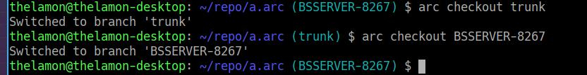
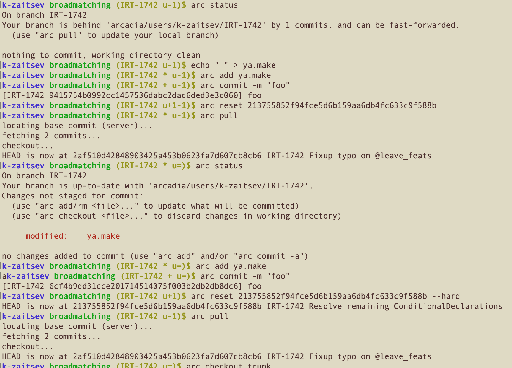
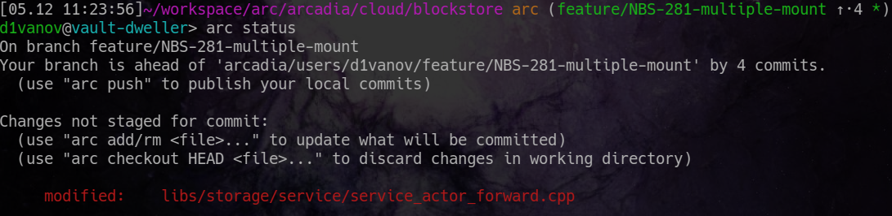

# Конфигурация

## Конфигурационный файл { #config }

Все настройки Arc хранятся в текстовом файле. Файл лежит в `~/.arcconfig` или `$XDG_CONFIG_HOME/arc/config`, а на Windows - в `%USERPROFILE%\.arcconfig`. Формат файла соответствует аналогичному файлу [.gitconfig](https://git-scm.com/docs/git-config) в Git. Вот примеры того, что можно настроить в этом файле:

### Секция alias { #config-alias }

Позволяет создавать сокращения для наиболее часто используемых команд:

```
[alias]
    br = branch
```

С такой настройкой можно писать:

```bash
arc br
```

### Секция branch { #config-branch }

Запретить коммиты в локальную ветку (trunk):
```
[branch "trunk"]
    allowCommit = false
```

### Секция core 
```
[core]

    # выбор нужного редактора из PATH
    editor = code --wait

    # отключение pager, при необходимости можно выбрать свой pager (по умолчанию используется less, для того, чтобы отключить pager, необходимо указать 'cat')
    pager = cat

```

### Секция diff { #config-diff }

Управление отображением изменений.

Настройка `tool` позволяет задать внешний инструмент сравнения (`difftool`). Работает аналогично [Git](https://git-scm.com/docs/git-difftool).

```
[diff]
    tool = code # Команда code должна быть в PATH, либо определена ниже

[difftool "code"]
    path = /home/arc_user/work_folder/vscode
```

Посмотреть список доступных инструментов можно командой:
```bash
arc difftool --tool-help
```

Если включить настройку `renames`, то отображение изменений будет учитывать перемещения файлов.

```
[diff]
    renames = true
```

### Секция merge { #config-merge }

Управление разрешением конфликтов.

Настройка `tool` позволяет задать внешний инструмент для разрешения конфликтов (`mergetool`). Работает аналогично [Git](https://git-scm.com/docs/git-mergetool).

```
[merge]
    tool = meld

[mergetool "meld"]
    path = /home/arc_user/work_folder/meld

```

Посмотреть список доступных инструментов можно командой:
```bash
arc mergetool --tool-help
```

Если включить настройку `renames`, то разрешение конфликтов будет работать с учетом перемещения файлов. Настройка `resolve-copy-info` позволяет сохранять информацию о копированиях и перемещениях при выполнении команд `rebase` и `cherry-pick`.

```
[merge]
    renames = true
    resolve-copy-info = true
```

#### Секция traces
 
 
В arc существует возможность логгирования всех выполняемых команд. Такие логи помогают команде разработки разбираться с потенциальными проблемами.
При включенной опции `trace` (по умолчанию `true`) записывается время и содержание запускаемых команд. Опция `stage` (по умолчанию `false`) логгирует все этапы работы со стейджем.
Опция `ttl-days` (по умолчанию `30`) позволяет указать, как часто необходимо очищать логи арка.

```
[traces]
    enabled = [true, false]
    stage = [true, false]
    ttl-days = ...
```

## Настройки командного интерпретатора { #shell }

### Автоматическое дополнение команд { #shell-completion }

Если в качестве командного интерпретатора вы используете [Bash](https://en.wikipedia.org/wiki/Bash_(Unix_shell)) или [Zsh](https://en.wikipedia.org/wiki/Z_shell), то можете легко настроить автоматическое дополнение команд по нажатию на Tab.



При каждом обновлении Arc рекомендуется заново настраивать автоматическое дополнение команд.





- Bash в Linux

  ```bash
  arc completion bash > ~/.local/share/bash-completion/completions/arc
  ```

- Bash в MacOS

  ```bash
  mkdir -p $(brew --prefix)/etc/bash_completion.d
  arc completion bash > $(brew --prefix)/etc/bash_completion.d/arc
  ```
  
- Zsh в Linux
  
  ```bash
  mkdir -p ~/.zfunc
  arc completion zsh > ~/.zfunc/_arc
  sed -i '1s|^|fpath+=~/.zfunc\n|' ~/.zshrc 
  ```

- Zsh в MacOS
  
  ```bash
  mkdir -p ~/.zfunc
  arc completion zsh > ~/.zfunc/_arc
  sed -i '' -e '1s|^|fpath+=~/.zfunc\n|' ~/.zshrc 
  ```



После применения изменений - перезапустите Bash или Zsh.

### Приглашение командной строки (prompt) { #prompt }



Данный раздел документации командой devtools официально не поддерживается, а является компиляцией рецептов, собранных сообществом пользователей Arc.



Существует несколько независимо развиваемых скриптов для приглашения командной строки.



- Bash #1

  

  Установка:
  ```bash
  git clone https://github.yandex-team.ru/thelamon/git-aware-prompt.git ~/.bash/git-aware-prompt
  echo "GITAWAREPROMPT=\"$HOME/.bash/git-aware-prompt\"" >> ~/.bashrc
  echo 'source "~/.bash/git-aware-prompt/main.sh"' >> ~/.bashrc
  source ~/.bashrc
  ```

- Bash #2
  
  
  
  1. Скачать [скрипт](https://a.yandex-team.ru/arc/trunk/arcadia/junk/k-zaitsev/arc-prompt.sh).
  2. Добавить вызов скрипта в `~/.bashrc`:
  ```bash
  echo 'source ~/arc-prompt.sh' >> ~/.bashrc
  ```
  3. Выставить переменную окружения PS1 (можно также в `~/.bashrc`):
  ```bash
  export PS1='\[\e[1;34m\]\u \[\e[1;32m\]\W \[\e[1;33m\]$(__git_ps1)$(__arc_ps1)\$\[\e[0m\] '
  ```
  
- Bash #3
  
  Установка:
  
  1. Скачать [скрипт](https://a.yandex-team.ru/arc/trunk/arcadia/junk/nslus/config/.bashrc).
  2. Добавить его содержимое в `~/.bashrc`

- Bash #4
  
  
  
  Установка:
  1. Скачать [devtools/scmprompt/scmstatus.py](https://a.yandex-team.ru/arc/trunk/arcadia/devtools/scmprompt/scmstatus.py) и  [devtools/scmprompt/scmprompt.sh](https://a.yandex-team.ru/arc/trunk/arcadia/devtools/scmprompt/scmprompt.sh) в `~/.bash/scmprompt`.
  2. Выполнить команды:
  ```bash
  echo 'source ~/.bash/scmprompt/scmprompt.sh' >> ~/.bashrc
  source ~/.bashrc
  ```

- Zsh #1
  
  Смотри [devtools/scmprompt/scmprompt.zsh](https://a.yandex-team.ru/arc/trunk/arcadia/devtools/scmprompt/scmprompt.zsh).

- Zsh #2

  Смотри [agnosther-theme](https://a.yandex-team.ru/arc/trunk/arcadia/junk/ivanzhukov/zsh/agnoster-theme).  
  
- Zsh #3

  Смотри [arc-zsh](https://github.yandex-team.ru/magras/arc-zsh).  

- Zsh #4

  [robbyrussell-arc](https://a.yandex-team.ru/arc/trunk/arcadia/junk/a-dd/robbyrussell-arc) — prompt для темы по умолчанию в [oh-my-zsh](https://github.com/ohmyzsh/ohmyzsh).

- Zsh #5

  [powerlevel10k-prompt-arc](https://a.yandex-team.ru/arc_vcs/junk/srg91/powerlevel10k-prompt-arc) — prompt для темы [powerlevel10k](https://github.com/romkatv/powerlevel10k).

- Fish
  
  Автоматическое дополнение и приглашение для [Fish](https://fishshell.com). Исходник скрипта лежит по [ссылке](https://a.yandex-team.ru/arc/trunk/arcadia/junk/perseus/arc-fish). 
  
  Установка:
  ```bash
  ln -sf $ARCADIA/junk/perseus/arc-fish/completions/arc.fish $HOME/.config/fish/completions/arc.fish
  ln -sf $ARCADIA/junk/perseus/arc-fish/functions/arc-prompt.fish $HOME/.config/fish/functions/arc-prompt.fish
  ```
  
  Для загрузки подсказок о текущем состоянии репозитория arc в prompt используйте функцию `arc-prompt`. Её нужно вызывать из функции [fish_prompt](https://fishshell.com/docs/current/cmds/fish_prompt.html). Пример определения функции можно посмотреть [здесь](https://a.yandex-team.ru/arc/trunk/arcadia/junk/perseus/arc-fish).
  

