# Веб-интерфейс Arcanum

Для работы с исходными кодами единого репозитория из браузера создан веб-интерфейс [Arcanum](https://a.yandex-team.ru), который многими возможностями напоминает [Github](https://github.com/). На этой странице собраны все основные возможности сервиса.

## Просмотр и редактирование исходных кодов { #navigation }

Arcanum позволяет легко просматривать содержимое единого репозитория:

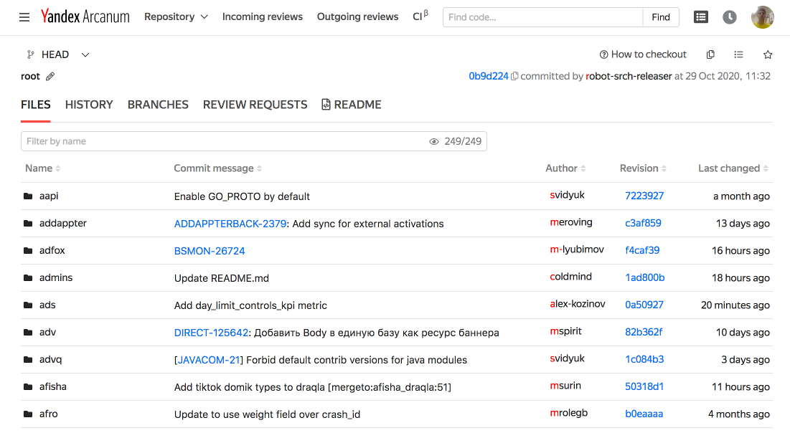

Для быстрого поиска интересующего вас раздела предусмотрена фильтрация:

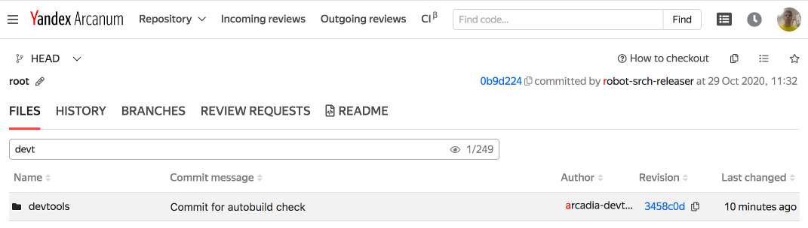

При нажатии на коммит в столбце **Revision**, можно просмотреть список измененных файлов и сами изменения в каждом из них:

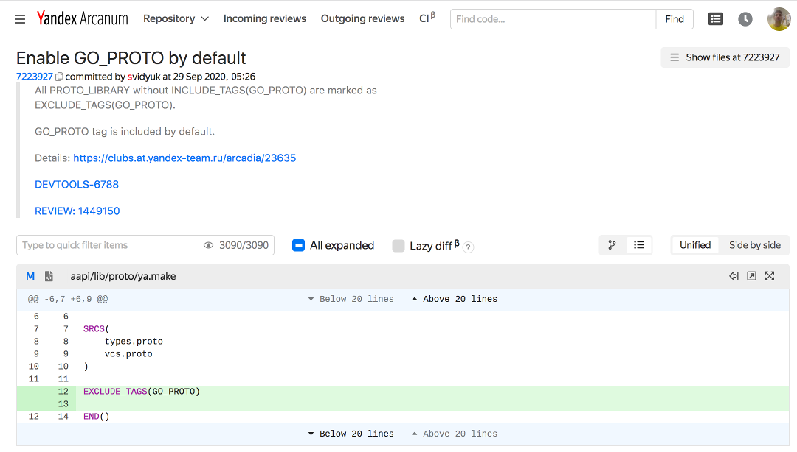

Можно просматривать содержимое любых файлов:

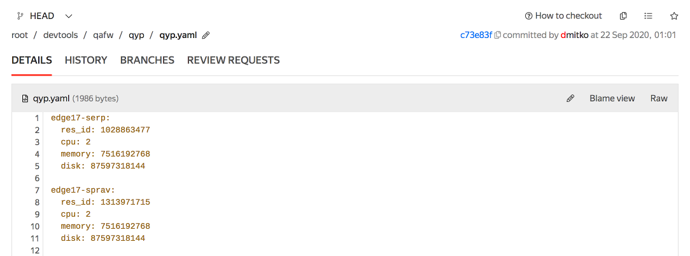

При просмотре файлов доступно отображение авторов изменений в каждой строчке (т.н. **blame** от англ. blame - винить):

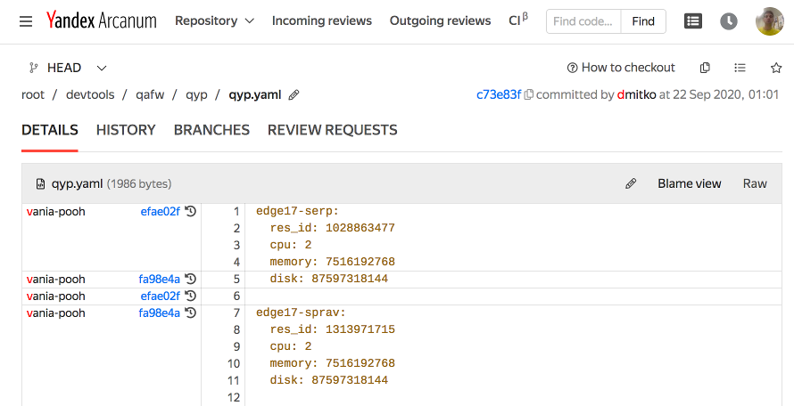

Можно редактировать файлы и отправлять изменения в виде пулл-реквеста :

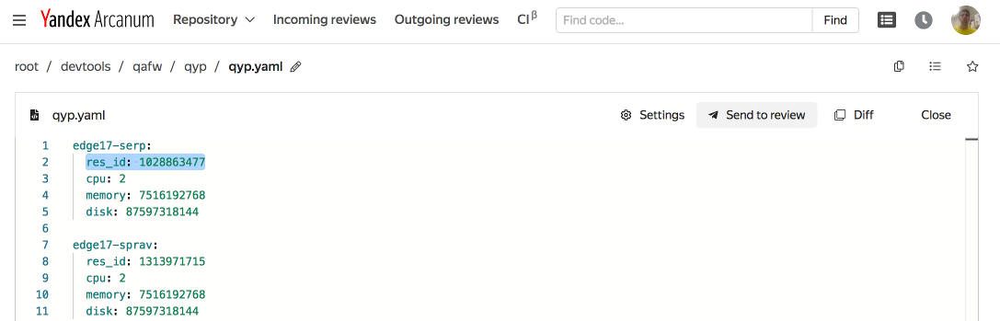

На вкладке **History** можно увидеть список всех изменений в выбранном разделе единого репозитория:

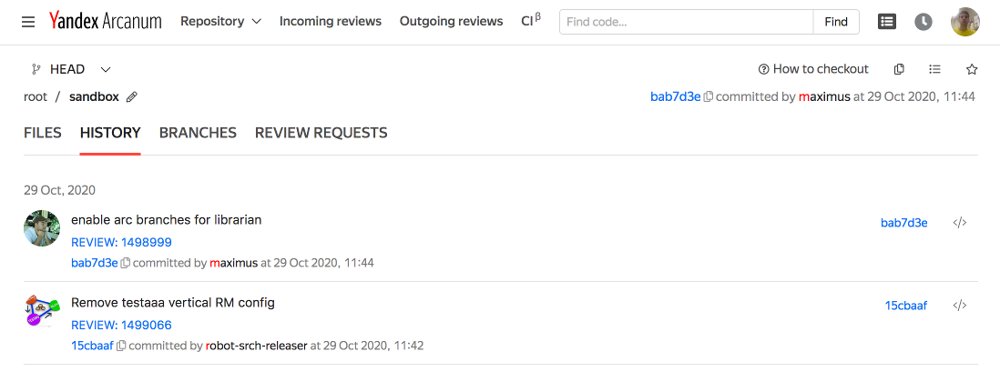

На вкладке **Branches** отображается список всех веток на сервере, относящихся к выбранному разделу единого репозитория.

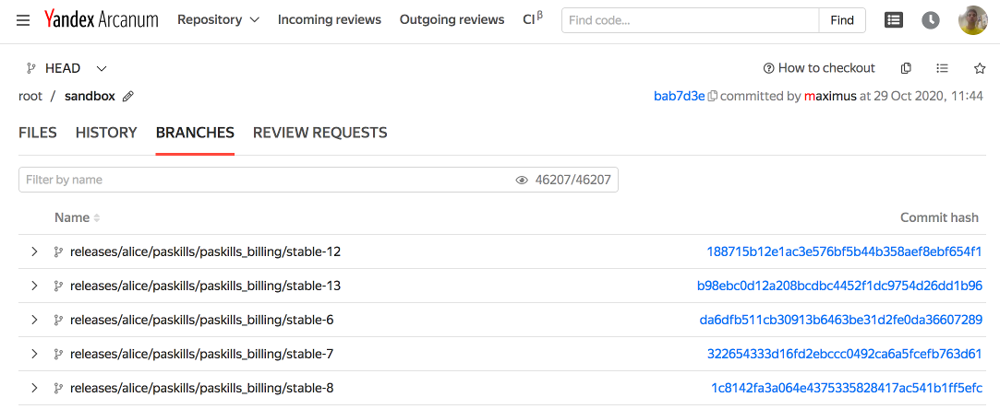

На вкладке **Review requests** находится список активных пулл-реквестов:

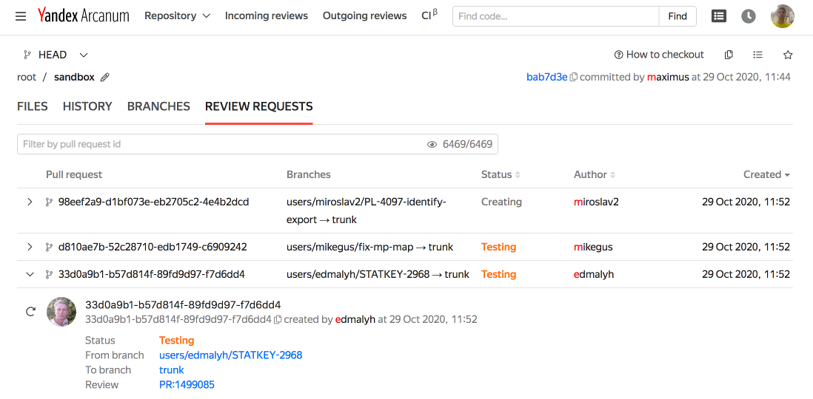

## Пулл-реквесты { #pull-requests }

Каждый созданный пулл-реквест отображается в виде отдельной страницы:

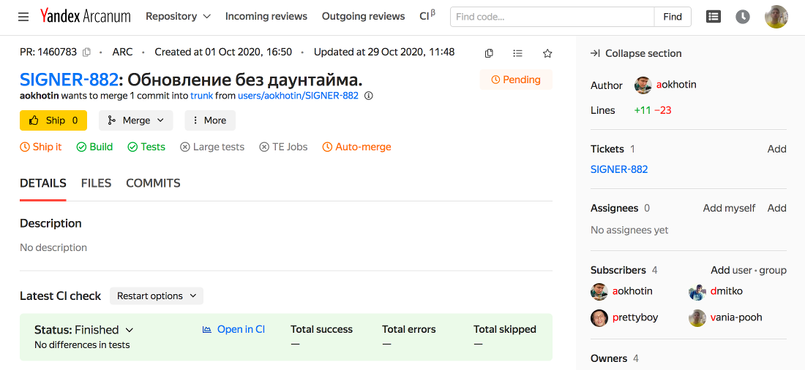

Страница содержит:

1. Различную мета-информацию о пулл-реквесте:
    * Уникальный номер пулл-реквеста, его описание, время создания и последнего обновления;
    * Информацию о создателе и ветке, из которой он был создан;
    * Связанные тикеты в трекере [Startrek](https://st.yandex-team.ru/);
    * Наблюдатели и владельцы кода, в который внесены изменения.

2. Кнопки **Ship**, **Merge** и **More**, позволяющие управлять состоянием пулл-реквеста:

    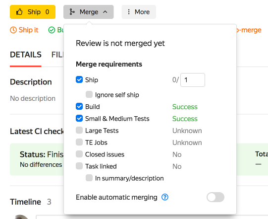

    Кнопка **Merge** позволяет задать условия, при которых пулл-реквест будет влит в единый репозиторий. По-умолчанию все пулл-реквесты вливаются автоматически (**automatic merging**) после успешного прохождения тестов. Можно отключить автоматическое вливание изменений и потребовать ручного одобрения изменений от одного или нескольких разработчиков. Одобрение пулл-реквеста делается нажатием кнопки **Ship** (то же самое, что **Approve**). После того как все условия выполнены, нужно включить флажок **Enable automatic merging** обратно и пулл-реквест будет влит.
    
    Кнопка **More** содержит более редко используемые возможности, например, позволяя закрыть пулл-реквест без добавления в единый репозиторий.

3. Информацию о прохождении тестов на вкладке **Details**:

    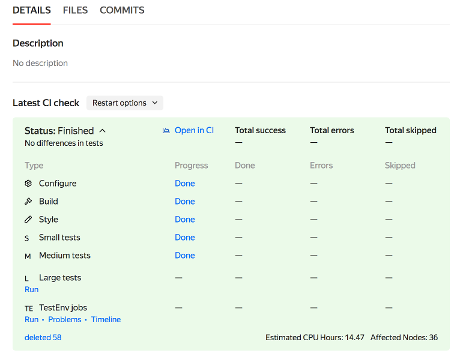

4. Список измененных файлов на вкладке **Files**:

    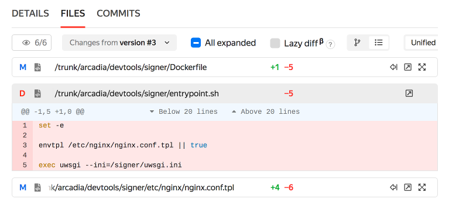
    
5. Список коммитов на вкладке **Commits**:

    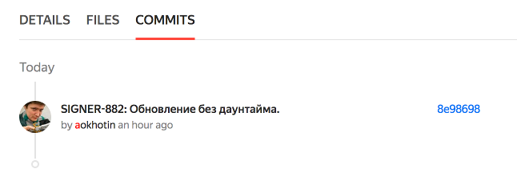
    
6. Список итераций (на каждый `arc push -f` в ветку создается новая итерация):

    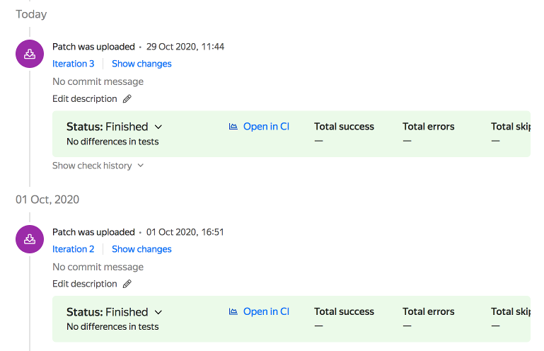
    
## Поиск по репозиторию { #code-search }

Arcanum предоставляет возможность искать исходный код по произвольному запросу. Для того, чтобы начать поиск - введите запрос в поле **Find code...**:

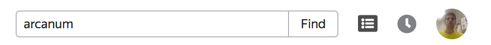

Будет показана страница с результатам поиска:

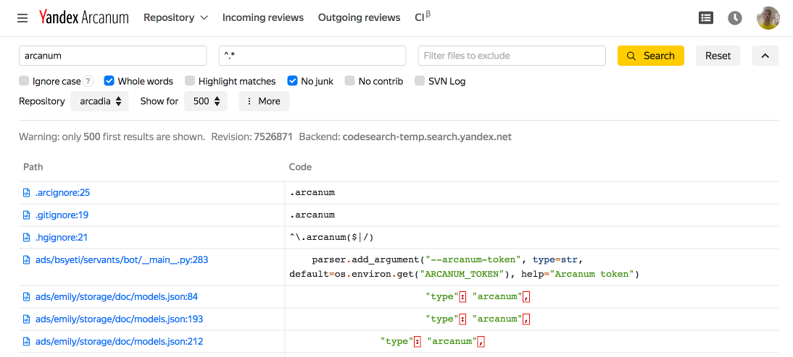

## Кабинет разработчика { #developer-page }

В Arcanum реализована личная страница (кабинет) разработчика, по-умолчанию доступная при **нажатии на вашу аватарку > My dashboard**.

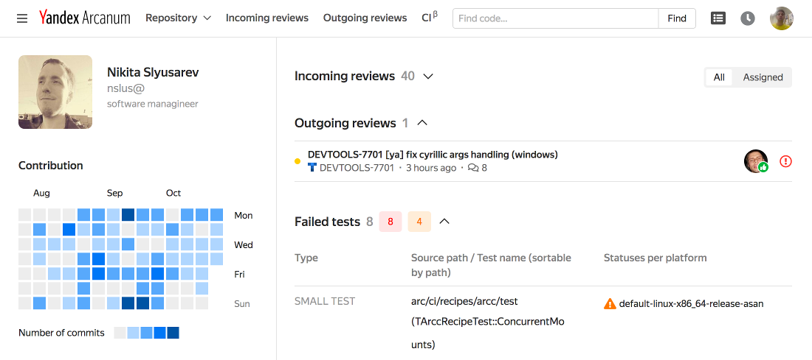

На данной странице отображается информация о коммитах по дням, списки пулл-реквестов и тестов, связанных с данным разработчиком.

## Настройки { #settings }

При **нажатии на аватарку > Settings** вы увидите экран настроек пользователя:

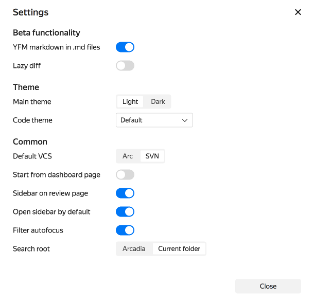

## Клавиатурные сокращения { #shortcuts }

Arcanum поддерживает клавиатурные сокращения для более быстрой навигации по коду и работы с пулл-реквестами. Полный список поддерживаемых сокращений отображается при **нажатии на аватарку > Shortcuts**: 

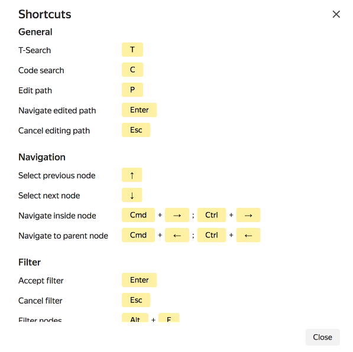
