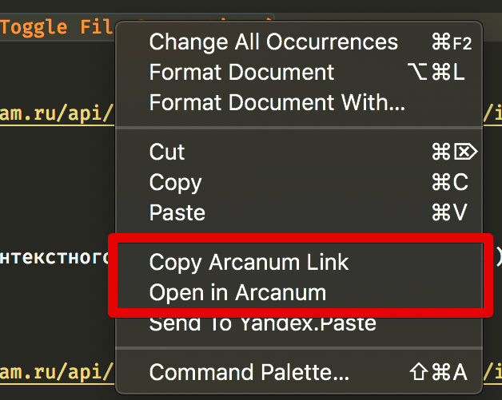

# Поддержка IDE

Для более удобной работы с инструментами разработки из IDE реализованы плагины поддержки инструментов разработки для [Visual Studio Code](https://en.wikipedia.org/wiki/Visual_Studio_Code) и IDE от [JetBrains](https://www.jetbrains.com/) (Intellij IDEA, PyCharm, CLion, GoLand, WebStorm и т.п.). Подробности установки плагинов приведены в разделе [Быстрый старт](../intro/quick-start-guide.md). На этой странице описаны возможности данных плагинов.

## Плагин для Visual Studio Code { #vsc-plugin }

Основные возможности плагина:

1. Подсветка синтаксиса и автоматическое дополнение файлов **ya.make**.
2. Работа с Arc средствами IDE: команды **Push**, **Pull**, **Checkout to**.
3. Поддержка **arc blame** (команда `Toggle File Decorations`):

    

4. Открыть файл в браузере в [Arcanum](https://a.yandex-team.ru/): правая кнопка мыши на файле > Open in Arcanum.

    

5. Отправить файл в [Yandex.Paste](https://paste.yandex-team.ru/): правая кнопка мыши на файле > Send to Yandex.Paste.

    

## Плагин для IDE от JetBrains { #jb-plugin }

После установки плагина появляется новое окно **Tool Windows > Arcanum** и поддержка Arc в **Tool Windows > Version Control**.

Основные возможности плагина:

1. Подсветка синтаксиса и автоматическое дополнение файлов **ya.make**:

    

2. Работа с Arc средствами IDE:

    

3. Поддержка **arc blame** (команда `Annotate`) и **arc stash**.
4. Работа с пулл-реквестами.

    Просмотр списка пулл-реквестов:
    
    
    
    Просмотр изменений в пулл-реквесте, работа с комментариями, кнопка **Ship**:
    
    
    
    Управление **Merge**-требованиями:
    
      
     
5. Открыть файл в браузере в [Arcanum](https://a.yandex-team.ru/):

    

6. Отправить файл в [Yandex.Paste](https://paste.yandex-team.ru/):

    

7. Разные оптимизации, позволяющие удобно работать с импортами зависимостей в Java \ Python.

## Дополнительная информация { #additional-info }
Так как для сборки проектов в Аркадии используется самописная система сборки, с которой не знакомы используемые IDE, существует семейство утилит **ya ide**, упрощающих первичную настройку и генерацию проекта для основных используемых IDE, а также сборки Vim и Emacs, адаптированные для работы в Arcadia.
**Поддерживаемые IDE:**
- [CLion](https://docs.yandex-team.ru/ya-make/usage/ya_ide/clion)
- [Emacs](https://docs.yandex-team.ru/ya-make/usage/ya_ide/emacs)
- [GoLand](https://docs.yandex-team.ru/ya-make/usage/ya_ide/goland)
- [IDEA](https://docs.yandex-team.ru/ya-make/usage/ya_ide/idea)
- [MSVS](https://docs.yandex-team.ru/ya-make/usage/ya_ide/msvs)
- [PyCharm](https://docs.yandex-team.ru/ya-make/usage/ya_ide/pycharm)
- [QtCreator](https://docs.yandex-team.ru/ya-make/usage/ya_ide/qt)
- [ViM](https://docs.yandex-team.ru/ya-make/usage/ya_ide/vim)
- [VS Code](https://docs.yandex-team.ru/ya-make/usage/ya_ide/vscode)
