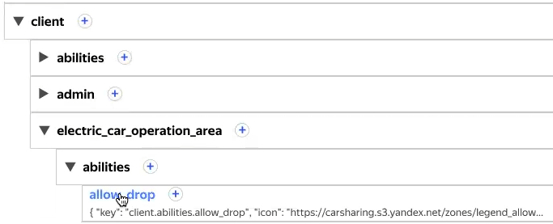

# GVars

GVars — это набор настроек для гибкого конфигурирования сервиса.

## Назначение {#purpose}

Переменные GVars задаются при разработке новой функциональности. С их помощью легко изменять настройки или текст этой функциональности в дальнейшем. Например, можно редактировать интерфейс приложения: исправить заголовок или надпись на экране, сменить иконки для состояний профиля. С GVars не нужно пересобирать приложение после внесения подобных изменений.

Переменные GVars влияют на настройки как пользовательского приложения, так и процессов в бэкенде.

GVars может быть рекурсивным: содержать внутри себя обращение к другому GVars.

## Формат {#format}

Переменные GVars имеют формат **Ключ + Значение**.



|**Ключ**|**Значение**|
|--------|------------|
|allow_drop_off_notification|Здесь [color=#142AF3]можно завершать аренду[/color] и переводить в [color=#142AF3]«ожидание»[/color].|



Ключ может иметь несколько уровней:

Ключ может содержать настройки для управления сложными процессами. Хороший пример применения GVars — ветка ключей `fines`, которые управляют процессом обработки штрафов. Ветка содержит переменные:

1. Для роботов бэкенда. Например:
    
    - `fines.fine_article_matcher.generic_match_rule` — правило обработки штрафов;
    - `fines.tag_templates.charge_tag.data` — шаблон для тега штрафа.
    
1. Для отправки писем пользователям: `fines.tag_templates.mail_tag.data`.

