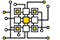

# Основные объекты

В админке Драйва существует несколько основных объектов, работать с которыми приходится наиболее часто:

[Пользователи и автомобили](users-and-cars.md)

[Теги](tags.md)

[Экшны и роли](action-and-roles.md)

[Сессии](sessions.md)

[GVars](gvars.md)

[Локализации](localisations.md)

[Сигналы](signals.md)

