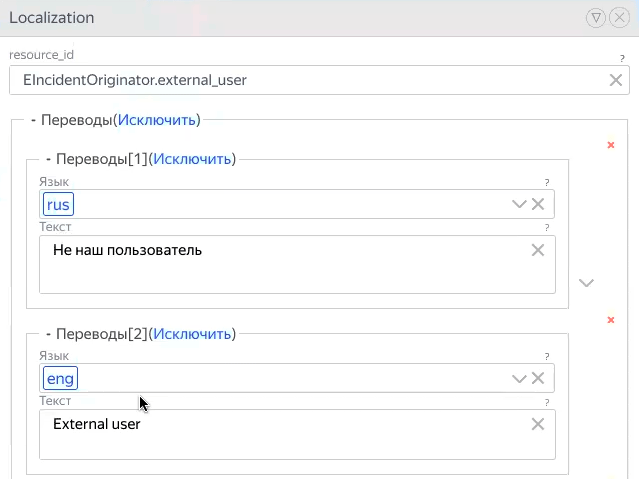

# Локализации

Локализации — это переменные для гибкой настройки языков, на которых отображается интерфейс приложения. Эти переменные очень важны, потому что пользователи говорят на разных языках.

Переменные локализации имеют формат **Ключ + Значение**. Значения различаются в зависимости от языка:

В любой функциональности приложения или бэкенда можно указать текст, который будет отображаться для данной локализации.

От того, с какой локали пользователь открывает приложение, будет зависеть язык интерфейса.

