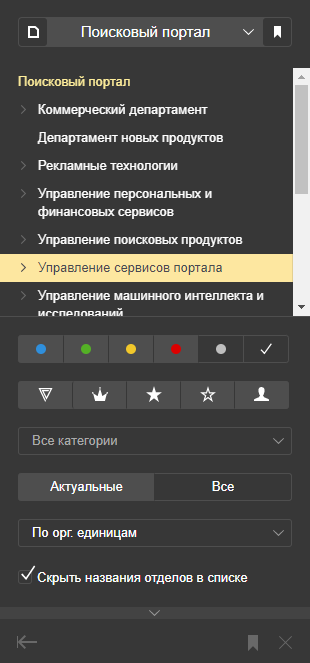
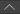
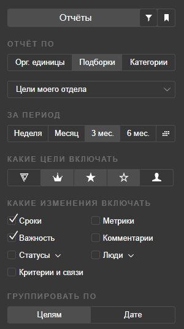

# Навигация по целям

## Найти цели пользователей или подразделений {#by-users}

#### Найти свои цели {#by-owner}

Найти свои цели можно двумя способами:

* Введите ваше имя или логин в строку поиска на верхней панели, затем выберите себя из списка в подсказке.
* На левой панели откройте [подборки](#favourites) (если они скрыты, нажмите значок ) и выберите **Мои цели**.

#### Найти цели любого пользователя {#by-user}

Чтобы найти цели пользователя, введите его имя или логин в строку поиска на верхней панели, затем выберите пользователя из списка в подсказке.

#### Найти цели подразделения {#by-div}

* Чтобы найти цели своего подразделения, на левой панели откройте [подборки](#favourites) (если они скрыты, нажмите значок ) и выберите **Цели моего отдела** или **Цели моего подразделения**.
* Чтобы найти цели любого подразделения, выберите подразделение [с помощью фильтра](#filters).

## Подписаться на цель {#subscribe}

Чтобы получать по почте уведомления об изменении цели, подпишитесь на нее. На цель автоматически подписываются ответственный, заказчики и сотрудники в главных ролях.

* Чтобы подписаться на уведомления об изменении цели, внизу страницы нажмите кнопку **Подписаться на цель**.
* Чтобы подписать на уведомления об изменении цели других пользователей, внизу страницы нажмите кнопку **Подписать**, укажите пользователей и снова нажмите кнопку **Подписать**.
* Чтобы отписаться от уведомлений, внизу страницы нажмите кнопку **Отписаться**.
* Чтобы увидеть список целей, на которые вы подписаны, на левой панели откройте [подборки](#favourites) (если они скрыты, нажмите значок ) и выберите **Мои подписки**.

## Поиск по фильтрам {#filters}

С помощью фильтров вы можете искать цели по подразделению, статусу и важности и тегам:

1. На левой панели откройте фильтры (если они скрыты, нажмите значок ).
    
    

    

    
    
1. Выберите подразделение, цели которого вы хотите увидеть:
    1. В заголовке панели фильтров выберите подразделение верхнего уровня.
    1. В структуре подразделения выберите департамент, отдел, группу и так далее.
    
1. Чтобы отфильтровать список целей по статусу и важности, выберите статусы и уровни важности с помощью значков.
1. Чтобы настроить дополнительные фильтры и отображение целей, внизу панели нажмите значок :
    * В поле **Все категории** выберите или введите тег, по которому хотите найти цели.
    * Отфильтруйте цели по актуальности: **Актуальные** или **Все**. Неактуальными считаются цели, которые были закрыты или отменены больше 6 месяцев назад.
    * Выберите порядок сортировки:
        * **По орг. единицам** — отображаются цели, в которых сотрудники выбранного подразделения являются ответственными, заказчиками или участвуют в главных ролях. Цели сгруппированы по ролям.
        * **По цвету** — цели сгруппированы по статусу.
    
    * Чтобы над целями отображать подразделения, к которым они относятся, выключите опцию **Скрыть названия отделов в списке**.
    
1. Чтобы сохранить фильтр в [подборки](#favourites), внизу панели нажмите значок .
1. Чтобы сбросить параметры фильтра, внизу панели нажмите значок .

## Подборки {#favourites}

Подборки — это сохраненные фильтры, с помощью которых можно быстро найти цели по определенным признакам.

Чтобы просмотреть подборку, на левой панели нажмите значок . Отображение списка целей в подборке можно дополнительно настроить на [вкладке фильтров](#filters).

По умолчанию настроено несколько подборок:

* **Ключевые цели компании** — цели, у которых установлен уровень важности **Ключевая компании**.
* **Цели моего отдела** — цели уровня отдела.
* **Цели моего подразделения** — цели уровня службы или группы.
* **Мои цели** — цели, в которых вы участвуете как заказчик, ответственный или в главных ролях.
* **Мои подписки** — цели, на которые вы [подписались](#subscribe).

Вы можете настроить свой [фильтр целей](#filters) и сохранить его в подборки, нажав значок .

## Отчеты {#report}

С помощью отчетов можно увидеть изменения, которые произошли в заданном списке целей.

Чтобы сформировать отчет:

1. На левой панели откройте отчеты (если они скрыты, нажмите значок ).
    
    

    
    
    

1. Выберите тип отчета:
    * **Орг. единицы** — отчет по целям подразделения или сотрудника. При выборе этого типа отчета введите название подразделения или имя сотрудника, затем выберите подразделение или сотрудника из подсказки.
    * **Подборка** — отчет по целям из заданной подборки. При выборе этого типа отчета укажите [подборку](#favourites).
    * **Категории** — отчет по целям с заданным тегом. При выборе этого типа отчета укажите тег.
    
1. Выберите период, за который нужно сформировать отчет.
1. Выберите уровни важности целей, которые нужно включить в отчет.
1. Выберите изменения в целях, которые нужно включить в отчет.
1. Выберите тип группировки событий в отчете: по целям или по дате.
