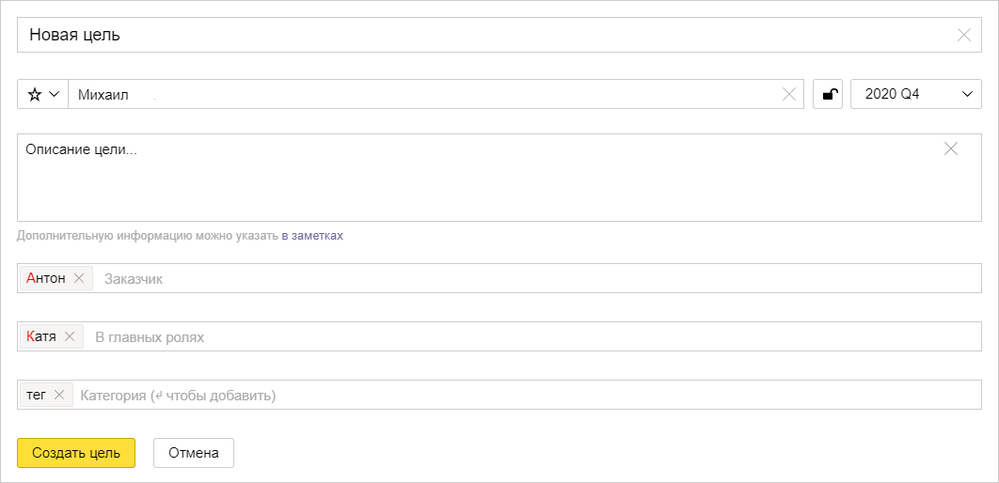
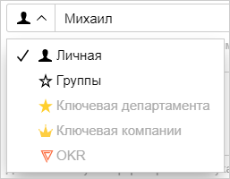

# Создать цель

Чтобы создать цель:

1. В правом верхнем углу страницы нажмите кнопку **Создать** и выберите **Создать цель**.
1. На карточке новой цели введите название и укажите ответственного — сотрудника, который будет заниматься реализацией цели.
    
    
    
    Название и ответственный должны быть указаны обязательно. Другие параметры можно [задать после создания цели](update.md#checklist).
    
    
    
    
    
1. Введите описание цели. Старайтесь, чтобы из описания было понятно, какую пользу принесет достижение цели, и как эту пользу оценить.
1. Чтобы задать сроки достижения цели, нажмите поле **Без срока** и выберите квартал и год.
1. В поле **Заказчики** укажите сотрудников, которые заинтересованы в достижении цели. Например, руководителей сервиса или подразделения.
1. Если для достижения цели требуется участие других сотрудников, кроме ответственного, добавьте этих сотрудников в поле **В главных ролях**.
1. Чтобы изменить важность цели, нажмите значок слева от имени ответственного и выберите уровень важности.

    
    
1. Чтобы ограничить доступ к цели, нажмите значок . Цель будет доступна только ответственному, заказчикам, сотрудникам в главных ролях и подписчикам.
1. Чтобы добавить к цели произвольную текстовую метку (тег), введите текст в поле **Категория** и нажмите клавишу **Enter**. При необходимости можно добавить несколько меток.
1. Нажмите кнопку **Создать цель**.

К созданной цели можно добавить больше информации:

* [Этапы или критерии достижения цели в виде чеклиста.](update.md#checklist)
* [Связи с другими целями или задачами в {{ tracker-full-name }}.](update.md#links)
* [Графики из {{ datalens-full-name }}.](update.md#metrics)
