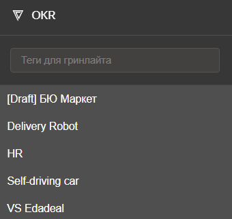
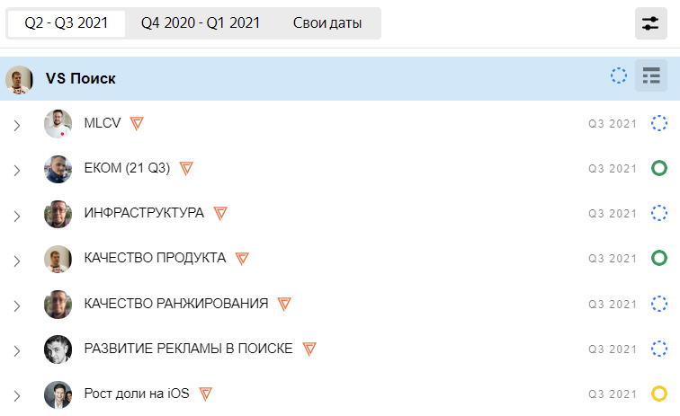

# Цели и Градиент

Планирование в Поиском портале происходит по системе Градиент. Подробнее о Градиенте можно узнать [на Вики](https://wiki.yandex-team.ru/gradient/guide/).

Внутри Портала выделены стримы (VS — {{ vs }}) — крупные направления бизнеса, которые имеют собственные ключевые цели. Верхнеуровневые цели стрима декомпозируются и спускаются на уровень подразделений и проектов.

## {{ vs }}, зонтики, контуры {#types}

Чтобы отразить эту структуру планирования, в сервисе Цели используются специальные типы целей, отмеченные значком :

* **{{ vs }}** — головная цель, которой подчинены все цели стрима. Например, <q>VS Поиск</q>, <q>VS Краудсорсинг</q>.
* **Зонтик** — направление работы внутри стрима. Например, <q>Инфраструктура</q>, <q>Клиентский сервис</q>.
* **Контур** — проект или группа проектов с конкретными задачами.

Цели Градиента отличаются от обычных целей и содержат дополнительные поля, которые используются для планирования: сценарий, цели (Objectives), ключевые результаты (Key Results), необходимое количество сотрудников (HC — HeadCount). Подробнее об основных понятиях Градиента читайте [на Вики](https://wiki.yandex-team.ru/gradient/guide/#terms). Заполнение целей Градиента описано в разделе [Создать цели Градиента](create-okr.md).

Цели Градиента имеют строгую иерархию:

* Стрим всегда находится на верхнем уровне и не может быть подчинен другим элементам.
* Зонтик может быть подчинен только стриму.
* Контур может быть подчинен только зонтику.
* Обычные цели могут быть подчинены только контуру.

## Просмотреть цели Градиента {#view}

Чтобы просмотреть иерархию целей Градиента:

1. На левой панели нажмите кнопку OKR . Отобразится список стримов.
    
    
1. На левой панели выберите стрим, справа откроется дерево целей, в котором будет раскрыт выбранный элемент.
    
    
1. Если требуется, отфильтруйте список:
    * Чтобы выбрать период для просмотра целей, вверху списке нажмите кнопку с датами.
    * Чтобы отфильтровать цели по тегам, введите их в поле **Теги для гринлайта** на левой панели.
    
        
        
        В отличие от обычного поиска по тегам, фильтрация по тегам для гринлайта отображает не только те элементы, которые отмечены тегом, но и все их дочерние цели.
        
        
    
    * Чтобы отфильтровать цели по статусу, вверху списка нажмите кнопку .
    
1. Чтобы открыть цель для просмотра деталей, выберите ее в дереве.
1. Чтобы перейти к [табличному представлению стрима](table-view.md) с подчиненными зонтиками и контурами, в строке стрима нажмите кнопку .
