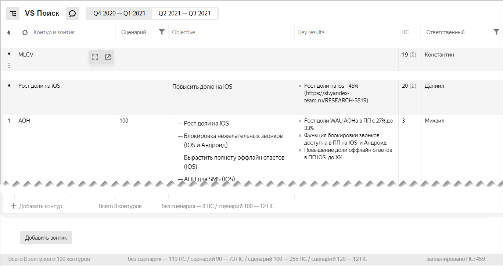

# Табличное представление

Табличное представление целей [Градиента](https://wiki.yandex-team.ru/gradient/guide/) позволяет на одной странице просматривать, создавать и редактировать [зонтики и контуры](okr.md#types) выбранного стрима. Табличное представление удобно использовать для планирования работы на семестр, когда приходится создавать, обсуждать и согласовывать множество связанных между собой целей.

Все зонтики и контуры, которые вы создадите или отредактируете в табличном представлении, также будут доступны для [просмотра и редактирования на отдельных страницах](update.md), как обычные цели. Точно так же зонтики и контуры, [созданные обычным способом](create-okr.md) с помощью кнопки **Создать**, будут отображаться в табличном представлении.

Чтобы перейти к табличному представлению целей:

1. На левой панели нажмите кнопку OKR .
1. Наведите указатель на стрим, который вы хотите открыть в табличном представлении, и нажмите кнопку .
Откроется таблица со списком всех зонтиков и контуров выбранного стрима.
    

## Просмотр таблицы {#view}

В таблице отображается список всех зонтиков и контуров стрима.

В столбцах таблицы отображаются [основные параметры целей Градиента](https://wiki.yandex-team.ru/gradient/guide/#terms): сценарий, цели (Objectives), ключевые результаты (Key Results), необходимое количество сотрудников (HC — HeadCount), команда (для контуров). В столбце **Комментарий** отображается последний комментарий, добавленный на странице зонтика или контура.

Строки зонтиков выделены серым фоном, под каждым зонтиком сгруппированы входящие в него контуры. В последней строке зонтика указано общее количество контуров и количество сотрудников (HC), необходимое для достижения целей.

Внизу таблицы указана сводная информация для всего стрима: количество зонтиков, контуров и количество сотрудников (HC), необходимое для достижения целей.

Вы можете настроить отображение таблицы:

* Чтобы выбрать семестр для просмотра целей, вверху страницы нажмите кнопку с датами.
* Чтобы просмотреть или отредактировать заметку для стрима, вверху страницы нажмите значок . Заметки можно использовать во время планирования, они не отображаются на странице стрима.
* Чтобы выбрать столбцы для отображения, в заголовке таблицы нажмите значок , отметьте нужные столбцы и нажмите кнопку **Применить**.
* Чтобы отфильтровать таблицу по одному из столбцов, в заголовке столбца нажмите значок .
* Чтобы отредактировать значение ячейки, дважды щелкните внутри ячейки.
* Чтобы свернуть или развернуть все зонтики, в заголовке левого столбца нажмите значок .
* Чтобы сохранить таблицу в файл Excel, в правом верхнем углу страницы нажмите значок **Экспорт**! .
* Чтобы вернуться к [дереву целей Градиента](okr.md#view), вверху страницы нажмите значок .

## Создать и отредактировать зонтик {#umbrella}

* Чтобы создать новый зонтик, внизу страницы нажмите кнопку **Новый зонтик**.
* Чтобы заполнить или отредактировать поле зонтика, дважды щелкните внутри ячейки и введите значение.

    
    
    Чтобы добавить сотрудников, которые работают над целями зонтика, [внесите их в команды контуров](#contour).
    
    
    
* Чтобы изменить [статус](update.md#status) зонтика, нажмите значок статуса и выберите новое значение.
* Чтобы свернуть или развернуть зонтик, слева от названия нажмите значок .
* Чтобы отобразить выбранный зонтик в отдельной таблице, наведите указатель на название зонтика и нажмите значок . Чтобы снова отобразить в таблице все зонтики, нажмите на название стрима вверху страницы.

    
    
    Ссылку на зонтик в отдельной таблице можно сохранить или отправить коллегам. Для этого откройте таблицу зонтика с помощью значка  и скопируйте ссылку из адресной строки браузера.
    
    
    
* Чтобы открыть страницу зонтика в отдельной вкладке, наведите указатель на название и нажмите значок .
* Чтобы удалить зонтик, наведите указатель на ячейку слева от названия, нажмите значок  и выберите **Удалить**.

## Создать и отредактировать контур {#contour}

* Чтобы создать в зонтике новый контур, в нижней строке зонтика нажмите **Добавить контур**.
* Чтобы заполнить или отредактировать поле контура, дважды щелкните внутри ячейки и введите значение.
* Чтобы добавить сотрудников, которые участвуют в целях контура, укажите их в ячейках **Команда** и **Ответственный**.

    При вводе имен или логинов в этих ячейках работает саджест. В ячейку **Команда** можно скопировать список логинов, разделенных запятыми или пробелами.
    
    
    
    Важно заполнять команды контуров, так как эти данные используются для учета сотрудников, которые работают в стриме.
    [Указать процент занятости сотрудников в целях контура](hc-table-view.md) можно в табличном представлении целей в режиме редактирования информации о сотруднике.
    
    
    
* Чтобы изменить [статус](update.md#status) контура, нажмите значок статуса и выберите новое значение.
* Чтобы открыть страницу контура в отдельной вкладке, наведите указатель на название и нажмите значок .
* Чтобы переместить контур в другой зонтик, наведите указатель на ячейку слева от названия, нажмите значок , затем **Переместить** и выберите новый зонтик.
* Чтобы удалить контур, наведите указатель на ячейку слева от названия, нажмите значок  и выберите **Удалить**.
