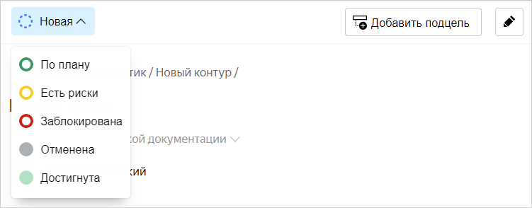
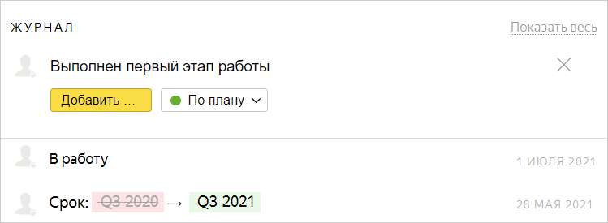
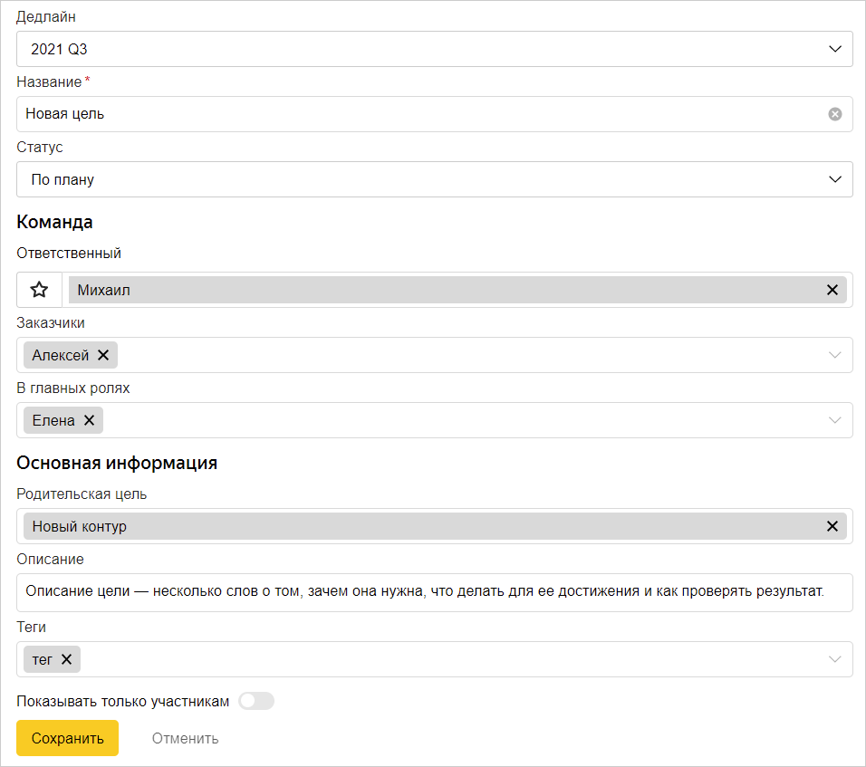
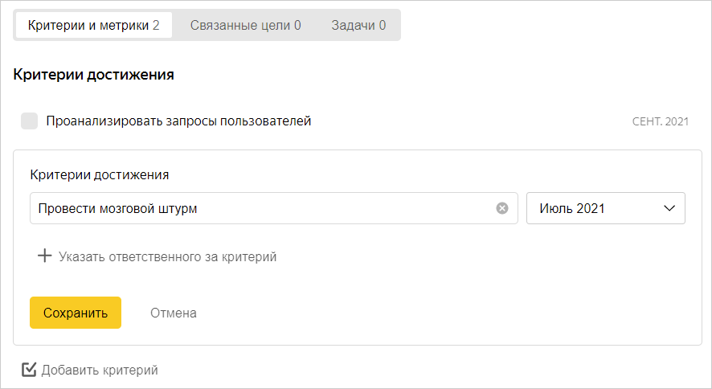
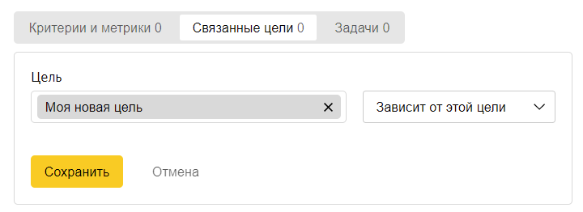

# Редактировать цель

## Обновить статус цели {#status}

В целях, за которые вы отвечаете, рекомендуется периодически писать о ходе работы и выставлять актуальный статус. Это поможет заказчикам цели и руководителям понимать, насколько успешно идет работа.

Чтобы обновить статус цели:

1. Найдите [вашу цель](navigation.md#by-users).
1. Чтобы изменить статус цели, в левом верхнем углу страницы нажмите кнопку с обозначением статуса и выберите новый.
    
    
    
1. В блоке **Журнал** нажмите строку **Добавить комментарий**.
1. Напишите в комментарии, что было сделано для достижения цели, какие получены результаты и так далее. Чтобы изменить статус при отправке комментария, под текстом выберите новый статус. Затем нажмите кнопку **Добавить**.
    
    
    
1. [Добавьте связи с задачами в {{ tracker-name }}](#tickets), в которых вы работаете над целью.
1. Если вы выполнили какие-либо [критерии достижения цели](#checklist), отметьте их <q>галочкой</q>.

## Изменить основные параметры цели {#general}

1. В правом верхнем углу нажмите кнопку .
    
1. При необходимости отредактируйте основные параметры цели: название, статус, дедлайн, родительская цель, команда и так далее.
    
    

    

    
    
1. Чтобы ограничить доступ к цели, включите опцию **Показывать только участникам**.
1. Нажмите кнопку **Сохранить**.

## Добавить критерии {#checklist}

Чтобы перечислить условия достижения цели или шаги, которые необходимо выполнить, добавьте в цель критерии (чеклист):

1. Найдите [вашу цель](navigation.md#by-users).
1. Под описанием цели выберите **Критерии и метрики**, затем нажмите **Добавить критерий**.
1. В блоке **Критерии достижения**:
    1. Введите описание пункта — критерия или этапа выполнения цели.
    1. При необходимости задайте срок, когда пункт должен быть выполнен.
    1. Если требуется назначить ответственного за выполнение пункта, нажмите **Указать ответственного за критерий** и введите имя сотрудника.
    1. Нажмите кнопку **Сохранить**.
    
    
    
1. Аналогичным образом добавьте все необходимые критерии.
1. Чтобы отредактировать пункт списка, наведите на него указатель и нажмите значок  .
1. Чтобы удалить пункт списка, наведите на него указатель и нажмите значок .

## Добавить связи с целями {#links}

Добавьте ссылки на другие цели, которые влияют на достижение вашей цели:

1. Найдите [вашу цель](navigation.md#by-users).
1. Под описанием цели выберите **Связанные цели**.
    
    
1. Введите часть названия цели, затем выберите нужную из подсказки.
1. Справа выберите из списка тип связи:
    * **Дочерняя цель** — для создания древовидной иерархии целей.
    
    
    
    Родительскую цель можно указать при [редактировании основных параметров цели](#general). Родительская цель может быть только одна.
    При создании связей с [зонтиками и контурами](okr.md#types) действуют ограничения:
    * Зонтик может быть подчинен только стриму. 
    * Контур может быть подчинен только зонтику.
    
    
    
    * **Блокирует эту цель / Зависит от этой цели** — рекомендуется использовать для связей с целями из других [стримов](okr.md#types).
    
1. Нажмите кнопку **Сохранить**.
1. Чтобы изменить тип связи, наведите на нее указатель и нажмите значок .
1. Чтобы удалить связь, наведите на нее указатель и нажмите значок .



Управлять связями и другими параметрами целей также можно [через интерфейс {{ tracker-name }}](goals-tracker.md).



## Добавить задачи {#tickets}

Добавьте ссылки на задачи в {{ tracker-name }}, в которых вы с коллегами работаете над достижением цели:

1. Найдите [вашу цель](navigation.md#by-users).
1. Под описанием цели выберите **Задачи**.
1. Нажмите **Добавить связь с задачей или фильтром**.
1. Укажите ключ задачи и нажмите клавишу **Enter**.
1. Чтобы удалить связь, наведите на нее указатель и нажмите значок .

## Добавить метрики (графики) {#metrics}

В цель можно добавить график из [{{ datalens-name }}](https://datalens.yandex-team.ru/), [Статистики](https://stat.yandex-team.ru/), [Metrics](https://metrics.yandex-team.ru/), [Pulse](https://pulse.yandex-team.ru/):

1. Найдите [вашу цель](navigation.md#by-users).
1. Под описанием цели выберите **Критерии и метрики**, затем нажмите **Добавить метрику**.
1. В поле **Название** введите заголовок графика.
1. В поле **Ссылка на метрику** вставьте ссылку на график.
1. Нажмите кнопку **Сохранить**.
1. Чтобы изменить заголовок или ссылку на график, наведите на него указатель и нажмите значок .
1. Чтобы удалить график, наведите на него указатель и нажмите значок .
