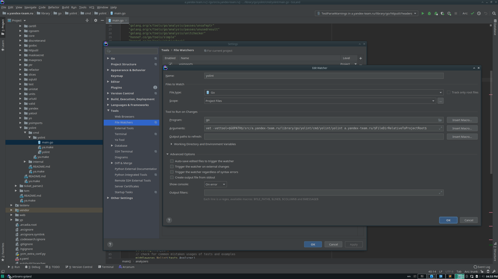

# Линтинг

## Инструмент
В экспериментальных пакетах Go появился инструмент для создания эффективных статических анализаторов - [golang.org/x/tools/go/analysis](https://pkg.go.dev/golang.org/x/tools/go/analysis).
С помощью данного пакета можно писать кастомные инструменты анализа для стандартного `go vet`.

На данный момент в Аркадии существует пакет [yolint](https://a.yandex-team.ru/arc/trunk/arcadia/library/go/yolint).
Он включает в себя практически все анализаторы из стандартной поставки `go vet`, сторонний набор анализаторов [staticcheck](https://staticcheck.io/docs/checks),
а также несколько наших внутренних [анализаторов](https://a.yandex-team.ru/arc/trunk/arcadia/library/go/yolint/internal/passes).

## Поддержка в Аркадии
На данный момент `yolint` поддержан в CI и ya make.

## Запуск
Локальный запуск можно произвести с помощью команды `ya make -t <path/in/arcadia>`. Также линтинг происходит на каждый коммит в Аркадию с рамках style тестов.

Также есть возможность собрать `yolint` в виде отдельного бинарника:

```
$ ya make library/go/yolint/cmd/yolint
$ ls -la library/go/yolint/cmd/yolint/yolint
lrwxrwxrwx 1 arcadiy arcadiy   70 Apr 1 17:28 yolint -> /home/arcadiy/.ya/build/symres/e18c3eef36d91adf41a624ac9625873a/yolint
```

## Линтинг в IDE

### (lint_in_vs_code) VS Code
Для Microsoft Visual Studio Code есть [плагин](https://marketplace.visualstudio.com/items?itemName=ms-vscode.Go), позволяющий настроить среду для использования go-тулкита в реальном времени.
Работает как на локальной машине, так и на удалённой при помощи [Remote SSH](https://code.visualstudio.com/docs/remote/ssh) с установкой соответствующего расширения.
Здесь и далее будут упоминаться настройки IDE в `settings.json` для работы на удалённой dev-машине (файл должен располагаться в `/home/arcadiy/.vscode-server/data/Machine/settings.json`)

В `settings.json` добавьте следующие параметры:
```(json)
"go.lintOnSave": "off",
"go.useLanguageServer": false,
"go.buildOnSave": "off",
"go.vetFlags": [
"-vettool={expanded_go_path_env}/src/a.yandex-team.ru/library/go/yolint/cmd/yolint/yolint",
],
"go.formatTool": "gofmt",
"go.vetOnSave": "package"
```

### (lint_in_jetbrains) JetBrains
Для подключения линтинга в IDE от JetBrains необходимо создать соответствующий File Watcher.

Name: `yolint` <br/>
File Type: `Go` <br/>
Scope: `Project Files` <br/>
Program: `go` <br/>
Arguments: `vet -vettool=$GOPATH$/src/a.yandex-team.ru/library/go/yolint/cmd/yolint/yolint a.yandex-team.ru/$FileDirRelativeToProjectRoot$` <br/>
Advanced Options - по вкусу <br/>




## Отключение линтинга
**WARNING**: Отключать линтинг настоятельно не рекомендуется. Вы сделаете удобнее себе, но скорее всего создадите проблемы для других.

Для Go нельзя отключить линтинг на уровне файлов или пакетов. Соответственно, макрос `NO_LINT()` в `ya.make` не имеет никакого эффекта. Это by design.

Линтинг можно отключить в крайних случаях и только точечно. Для этого нужно в проблемном месте добавить комментарий вида `//nolint:check_name` где `check_name` - название проверки линтера.
