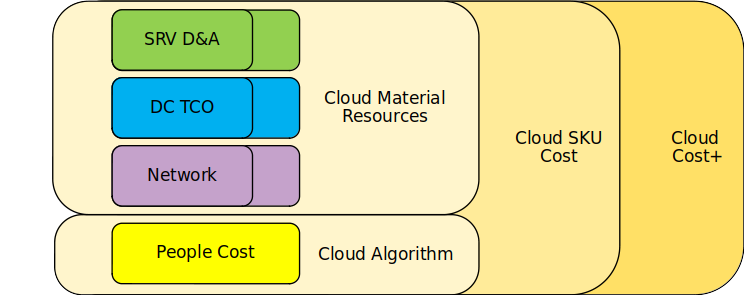

# Обзор

## Зачем нужен биллинг ресурсов
Биллинг ресурсов делается для того чтобы корректно понимать структуру расходов на хостинг сервисов Яндекса.
С помощью биллинга делаются расчёты за хостинг между БЮ и предоставляющим хостинг Порталом.
Так же данные биллинга используются для построения P&L Value Stream'ов внутри Портала.

## Базовые принципы тарификации SKU
- Прайсинг по модели cost+, учет всех основных расходов.
- Привязка тарифов внутренних облаков к аналогам во Внешнем Облаке
  - чтобы можно было корректно сравнивать бизнес модель сервисов с конкурентами.
- Тарифы выравниваются в рамках контура и между однотипными контурами с одним продуктом.
- Единая сетка тарифов для всех клиентов (БЮ, VS).
- Низкая волатильность, тарифы меняются редко (~раз в год).

{ .left }

<small>Рисунок 1 — Модель cost+</small>

## Общий подход к ценообразованию SKU

1. Выделяются контуры облаков в рамках каждого ресурсного провайдера.
   - Контуров может быть несколько.
   - Например в RTC отдельным контуром считаются хосты с GPU, а в YT — кластеры динамических таблиц и кластеры с MapReduce.
   - Контур представляет собой множество хостов и стоимость их элементарных ресурсов  (амортизация оборудования, DC TCO, сеть и стоимость команды).
   - Контур может иметь свой собственный набор SKU и свои тарифы.
   - Для однотипных по смыслу контуров, например созданных для геораспределенных инсталляций, допускается считать себестоимость отдельно, но конечные пользовательские тарифы в таком случае усредняются и делаются одинаковыми во избежание перетекания пользователей из одного ДЦ в другой.
2. Формируется список SKU для каждого из контуров.
3. Вычисляется количество SKU, которые можно "снять" с каждого из контуров в идеальном случае. Проводятся корректировки:
   - учитываются затраты на инфраструктуру  (фрагментация, логи, налог на повышенную доступность и т.д);
   - учитывается несбалансированность ресурсов (сколько аллоцируется при максимальной модели аллокации).
4. Вычисляется себестоимость SKU как стоимость контура, делённое на итоговое количество SKU, снимаемого с контура.
5. Если необходимо, перебалансируется стоимость SKU внутри провайдера ресурсов так, чтобы общая сумма не менялась.
6. Выполняется проверка на то, что суммарная стоимость, которую можно получить от продажи всех SKU, сходится к стоимости контура (железо+ДЦ+люди+сеть etc).
7. Поверх тарифа, посчитанного по себестоимости, добавляется небольшая наценка для налоговой.
