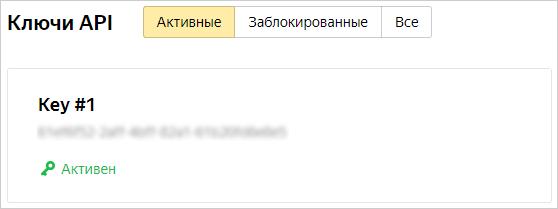
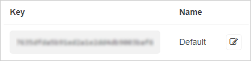

# Аутентификация и авторизация

Почти каждый сайт API обладает методом аутентификации запросов. Для этого обычно нужно передать в запросе свой API-ключ.

* **Аутентификация** — подтверждение подлинности пользователя. API может аутентифицировать, но не разрешит делать определенный запрос.
* **Авторизация** — разрешение определенного действия.

## Зачем это нужно {#what-for}

Аутентификация и авторизация с помощью API позволяют:
- аутентифицировать запросы только зарегистрированных пользователей;
- отследить использование API (лимиты);
- контролировать доступ к определенным функциям;
- отследить, кто делает запросы.

Для тестирования ресурсов нужно получать собственные API-ключи. Они обрабатываются как пароли и открыто не публикуются.

## Получить API-ключ Яндекс&#160;Погоды {#yandex-weather}

В этом примере получим API-ключ Яндекс&#160;Погоды. Он пригодится для практического задания.

1. Перейдите в [Кабинет разработчика](https://developer.tech.yandex.ru/).
1. Нажмите кнопку **Подключить API**.
1. Выберите, какой API подключить. В нашем случае — API Яндекс&#160;Погоды.
1. Введите свои данные и выберите тариф. Для наших целей подойдет **Бесплатный тариф «Погода на вашем сайте»**.
   
    Если вы выберете другой тариф, то описанный в документации [тестовый запрос к API Яндекс Погоды](postman-test.md#yandex-weather) не сработает и вернет ошибку **403 Forbidden**.
    
2. Вас перенаправит на [страницу API Яндекс&#160;Погоды](https://developer.tech.yandex.ru/services/18) в кабинете разработчика. Там будет API-ключ.
3. Скопируйте ключ и сохраните в текстовый редактор. Он пригодится при дальнейшем тестировании запросов.
    
    

## Получить API-ключ OpenWeatherMap {#open-weather}

Для практического задания нужно получить ключ сервиса погоды OpenWeatherMap.

1. Создайте аккаунт на [сайте](https://home.openweathermap.org/users/sign_up).
1. Перейдите на вкладу **API Keys**.
    
    
1. Скопируйте ключ и сохраните в текстовый редактор. Он пригодится при дальнейшем тестировании запросов.
    
    

## Получить API-ключи Предиктора и Яндекс&#160;Словаря {#predict}

Для тестов и практического задания получите ключи двух еще двух сервисов Яндекса.

1. Перейдите на [страницу получения ключа Предиктора](https://yandex.ru/dev/predictor/keys/get/?service=pdct).
1. Поставьте галочку напротив пункта с Пользовательским соглашением и нажмите кнопку **Получить API-ключ**.
1. Скопируйте ключ и сохраните в текстовый редактор. Он пригодится при дальнейшем тестировании запросов.
    
    
1. Повторите то же самое для [API-ключа Яндекс&#160;Словаря](https://tech.yandex.ru/keys/get/?service=dict).

После получения API-ключи Предиктора и Яндекс&#160;Словаря можно будет скопировать со [страницы со списком ключей](https://yandex.ru/dev/keys/).

