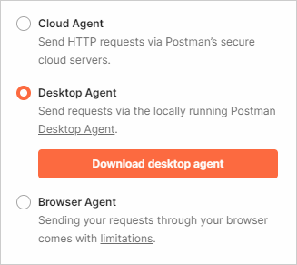

# Установка ПО

Традиционный метод тестирования запроса — curl. Он доступен на MacOS по умолчанию, для Windows требуется установка.

Помимо curl при тестировании конечных точек можно использовать любой графический интерфейс, например Postman. Тестирование с графическим интерфейсом намного проще.

Также существуют инструменты для создания запросов, такие как Swagger, которые работают на определенных спецификациях и обладают собственным интерфейсом.

## cURL {#curl}

 
- Установка на Windows

  #### Процесс установки

	1. Определите вашу версию Windows (32/64).
	2. Скачайте файл с [этой страницы](https://curl.se/windows/), выбрав подходящую версию.
	3. Скаченный архив извлеките в директорию `С:\`. После извлечения у вас должна отобразиться папка с файлами вида `C:\curl-7.76.0-win64-mingw`.
	4. Установите сертификат безопасности, для этого:
		1. В разархивированной директории перейдите в папку `bin` и запустите файл `curl-ca-bundle.crt`.
		2. В отобразившемся окне нажмите **Установить сертификат**, затем выберите **Локальный компьютер** и нажмите **Далее**.
		3. В следующем окне выберите **Автоматически выбрать хранилище на основе типа сертификата** и нажмите **Далее**.
    
	5. Чтобы запускать curl с помощью команды в командной строке, добавьте curl в Path. Для этого:
        1. Перейдите в **Система** → **Дополнительные параметры системы** → **Дополнительно** → **Переменные среды** → **Системные переменные** → **Path** → **Изменить**.
		2. Нажмите **Создать** и укажите путь к папке `bin`, например, `C:\curl-7.76.0-win64-mingw\bin`. Если в переменной уже прописаны пути, запишите новый через точку с запятой. Для корректной работы все элементы пути должны быть написаны латиницей.
    
		1. С помощью кнопки **Вверх** переместите созданную переменную среду на верх списка.
		1. Нажмите **ОК**.
    
	1. После установки откройте Git Bash (или командную строку) и введите `curl -V`. Ответ должен быть примерно таким:
		```
		curl 7.76.0 (x86_64-w64-mingw32) libcurl/7.76.0 OpenSSL/1.1.1g (Schannel) zlib/1.2.11 brotli/1.0.7 libidn2/2.3.0 libssh2/1.9.0 nghttp2/1.41.0
		Release-Date: 2021-03-31
		Protocols: dict file ftp ftps gopher http https imap imaps ldap ldaps pop3 pop3s rtsp scp sftp smtp smtps telnet tftp
		Features: AsynchDNS brotli HTTP2 HTTPS-proxy IDN IPv6 Kerberos Largefile libz Metalink MultiSSL NTLM SPNEGO SSL SSPI TLS-SRP
		```
    

     #### Особенности curl в Windows

	- В Git Bash и командной строке не работает `Ctrl + V`, нужно нажать правой кнопкой мыши и выбрать `paste`.
    - Не используйте обратную косую черту `\` для разделения строк.
    - В командной строке используйте двойные кавычки. Одинарные не поддерживаются.
	   
    
		При ошибке использования одинарных кавычек вы получите такую ошибку: `curl: (1) Protocol "'https" not supported or disabled in libcurl`.
    
	    
    
 	- Русский язык в GitBash будет отображаться вот так: `╜╨╡╨▒╨╛╤Б╨▓`.
    - Если в командной строке кириллица отображается в виде нечитаемых символов, проверьте, что у вас установлена последняя версия curl. Для этого введите команду `curl -V` и сравните версию, которая установлена у вас, с последней версией, которая представлена на [официальном сайте](https://curl.se/windows/). При необходимости обновите вашу версию по [этой инструкции](#curl).

- Установка на MacOS

	Так можно проверить, установлен ли curl на MacOS:

	1. Откройте Терминал (нажмите `Cmd` + `spacebar` для открытия Спотлайт и введите `Terminal`).
	1. В терминале напишите `curl -V`. Ответ должен быть примерно таким:
		```
		curl 7.71.1 (x86_64-apple-mingw32) libcurl/7.54.0 SecureTransport zlib/1.2.8
		Protocols: dict file ftp ftps gopher http https imap imaps ldap ldaps pop3 pop3s rtsp smb smbs smtp smtps telnet tftp Features: AsynchDNS IPv6 Largefile GSS-API Kerberos SPNEGO NTLM NTLM_WB SSL libz UnixSockets
		```
    
	1. Если такого ответа нет, то [скачайте и установите](https://curl.haxx.se/) curl.



## Postman {#postman}

Чтобы установить Postman, откройте [сайт](https://www.postman.com/downloads/) и выберите, скачать приложение или пользоваться веб-версией.

Postman можно использовать:
- через облачные серверы;
- как приложение;
- в браузере.



При открытии Postman в браузере не забывайте активировать агент на рабочем столе.

## Swagger {#swagger}

Swagger — инструменты API, связанные со спецификацией [OpenAPI](https://swagger.io/specification/). Дополнительно устанавливать ничего не требуется.

Ссылки на [инструменты Swagger](https://swagger.io/tools/):
- [Swagger UI](https://github.com/swagger-api/swagger-ui) анализирует документ в спецификации OpenAPI и создает веб-страницу для экспериментов с запросами в реальном времени.
- [Swagger Editor](https://editor.swagger.io) — онлайн-редактор, который проверяет документацию OpenAPI на соответствие правилам спецификации.
- [Swagger Codegen](https://swagger.io/tools/swagger-codegen) генерирует код SDK.

