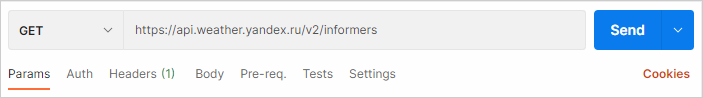
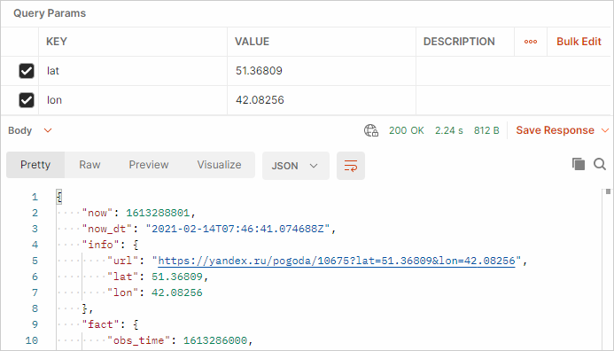

# Тестовый запрос в Postman

Перед запросом убедитесь, что получили нужный API-ключ.

## Создать запрос к API Яндекс&#160;Погоды {#yandex-weather}

Здесь вы создадите запрос с помощью API Яндекс&#160;Погоды, чтобы узнать [прогноз погоды](https://yandex.ru/dev/weather/doc/dg/concepts/forecast-info.html) для места, которое мы определим с помощью координат.

1. Откройте Postman и выберите **File → New → HTTP Request**.
2. Нажмите **Save**. В открывшемся окне в поле **Request name** введите имя запроса. Создайте или укажите папку, в которой запрос будет сохранен. Нажмите **Save** в нижней части окна.
3. Выберите метод **GET**.
4. Вставьте конечную точку `https://api.weather.yandex.ru/v2/informers` в ячейку справа от метода.

    
    
5. Под методом откройте вкладку **Params** и введите значения широты (параметр `lat`) и долготы (параметр `lon`):
    Key | Value
    ----- | -----
    lat | 54.7065
    lon | 20.511
    
    Добавленные параметры отобразятся после знака `?` в виде строки запроса к URL-адресу конечной точки в поле `GET` и будут отделены амперсандом `&`. В нашем случае конечная точка будет выглядеть так:
    ```
    https://api.weather.yandex.ru/v2/informers?lat=54.7065&lon=20.511
    ```   
6. Откройте вкладку **Headers** и добавьте API-ключ:
    Key | Value
    ----- | -----
    X-Yandex-API-Key | ваш API-ключ
    
    Обращайте внимание на то, как передается API-ключ: в нашем случае он передается в заголовке, но некоторые API передают его в строке запроса вместе с другими параметрами.
    
7. Нажмите кнопку **Send**. Ответ появится в нижней панели.
    
    
    

    
    
    Если в ответе вернулась ошибка 403 Forbidden, то проверьте [выбранный тариф](authorization.md#yandex-weather): запрос сработает только на тарифе **«Погода на вашем сайте»**.
    
8. Сохраните запрос, нажав кнопку **Save** (над **Send**). Назовите свой запрос и создайте для него папку кнопкой **+ Create collection** и нажав **Save to (имя папки)**.

## Создать запрос к API OpenWeatherMap {#openweather}

Здесь вы создадите запрос с помощью API OpenWeatherMap, чтобы узнать [текущую погоду](https://openweathermap.org/current) для места, которое мы определим через параметр имени.

1. Выберите метод **GET**.
1. Вставьте конечную точку `https://api.openweathermap.org/data/2.5/weather` в ячейку справа от метода.
1. Во вкладке **Params** введите следующие значения:
    Key | Value
    ----- | -----
    q | Kaliningrad
    lang | ru
    units | metric
    appid | ваш API-ключ
    
    Перейдите на страницу с описанием запроса и посмотрите, через какие еще параметры можно определить город.
    
2. Нажмите кнопку **Send**. Ответ появится в нижней панели.

