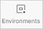

# Использование переменных



Это информация для углубленного понимания.




## Что такое переменные в Postman {#about}

В Postman можно настроить переменные. Они используются для подстановки заранее заданных значений в запросы внутри одной коллекции. Переменные пригодятся, например, чтобы не дублировать в запросах к одному и тому же сервису свой API-ключ.

Переменные хранятся в окружении. Postman-окружение — это хранилище для переменных, которое существует отдельно от коллекций. Подключите к своей коллекции нужное окружение, чтобы подтягивать в запросы переменные из этого окружения.

Переменные в Postman можно использовать в любых частях запроса: в строке запроса (вкладка **Params**), заголовках (вкладка **Headers**), пути к ресурсу (например, `GET https://toloka.yandex.ru/api/v1/{{object}}`) и теле запроса (вкладка **Body**). При вставке используйте фигурные скобки в качестве плейсхолдера.

## Как настроить переменные {#set-up}

1. В меню слева перейдите на вкладку **Environments**.
   
2. Создайте новое окружение с помощью кнопки .
3. В ячейку **VARIABLE** добавьте имя переменной.
4. В ячейку **CURRENT VALUE** добавьте значение.
5. Сохраните окружение, нажав кнопку **Save**.
6. Перейдите в запрос, в котором хотите использовать переменную.
7. Во вкладке запроса справа вверху из выпадающего списка с **No Environment** выберите свое окружение. Посмотреть все переменные в нем можно, нажав значок  справа.
8. Добавьте ключ, а в качестве его значения укажите переменную в формате `{{имя-переменной}}`.

Также у Postman есть свои (глобальные) переменные. Например, `{{$randomInt}}` добавит случайное число от 0 до 1000, а `{{$timestamp}}` вставит UNIX-временную отметку в секундах.

Подробнее о настройке переменных читайте в разделе [Using variables](https://learning.postman.com/docs/sending-requests/variables/) на сайте Postman.

## Настроить переменную для API‑ключа Яндекс&#160;Погоды {#example}

Пример с настройкой переменной для API-ключа Яндекс&#160;Погоды.

1. Перейдите на вкладку **Environments** и создайте новое окружение.
2. В ячейке **VARIABLE** назовите переменную `X-Yandex-API-Key`, по имени параметра, в котором ключ будет передаваться.
3. В ячейку **CURRENT VALUE** добавьте значение API-ключа и сохраните окружение, нажав кнопку **Save**.
4. В меню слева перейдите на вкладку **Collections** и выберите или создайте GET-запрос к конечной точке:
    ```
    https://api.weather.yandex.ru/v2/informers?lat=54.7065&lon=20.511
    ```
    
5. Справа вверху из выпадающего списка с **No Environment** выберите нужное окружение.
6. В **Headers** добавьте ключ `X-Yandex-API-Key`, а в качестве его значения укажите переменную `not_var{{X-Yandex-API-Key}}`.
7. Выполните запрос.

