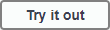
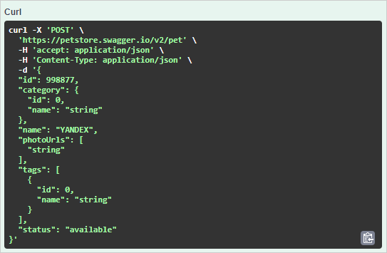

# Тестовый запрос в Swagger

## Создать POST-запрос к Swagger Petstore {#post}

Здесь вы создадите виртуального питомца на демонстрационном сайте, который генерируется с помощью Swagger UI.

1. Перейдите на страницу [Swagger Petstore](http://petstore.swagger.io/). Тут три группы конечных точек: `pet`, `store` и `user`. В этом и следующем запросах мы будем обращаться к `pet`.
2. Обычно нужно было бы авторизоваться, нажав кнопку , но так как сайт демонстрационный, сейчас это не нужно.
3. Разверните точку **Post/pet**.
4. Нажмите кнопку , чтобы изменять пример в теле запроса.
5. В поле **Example Value** измените:
    - первое значение `id` на любое целое число;
    - значение второго `name` на любое другое (это будет имя питомца).

  
  ```json
  {
    "id": 998877,
    "category": {
      "id": 0,
      "name": "string"
    },
    "name": "YANDEX",
    "photoUrls": [
      "string"
    ],
    "tags": [
      {
        "id": 0,
        "name": "string"
      }
    ],
    "status": "available"
  }
  ```
  
    
1. Нажмите **Execute**.

Интерфейс Swagger покажет отправленный curl в блоке **Responses**. В блоке **Response content type** справа можно выбрать **application/xml** вместо **application/json** и посмотреть ответ в другом формате.



## Создать GET-запрос к Swagger Petstore {#get}

Проверим созданного питомца.

1. Разверните точку **GET /pet/{petId}**.
1. Нажмите кнопку , чтобы изменять пример в теле запроса.
1. Введите `id` питомца из предыдущего запроса.
1. Нажмите **Execute**. В теле ответа вы получите имя вашего питомца.

## Узнайте больше {#learn-more}

В этом видео рассказывается, как создавать спецификацию и генерировать по ней веб-страницу.

@[youtube](https://www.youtube.com/embed/lYjm2w8-ERI)

