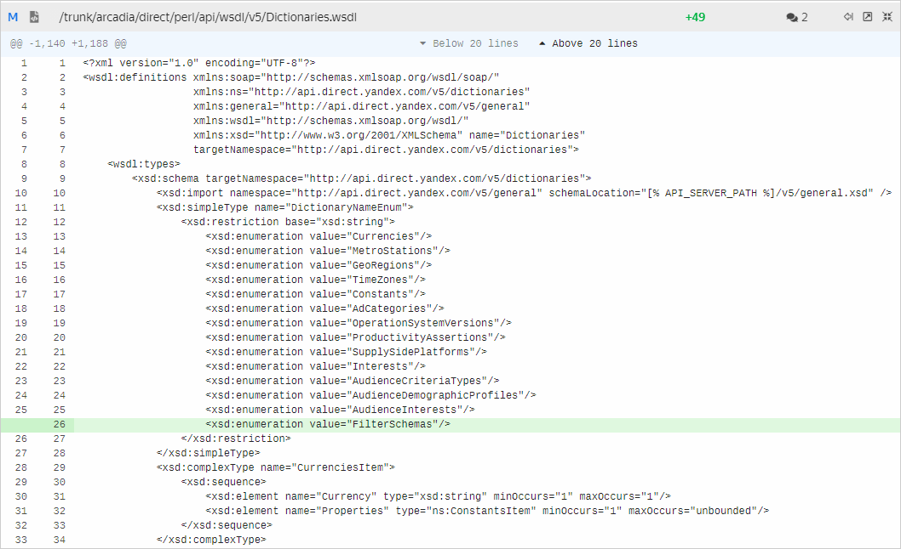

# WSDL

WSDL (англ. _Web Services Description Language_) — это язык описания веб-сервисов, основанный на XML. На нем описываются методы, входные и результирующие структуры данных, типы данных, сетевые адреса для обращения к сервису и другое.

Пример структуры API на WSDL можно скачать по [ссылке](https://api.direct.yandex.ru/v4/wsdl/). После завершения загрузки откройте файл в любом текстовом редакторе для работы с кодом (Sublime, Notepad++ и подобные).

Документы на WSDL помогают ознакомиться с актуальной структурой API и описать ее. В некоторых задачах от заказчика вы будете получать скриншоты WSDL-документов из системы контроля версий с изменениями в структуре API:

- зеленым будут выделены добавленные части кода;
- красным — удаленные.



В данном примере в сервисе `Dictionaries` для объекта `DictionaryName` был добавлен параметр `FilterSchemas`, через который задаются названия схем для создания фильтров.

На практике информация была внесена на страницу [get](https://yandex.com/dev/direct/doc/ref-v5/dictionaries/get.html#input) документа [Yandex Direct API. Version 5](https://yandex.com/dev/direct/doc/start/index.html) .



## Узнайте больше {#learnmore}

- [Использование WSDL с протоколом SOAP](https://yandex.ru/dev/direct/doc/dg-v4/concepts/SOAP.html#SOAP__wsdl)
