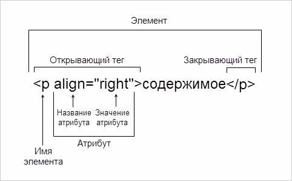

# XML и HTML

XML и HTML внешне похожи, но:
* в HTML теги и атрибуты определены заранее.
* в XML разработчики сами определяют, какие названия им дать. Например, в одном приложении для обозначения товара могут использовать тег `<item>`, а в другом приложении — `<product>`. 

HTML может также быть определен средствами XML, и поэтому он представляет собой одну из конкретизаций XML.

## Структура языка {#lang-structure}







### Элемент {#element}
Элемент — структурная единица. Элемент состоит из тегов и может содержать атрибуты, значение и другие вложенные элементы.

### Тег {#tag}

В большинстве случаев элемент состоит из двух тегов: открывающего и закрывающего. Название тега пишется между угловых скобок `<>`, а перед названием закрывающего тега ставится косая черта `/`:

```xml
<tag></tag>
```

Элемент может состоять из одного самозакрытого тега, если его значение отсутствует. Тогда одинарный тег оканчивается косой чертой:

```xml
<tag/>
```

Для некоторых HTML-тегов допускается отсутствие закрывающего тега.

### Значение {#value}

Текст между открывающим и закрывающим тегами — это значение элемента. Атрибуты и другие вложенные элементы не являются значением элемента.
```xml
<tag>Значение — это текст между тегами элемента</tag>
```

### Вложенность {#nesting}

Кроме текста между тегами могут находиться другие элементы. Элемент снаружи называется **родительским**, внутри — **дочерним**. Дочерние элементы могут быть родительскими для следующего уровня и так далее. Таким образом элементы образуют древовидную структуру. Самый верхний элемент, у которого нет родителей, называется **корневым**. В документе должен быть только один корневой элемент, иначе возникнут ошибки.

Вложенные теги используются для введения дополнительной разметки или правил отображения:

```html
<tag1>
    <tag2>блок информации</tag2>
    <tag3>
        <tag4>блок</tag4> информации
    </tag3>
</tag1>
```
При вложенной структуре всегда соблюдается правило закрывающего тега, который должен охватывать все теги внутри. 
Описывая вложенность HTML-элементов вместо «элемент» используйте термин «контейнер», например:

```html
Поместите элемент img в подходящий контейнер с классом ya-phone. 
Например: <span class="ya-phone"></span>.
```

#### Атрибут {#attribute}

Тег может содержать набор атрибутов. Атрибуты позволяют изменять свойства и поведение элемента, для которого они заданы:

```html
<tag param1="value1" param2="value2" param3="value3"...>блок информации</tag>
```

Когда мы говорим об атрибутах `class` и `id`, можно использовать термины «класс» и «идентификатор». Для других атрибутов так лучше не делать.

## Структура HTML‑документа {#doc-html-structure}

HTML-документ имеет строго определенную структуру и набор обязательных тегов. Браузер просматривает и отображает документ в соответствии с включенными в него инструкциями. Если разметка правильная, то в окне браузера будет отображена HTML-страница с нужными данными.

### DOCTYPE {#doctype}

`<!DOCTYPE html>` является директивой, которая объявляет формат документа для корректного отображения в браузере.

### Корневой элемент {#root}

Элемент `<html>` является корневым элементом документа. Все остальные элементы содержатся внутри. Все, что находится за пределами элемента <`html`>, не воспринимается браузером как HTML и никак им не обрабатывается.

### Техническая информация {#technical}

Раздел, определенный элементом `<head>`, содержит техническую информацию: название документа, описание, ключевые слова для поисковых машин, кодировку. Эта информация указывает браузеру, как следует обрабатывать страницу, но в окне браузера не отображается.

Внутри раздела присутствует обязательный тег `<title>`, в котором содержится название документа. Там же могут находиться необязательные теги, как `<meta>`, `<link>`, `<script>`, `<style>`.

### Содержимое документа {#content}

Внутри тега `<body>` располагается все содержимое документа, которое отображается пользователю в окне браузера.

```html
<!DOCTYPE html>
<html>

<head>
  <title>Название документа</title>
</head>

<body>
    Основное содержимое документа
</body>

</html>
```

## Структура XML‑документа {#doc-xml-structure}

### XML-пролог {#prolog}

В первой строке XML-документа обычно указывается пролог. Это специальный элемент, который сообщает обработчику документа версию языка и кодировку. В примере ниже версия 1.0 и кодировка UTF-8: `<?xml version="1.0" encoding="UTF-8"?>`.

### Корневой элемент {#xml-root}

У XML-документа обязательно должен быть один корневой элемент, который будет родительским для остальных элементов. В примере ниже корневой элемент — `<root>`.

В таблице ниже показано, как выглядит одна и та же структура в XML и JSON.

#|
||XML | JSON||
||
```xml 
<?xml version="1.0" encoding="utf-8"?> 
<root>   
  <chapter>     
    <block>Текст 1</block>     
    <block>Текст 2</block>   
  </chapter>   
  <chapter>     
    <block>Текст 3</block>   
  </chapter> 
</root> 
``` 
| 
```json
{
  "root": {
    "chapter": [{
        "block": [
          "Текст 1",
          "Текст 2"
        ]
      },
      {
        "block": "Текст 3"
      }
    ]
  }
}
 ```
||
|#

### Теги {#tags}

Внутри первого тега указывают атрибуты элемента в виде `свойство="значение"`. Часто одну и ту же информацию можно передать и через атрибуты, и через вложенные элементы.

Оформляйте данные в виде элементов, а метаданные — в виде атрибутов (например, уникальные идентификаторы).


Как одну и ту же информацию можно записать разными способами:

#|
||Самозакрытый тег и атрибуты | Двойной тег и атрибуты | Двойной тег, атрибут и вложенный элемент||
||
```xml 
<element feature="true" id="159"/> 
``` 
| 
```xml 
<element feature="true" id="159"></element> 
``` 
| 
```xml 
<element id="159">
   <feature>true</feature> 
</element> 
```
||
|#


## Пространство имен в XML {#xml-names}

Пространство имен — совокупность названий тегов и атрибутов, принятых в конкретном документе. Это словарь, который позволяет разработчикам понимать друг друга и работать независимо.

Разные группы разработчиков могут работать в разных пространствах имен: для одной сущности использовать разные названия или для разных сущностей одинаковые.

При взаимодействии этих пространств могут возникать конфликты. Например, когда нужно передать XML из одного приложения в другое или агрегировать XML из множества источников и отобразить для пользователей в одинаковом виде.

Пример ниже показывает простой конфликт: подразумевается идентичность тегов `<item>` и `<product>`, атрибутов `feature` и `property`.

```xml
<root>
    <item feature="true"></item>
    <product property="true"></product>
</root>
```

Чтобы разрешить конфликт, нужно декларировать пространства имен и использовать префиксы для обозначения пространств. Декларировать можно в корневом элементе или в другом элементе, внутри которого (или внутри его потомков) используется конкретное пространство.

По умолчанию для декларирования используют атрибут `xmlns`, а для обозначения принадлежности к пространству — префикс вида `s:`.

```xml
<root xmlns:s="service" xmlns:a="app">
    <s:item s:feature="true"></s:item>
    <a:product a:property="true"></a:product>
</root>
```

## XML в API {#xml-api}

XML часто используют для передачи данных по API. XML можно использовать во всех типах параметров запроса, в том числе передавать XML-файл в качестве тела запроса.

Здесь передается логин и пароль пользователя в формате XML:

```bash
curl -X POST "https://target.url.address" -H "accept: application/xml" -H "Content-Type: application/xml" -d "<?xml version="1.0" encoding="UTF-8"?><request><userLogin>admin</userLogin><userPassword>qwerty</userPassword></request>"
```

В этом примере передается XML-файл:

```bash
curl -X POST "https://target.url.address" -H "accept: application/xml" -H "Content-Type: application/xml" -d @C:\path\file.xml
```

Также XML может частично или полностью составлять API-ответ. В таблице показан ответ на разных языках на один и тот же [запрос к API Предиктора](../../api-practice/curl-test.md#test-call):

#|
|| XML | JSON ||
||
```xml 
<?xml version="1.0" encoding="utf-8"?>
<CompleteResponse endOfWord="false" pos="-2">
  <text>
    <string>world</string>
  </text>
</CompleteResponse>
``` 
|
 ```json
{
    "endOfWord": false,
    "pos": -2,
    "text": ["world"]
}
```
||
|#

## Узнайте больше {#learnmore}
*  [Основные понятия XML и HTML](https://techwriter.daas.yandex-team.ru/guides/tech/xml/) в гайде «Руководство писателя и заказчика»
*  [Список стандартных HTML-тегов](https://msiter.ru/references/html-reference)